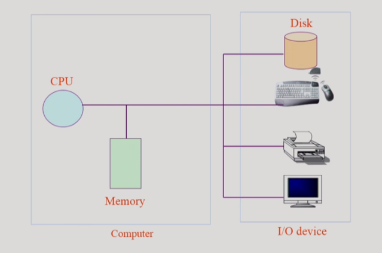
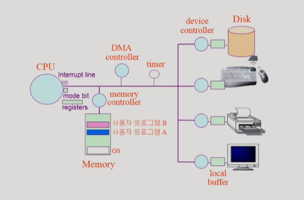
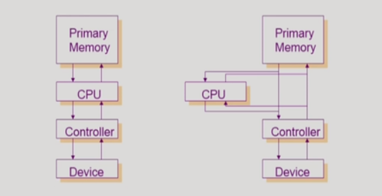
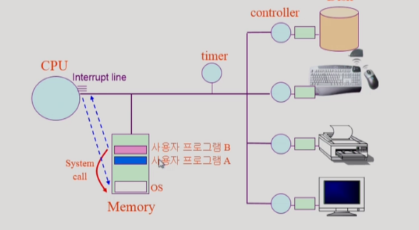
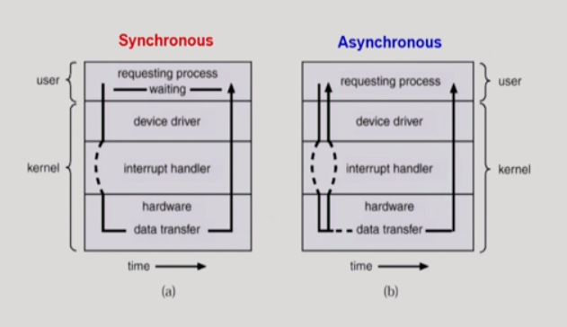
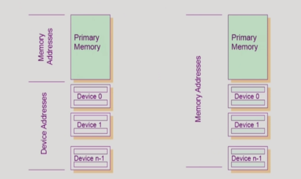
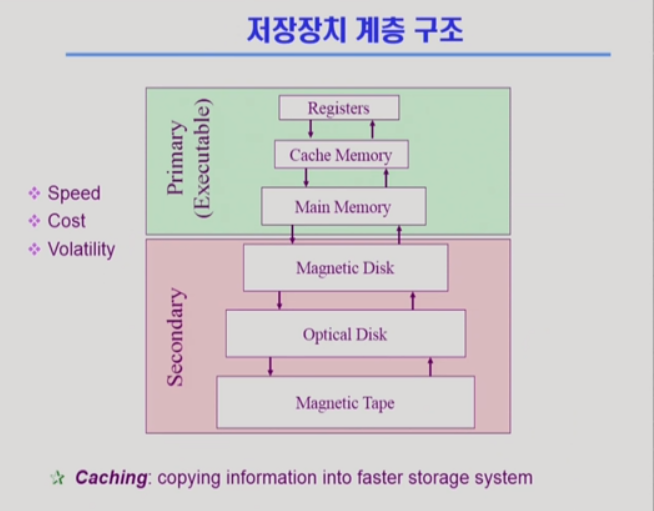

> 반효경 교수님 운영체제 수업(2014)을 듣고 정리한 내용입니다.

 

컴퓨터 하드웨어의 구조와 동작 방식을 알아본다.

 

# 2-1. 컴퓨터 시스템의 구조

컴퓨터 시스템은 크게 내부 장치와 외부 장치로 나눌 수 있다.

- 컴퓨터 내부 장치(Host): CPU, 메모리
- 컴퓨터 외부 장치(I/O device): 하드디스크, 키보드, 마우스, 모니터 등

- `CPU` (Central Processing Unit, 중앙처리장치) ─ 컴퓨터의 중심에 위치하여 시스템 전반을 이끄는 장치다. 입력 받은 명령을 해석/연산 한 후, 결과 값을 출력 장치로 전달한다. 스스로 작업을 수행하는 것이 아니라 매뉴얼에 따라 CPU 내부의 program counter 레지스터가 가리키고 있는 메모리 주소에 위치한 instruction을 실행한다. CPU에 대한 통제 역시 운영체제의 역할이다.

 

- `Memory` (RAM 또는 Random Access Memory, 주기억장치) ─ CPU가 처리할 데이터나 명령어가 임시로 저장되는 곳으로 CPU의 작업공간 역할을 한다. CPU는 매 클럭 사이클마다 메모리로부터 기계어로 작성된 instruction을 읽어서 실행한다. 컴퓨터 작업을 할 때 하드디스크에 있는 데이터는 먼저 메모리로 이동된 다음 CPU로 전송된다. 프로그램의 실행도 이와 마찬가지로, CPU가 메모리에 저장되어 있는 용량만큼 프로그램을 작동시킨다.

 

- `Disk` (HDD 또는 Hard Disk Drive, 보조기억장치) ─ 보통 보조기억장치라고 하지만 I/O device라고도 할 수 있다. 디스크 정보를 메모리로 읽어들이는 input device로서의 역할과, CPU의 처리 결과를 디스크의 파일 시스템에 저장하는 output device로서의 역할을 동시에 수행한다.

 

## CPU와 I/O 연산

세부 구조와 함께 CPU가 I/O 연산을 제어하는 과정을 살펴보자.

- `Device controller` ─ 각각의 I/O device마다 Device controller가 있다. I/O device의 내부 동작을 제어하는 일을 전담하는 작은 CPU라고 할 수 있다. `Local buffer`라는 일종의 data register를 가지고 있어서 I/O device로부터 들어오고 나가는 데이터를 임시 저장할 수 있다. Device controller는 CPU의 요청을 I/O device에 전달하고 처리가 완료되면 [인터럽트](https://real-dongsoo7.tistory.com/93?category=784608)를 발생시킨다.

  > 특정 프로그램이나 운영체제로부터 I/O device 처리 요청이 들어오면 CPU는 Device controller에게 요청을 전달하고 자신은 계속해서 메모리의 instruction을 수행한다. 처리 속도가 느린 I/O device의 출력 결과를 기다리지 않는다. 만약 I/O device의 출력 결과 없이 프로그램이 실행될 수 없다면 CPU 제어권은 다른 프로그램으로 넘어간다.

  > 참고) `Device driver`는 OS 코드 중 각 장치별 처리 루틴을 담당하는 '소프트웨어'이다. Device controller와 같은 CPU(하드웨어)가 아니다.

 

- `Registers` ─ 메모리보다 더 빠르면서 정보를 저장하는 CPU 내부 공간이다.

 

- `Mode bit` ─ 다중 프로그램이 실행되는 환경에서는 프로그램들간의 침범이 발생하면 안되기 때문에 하드웨어에 대한 각종 보안 기법이 필요하다. 하드웨어는 보안을 유지하기 위해 두 가지의 운영체제 모드(사용자 모드, 커널 모드)를 지원하며 *CPU 내부의 mode bit를 통해 현재 실행되고 있는 운영체제가 어떤 모드인지를 구별*하여 모드에 따라 실행 권한을 제어한다.

  > - 1: 사용자 모드 ─ CPU 제어권이 사용자 프로그램에 있음
  > - 0: 커널 모드 ─ CPU 제어권이 운영체제에 있음
  >
  > 커널 모드일 때는 메모리 뿐만 아니라 I/O device등에 대한 접근이 가능하지만 사용자 모드일 때는 자원에 대한 제한적인 접근만이 가능하다.

 

- `Interrupt line`(IRQ 또는 Interrupt Request Lines) ─ CPU는 수시로 Interrupt line을 통해 인터럽트 발생 여부를 확인한다. _인터럽트가 들어올 경우 CPU 제어권은 자동으로 운영체제에 넘어가고_, CPU는 우선순위에 따라 인터럽트를 처리한다.

 

- `Timer` ─ 이름 그대로 타이머 기능을 하는 하드웨어이다. 특정 프로그램이 CPU를 독점하는 일을 막는 역할을 한다. 컴퓨터 부팅 시 운영체제가 CPU를 가지고 있다가 특정 프로그램이 CPU를 요청할 때마다 타이머를 세팅한 후 CPU 제어권을 넘긴다. 세팅된 시간이 종료되면 타이머는 인터럽트를 발생시키고, CPU 제어권이 자동으로 프로그램으로부터 운영체제로 넘어간다. 타이머는 시분할(Time sharing) 처리방식을 위한 장치이자 프로그램이 의도치 않게 무한루프에 갇히는 것과 같은 소프트웨어 오류 상황을 회피하기 위한 장치라고 할 수 있다.

 

- `DMA controller` (Direct Memory Access) ─ I/O device로부터 들어온 인터럽트를 처리해서 CPU의 성능 저하를 막는다. CPU의 중재 없이 I/O device의 Local buffer에 접근하여 저장된 데이터를 **block** 단위로 메인 메모리에 복사(전송)하는 작업을 해준다. 인터럽트 역시 byte가 아닌 block 단위로 발생시키기 때문에 너무 많은 I/O 인터럽트로 인해 CPU의 성능이 떨어지는 것을 예방한다.

  

  > 메모리에 데이터를 block 단위로 전송한 뒤 전송이 완료되면 인터럽트를 발생시켜 CPU에 알린다.

 

## 입출력(I/O)의 수행

- 모든 입출력 명령은 '특권 명령'이다.

  > `특권 명령`:
  >
  > - 하드웨어의 동작, 시스템의 통합 환경 변경 등 개별 유저가 실행해선 안되는 명령
  > - 사용자 모드에서는 실행 불가

- 사용자 프로그램은 직접적으로 I/O device에 접근할 수 없기 때문에 운영 체제에게 I/O를 요청한다.(`System call`)

  > 보안을 포함한 여러 이유로 인해 only 운영체제만이 I/O device에 접근 가능하다.

  때문에 프로그램 실행중에 키보드 입력값을 받거나 화면을 출력하는 등의 I/O 작업을 해야 할 경우 스스로 CPU를 운영체제에게 넘겨주고(Trap) 운영체제는 CPU를 받아서 I/O 요청이 올바른 요청인지 확인한 후 해당 요청을 Device controller에 전달한다.

 

## Interrupt (인터럽트)

CPU가 다른 프로그램을 실행하고 있을 때, 입출력 하드웨어 혹은 소프트웨어에 의해 예외상황이 발생하여 처리가 필요한 경우에 CPU에게 이를 알려주는 것을 말한다.

### Interrupt의 종류

**Hardware Interrupt**

> 흔히 말하는 '인터럽트'는 하드웨어 인터럽트를 뜻하며, 다음과 같이 두 가지 종류가 있다.

- I/O Device controller로부터 발생한 인터럽트
- 타이머 인터럽트: 타이머가 발생시킨 인터럽트

**Software Interrupt** (`Trap`):

- Exception: 프로그램 오류로 인해 발생하는 인터럽트
- `System call`: 프로그램이 운영체제의 서비스를 받기 위해 커널 함수를 호출하는 경우 발생하는 인터럽트

> I/O 처리시에는 Hardware Interrupt와 Software Interrupt가 모두 발생한다. 프로그램이 I/O를 요청할 때 OS에 System call을 하고, I/O 처리가 끝난 뒤에는 Devicee cotroller가 Hardware Interrupt를 발생시키기 때문!

현대의 운영체제는 인터럽트에 의해서 구동된다고 할 수 있다. 인터럽트가 발생할 때에만 CPU가 운영체제로 넘어가고 그 외에는 사용자 프로그램이 CPU를 점유하기 때문이다.

### Interrupt 관련 용어

- **인터럽트 벡터** ─ 해당 인터럽트의 처리 루틴 주소를 가지고 있다. 특정 인터럽트가 발생했을 때 실행해야할 함수의 위치 주소를 정의해놓은 테이블이라고 할 수 있다.
- **인터럽트 처리 루틴** ─ 인터럽트 서비스 루틴, 인터럽트 핸들러 라고도 한다. 해당 인터럽트를 처리하는 커널 함수를 말한다.

 

## 동기식 입출력과 비동기식 입출력

### 동기식 입출력 (synchronous I/O)

- 운영체제(커널)에 I/O 요청 후 입출력 작업이 완료된 후에야 CPU 제어권이 사용자 프로그램에 넘어감
- 주로 입출력 처리에 의해 생성된 결과를 사용해야 하는 경우 활용
- 구현방법 1
  - I/O가 끝날 때까지 프로세스가 CPU를 가지고 있는 방법 (CPU 낭비)
- 구현방법 2
  - I/O가 완료될 때까지 다른 프로그램에게 CPU를 주는 방법

### 비동기식 입출력 (asynchronous I/O)

- 운영체제(커널)에 I/O 요청만 해놓고 CPU 제어권을 즉시 돌려받아 다른 작업을 수행함. 입출력 작업이 끝날때까지 기다리지 않음.

**동기식, 비동기식 모두 I/O 처리가 완료됐음을 인터럽트로 알려준다.**

 

## I/O 처리 방법 2가지

1. I/O를 수행하는 special instruction에 의해
2. Memory Mapped I/O에 의해

(좌) **일반적인 I/O 처리 방법** ─ 메모리상에 I/O 처리를 위한 별도의 instruction이 존재. 해당 instruction을 실행하여 I/O 처리를 할 수 있다.

(우) **Memory Mapped I/O** ─ I/O 처리를 위한 instruction을 메모리주소의 연장선상에 놓는 방법

 

## 저장장치의 계층 구조

상위로 갈수록 처리 속도가 빠른 매체를 사용하며 단위 공간당 가격이 비싸기 때문에 용량이 작다는 특징이 있다.

**primary (Executable) 매체**는 CPU에서 직접 접근할 수 있다. CPU가 byte 단위로 읽고 실행할 수 있는 경우를 말한다. 휘발성 매체이기 때문에 전원이 꺼지면 저장된 데이터가 모두 지워진다.

**secondary 매체**는 CPU에서 직접 접근하여 실행할 수 없다. 비휘발성 매체여서 전원이 꺼져도 데이터가 남아있다.

Caching(캐싱)은 secondary 매체로부터 primary 매체인 Cache memory에 데이터를 복사해오는 것을 말한다. 데이터의 재사용을 목적으로 한다.
