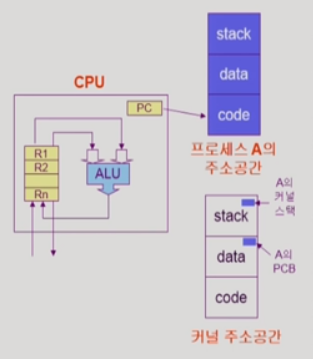
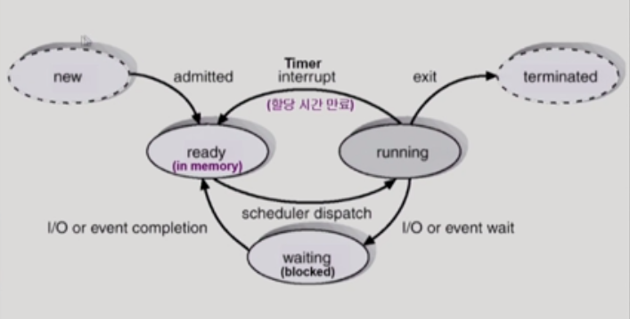
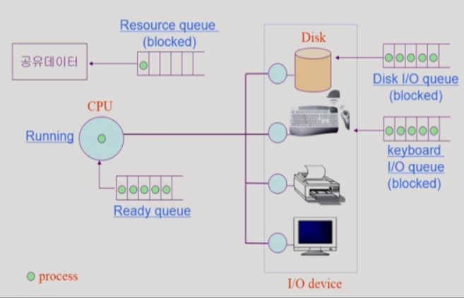
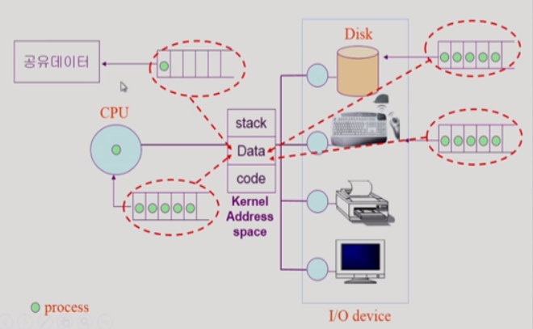
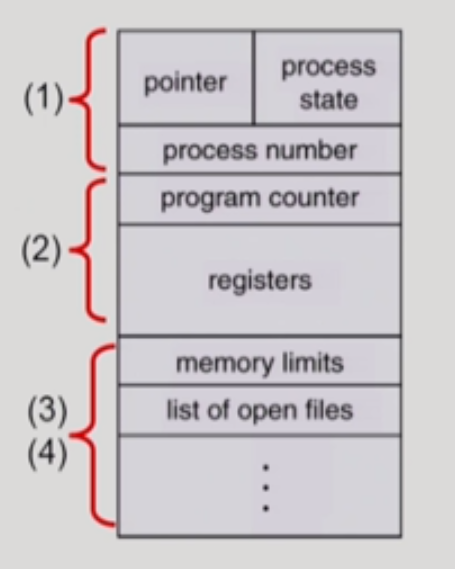
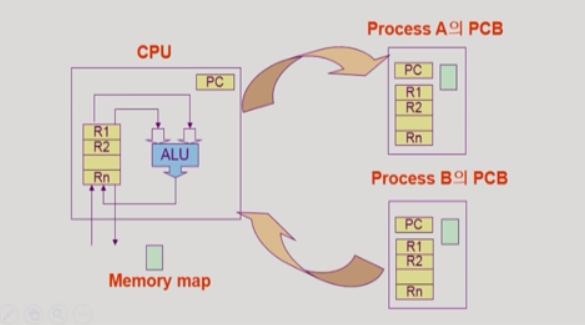
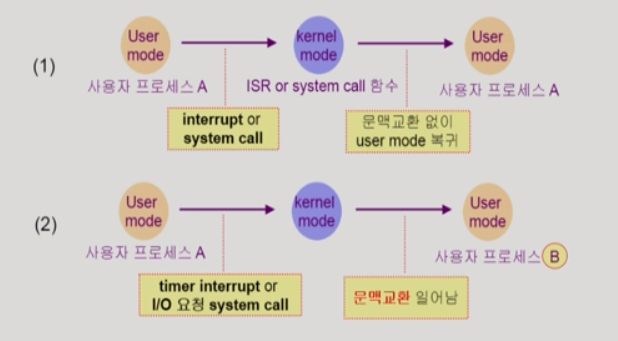
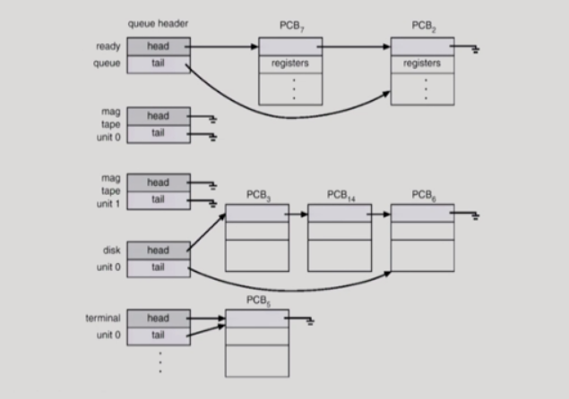
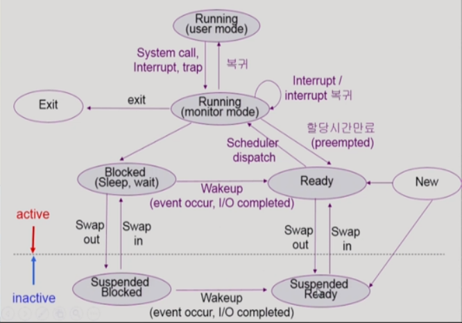

> 반효경 교수님 운영체제 수업(2014)을 듣고 정리한 내용입니다.

 

## Process의 개념

프로세스란 **실행중인 프로그램**이다.

 

 

프로세스와 관련된 중요한 개념으로 **프로세스의 문맥(context)**이란 것이 있다.

프로그램 실행시 Address space가 형성된 후 프로세스가 CPU 제어권을 갖게 되면 CPU는 매 클럭 사이클 마다 Program Counter(PC) 레지스터가 참조하고 있는 Address space의 한 부분(기계어 instruction)을 읽어서 실행한다. (실행 정보를 레지스터(R1, R2, ...)에 대입한 뒤 산술 논리 연산 장치(ALU)에서 연산을 하고, 그 결과를 다시 레지스터에 저장하거나 프로세스의 Address space에 저장)

이러한 과정중 *어느 한 시점의 프로세스의 실행 정보*를 프로세스의 문맥이라고 하며, 다음과 같이 3가지 관점에서 프로그램의 실행 정보들을 담고 있다.

 

1. CPU의 수행 상태를 나타내는 하드웨어 문맥

   - Program Counter가 가리키는 instruction의 위치 → 어디까지 실행했는가
   - 각종 레지스터가 담고 있는 데이터  → 어떤 정보들을 담고 있는가

2. 메모리 관점에서 프로세스의 Address space가 담고 있는 정보

   - code, data, stack

3. 커널 Address space 관점에서 프로세스 관련 커널 자료 구조

   - 실행중인 프로세스의 PCB(Process Control Block) 정보
   - 실행중인 프로세스의 Kernel stack 정보

   > 커널의 코드는 모든 프로세스가 공유하기 때문에 프로세스마다 별도의 kernel stack을 두고 있다. 프로세스의 현재 상태를 규명하기 위해서는 해당 프로세스의 kernel stack 정보가 필요하다.

 

그렇다면 이러한 정보들을 수집해서 프로세스가 특정 시점에 어떤 상태에 있는지 정확하게 알아야 하는 이유는 무엇일까?

현대의 컴퓨터 시스템은 time sharing, multi-tasking 환경이기 때문이다. 즉, 여러개의 프로세스들이 번갈아가면서 실행되면서 CPU 제어권이 프로세스 사이를 오가기 때문에 특정 시점의 프로세스 실행 정보를 백업해놓지 않으면 프로세스를 '이어서' 실행할 수 없다.

 

## 프로세스의 상태 (Process State)

> CPU가 하나밖에 없는 환경을 가정했을 때 CPU 제어권을 가지고 있는 프로세스는 매 순간 하나밖에 존재하지 않는다.

- `Running`

  - CPU 제어권을 가지고 instruction을 수행중인 상태

- `Ready`

  - CPU를 기다리는 상태 (실행을 위한 instruction이 메모리상에 올라와 있어서 CPU 제어권만 있으면 바로 실행할 수 있는 상태)
  - Ready 상태에 있는 프로세스들이 CPU 제어권을 주고 받으면서 instruction을 수행함

- `Blocked (wait, sleep)`

  - CPU 제어권을 주어도 당장 instruction을 수행할 수 없는 상태
  - 프로세스 자신이 요청한 이벤트(e.g. I/O)가 즉시 만족되지 않아 이를 기다리는 상태
  - e.g. 디스크에서 파일을 읽어와야 하는 경우

- New: 프로세스가 생성중인 상태
- Terminated: 수행(execution)이 끝난 상태

Ready queue에 대기하고 있다가 CPU 제어권을 얻어 instruction을 실행한다. 필요에 따라 I/O 작업 또는 공유데이터를 사용하기 위해 blocked 상태로 전환된 뒤 I/O queue 또는 Resource queue에 대기한다. 해당 작업이 끝나면 다시 Ready queue로 복귀한다.

커널이 자신의 data 영역에 queue라는 자료구조를 만들어 놓고 프로세스의 상태를 바꿔가면서 CPU 제어권 분배를 운영한다.

 

## PCB (Process Control Block)

- 운영체제가 각 프로세스를 관리하기 위해 프로세스당 유지하는 정보
- 다음과 같은 요소들로 이루어져 있다. (구조체로 유지)
  1. OS가 관리상 사용하는 정보: Process state, Process ID, scheduling information, priority (Reday queue에서 대기 순서가 아닌 우선순위가 높은 프로세스가 먼저 CPU 제어권을 얻는다.)
  2. CPU 수행 관련 하드웨어 값: Program counter, registers
  3. 메모리 관련: code, data, stack의 위치 정보
  4. 파일 관련: open file descriptors, ...

 

## 문맥 교환 (Context Switch)

- CPU를 한 프로세스에서 다른 프로세스로 넘겨주는 과정을 말한다.
- CPU가 다른 프로세스에게 넘어갈 때 운영체제는 다음의 두 가지를 수행한다.
  - CPU를 내어주는 프로세스의 상태를 그 프로세스의 PCB에 저장
  - CPU를 새롭게 얻는 프로세스의 상태를 PCB에서 읽어옴

> PCB 정보는 메모리상에서 커널의 data 영역에 저장된다.

 

---

:exclamation: system call이나 하드웨어 인터럽트가 발생했을 때 반드시 context switch가 일어나는 것은 아니다.

---

(1) **일반적인 하드웨어 인터럽트**나 **system call**의 경우 context switch 없이 kernel mode에서 user mode로의 전환만 발생한다.

(2) **timer interrupt**(CPU 제어권을 다른 프로세스에 넘기려고 하는 의도를 가진 인터럽트)나 **I/O처리를 위한 system call**(시간이 오래 걸리는 작업이기 때문에 프로세스의 상태를 blocked로 바꾸고 바로 작업 가능한 ready 상태의 다른 프로세스로 CPU 제어권을 옮기는 경우) _context switch가 발생한다._

> (1)의 경우에도 CPU 수행 정보 등 context의 일부를 PCB에 저장해야 하지만 문맥교환을 하는 (2)의 경우 그 부담(overhead)이 훨씬 크다. (e.g. cache memory flush)

 

## 프로세스를 스케줄링 하기 위한 큐

- **Job queue** ─ 현재 시스템 내에 있는 모든 프로세스의 집합
- **Ready queue** ─ 현재 메모리 내에 있으면서 CPU를 잡아서 실행되기를 기다리는 프로세스의 집합
- **Device queues** ─ I/O device의 처리를 기다리는 프로세스의 집합

프로세스들은 각 큐들을 오가며 수행된다.

> 맨 위에 있는 Ready queue와 나머지 device queue들의 자료구조를 나타낸 그림이다. PCB의 포인터를 통해 PCB를 줄세운다.

 

## 스케줄러 (Scheduler)

: 메모리에 올려둘 프로세스의 수를 관리하는 방식

- `Long-term scheduler` (장기 스케줄러 or job scheduler)

  - new 상태인 프로세스 중 어떤 것들을 **ready queue**로 보낼지 결정
  - 프로세스에 **memory 및 각종 자원 분배** 결정
  - **degree of Multiprogramming**을 제어
    > 메모리에 올라가있는 프로세스의 수를 조절한다. 프로그램이 너무 적어도, 너무 많아도 CPU의 성능이 저하된다. 너무 적은 경우에는 CPU가 대기하는 시간이 길어지기 때문.
  - BUT, _현대의 time sharing system에는 보통 장기 스케줄러가 없음 (무조건 ready)_

- `Short-term scheduler` (단기 스케줄러 or CPU scheduler)

  - 어떤 프로세스를 다음에 **running** 시킬지 결정
  - 프로세스에 CPU를 주는 문제
  - 충분히 빨라야 함 (millisecond 단위)

- `Medium-term scheduler` (중기 스케줄러 or Swapper)
  - time sharing system에서는 중기 스케줄러를 통해 **degree of Multiprogramming**을 제어함
  - 여유 공간 마련을 위해 프로세스를 통째로 메모리에서 디스크로 쫓아냄
  - 프로세스에게서 memory를 뺏는 문제

 

요약하면, 장기 스케줄러 방식은 애초에 프로그램에게 메모리를 줄지 말지 결정해서 메모리상의 프로세스의 수를 관리한다. 하지만 현대의 time sharing system은 장기 스케줄러 방식이 아니라 중기 스케줄러 방식을 쓴다. 일단 실행중인 모든 프로그램에 메모리를 주고 우선순위가 떨어지는 프로그램을 디스크로 쫓아낸다.

 

## 프로세스의 상태 (Suspended 상태 포함)

현대의 운영체제에서는 중기 스케줄러에 의해 메모리를 통째로 빼앗긴 프로세스가 존재하고 이러한 상태를 표현하기 위해 `Suspended (stopped)`라는 프로세스 상태가 추가됐다.

따라서 현대의 운영체제는 프로세스의 상태를 다음과 같이 구분한다고 할 수 있다.

- **Running**

  - CPU 제어권을 가지고 instruction을 수행중인 상태

- **Ready**

  - CPU를 기다리는 상태 (메모리 등 다른 조건을 모두 만족)

- **Blocked (wait, sleep)**

  - I/O 등의 event를 (스스로) 기다리는 상태
  - e.g. 디스크에서 파일을 읽어와야 하는 경우

- `Suspended (stopped)`

  - 중기 스케줄러 / 사용자에 의해 프로세스의 수행이 정지된 상태
  - 프로세스는 통째로 디스크에 swap out 된다.
  - e.g. 사용자가 프로그램을 일시 정지 시킨 경우(break key) 시스템이 여러 이유로 프로세스를 잠시 중단시킨다. (메모리에 너무 많은 프로세스가 올라와 있을 때)

> - **Blocked 상태의 프로세스는 자신이 요청한 event가 만족되면 Ready 상태로 전환된다.**
> - **Suspended 상태는 사용자가 프로세스를 재개시켜야 다시 Active한 상태가 된다.**

 

사용자 프로세스의 상태도 

> Running 상태를 프로세스가 user mode에서 자신의 코드를 실행하는 경우와 kernel mode에서 운영체제의 도움을 받는 경우로 나누어서 표현하고 있다. 이때 주의할 점은 Running, Block, Ready 등의 상태는 운영체제의 상태가 아니라 사용자 프로세스의 상태라는 점이다. 운영체제가 Running하는 것이 아니다.

> Suspended 상태에서도 진행중이던 작업이 있었을 경우 작업이 완료되면 Suspended Ready 상태로 전환된다. (Active한 상태로 갈 수 있다는 의미)
