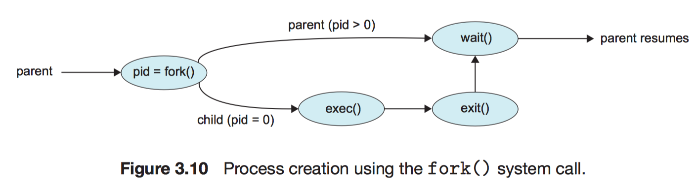
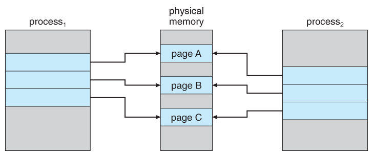
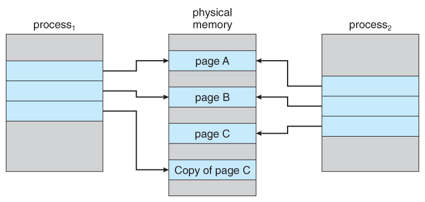

> 반효경 교수님 운영체제 수업(2014)을 듣고 정리한 내용입니다.

<br />

## 1. 프로세스의 생성 (Process Creation)



> 출처: https://walkccc.github.io/CS/OS/Chap03/

<br />

### 운영체제는 부모 프로세스(Parent Process)의 Address space를 '복제'하여 자식 프로세스(Child Process)를 만든다.

- 자식 프로세스에 해당하는 PCB 역시 별도로 생성한다.
- 자식 프로세스는 할당받은 주소공간에 새로운 프로그램을 올린다.

<br />

---

프로세스의 생성은 다음의 두 단계로 진행된다.

- 1단계: `fork` system call ─ 부모 프로세스를 복제해서 자식 프로세스 생성
- 2단계: `exec` system call ─ 자식 프로세스가 주소공간에 새로운 프로그램을 올림

---

→ 두 단계는 서로 '독립적'이다. 즉, 1단계의 fork를 수행하지 않아도 exec을 통해 새로운 프로세스를 생성할 수 있다.<br />
→ system call이라는 단어에서 알 수 있듯이 프로세스의 생성은 사용자 프로그램이 운영체제에 요청을 통해 의해 수행된다. 프로세스를 만들어 달라고 운영체제에 부탁하는 것.

<br />

### 최초의 프로세스 하나부터 시작해서 프로세스의 트리 구조를 형성한다.


> 출처: https://walkccc.github.io/CS/OS/Chap03/

<br />

### 자원을 공유하는 형태

1. 부모와 자식이 모든 자원을 공유하는 모델
2. 일부를 공유하는 모델
3. 전혀 공유하지 않는 모델

<br />

부모 프로세스와 자식 프로세스는 서로 독립적으로 존재하며 CPU 제어권을 두고 경쟁하는 관계이다. 자원을 공유하지 않는 경우가 일반적이다.<br />하지만 리눅스를 비롯한 일부 모델에서는 부모 자식 프로세스가 자원을 공유하다가 부모 또는 자식 프로세스에서 변경사항이 생겼을 때 해당 부분만 복제해서 물리적 메모리에 할당하는 **Copy-on-Write(COW)** 기법을 사용한다. Copy-on-Write는 write가 발생해서 내용이 수정됐을 때 copy를 한다는 의미이다. COW 기법을 사용하면 메모리를 보다 효율적으로 사용할 수 있다.

<br />





> 출처: https://www.cs.uic.edu/~jbell/CourseNotes/OperatingSystems/9_VirtualMemory.html

<br />

### 프로세스의 수행(Execution) 형태

1. 부모와 자식이 공존하며 CPU 제어권을 두고 경쟁하는 모델
2. 자식이 종료(terminate)될 때까지 부모가 기다리는(blocked, wait) 모델

<br />

## 2. 프로세스의 종료 (Process Termination)

- 프로세스가 마지막 명령을 수행한 후 운영체제에게 이를 알려준다.<br />: `exit` system call (자발적 종료)

  - 프로세스의 세상에서는 항상 자식 프로세스가 먼저 종료되며, 자식 프로세스는 종료 시점에 `wait` system call을 통해 부모에게 output data를 전달한다.
  - 프로세스의 각종 자원들이 운영체제에게 반납된다.

<br />

- 다음의 3가지 경우에는 부모 프로세스가 자식 프로세스의 수행을 종료시킨다.<br />: `abort` system call (비자발적 강제 종료)
  1. 자식이 할당 자원의 한계치를 넘어서는 경우
  2. 자식에게 할당된 태스크가 더 이상 필요하지 않은 경우
  3. 부모 프로세스가 먼저 종료(exit)되는 경우
     > - 운영체제는 부모 프로세스가 종료되는 경우 자식 프로세스가 수행되도록 두지 않는다.
     > - 자식이 생성한 모든 자손 프로세스들을 종료시킨다. 트리의 가장 깊은 레벨에 위치한 자손부터 단계적으로 종료시킨 후 맨 마지막에 부모 프로세스를 종료시킨다.

<br />

## 3. 프로세스와 관련된 시스템 콜

(1) fork

(2) exec

(3) wait

(4) exit

<br />

### (1) fork

**fork 시스템 콜은 자식 프로세스를 생성할 때 사용**된다.

아래 코드는 부모 프로세스가 fork 시스템 콜을 통해 프로세스 생성을 요청하는 내용을 담고 있다.

```c
// Parent Process

int main() {
  pid_t pid;
  printf("\n Hello, I am parent!\n");

  /* fork a child process */
  pid = fork();

  if (pid < 0) {
    /* error occurred */
    fprintf(stderr, "Fork Failed");
    return 1;
  } else if (pid == 0) {
    /* child process */
    /* a version of the `exec()` */
    execlp("/bin/ls", "ls", NULL);
  } else {
    /* parent process */
    /* parent will wait for the child to complete */
    wait(NULL);
    printf("Child Complete");
  }
  return 0;
}
```

line 7에서 fork를 호출하면 다음과 같이 부모의 Address space를 그대로 복제한 자식 프로세스가 생성된다. 부모 프로세스는 fork를 호출한 뒤 나머지 코드를 순차적으로 실행해 나간다.

```c
// Child Process

int main() {
  pid_t pid;
  printf("\n Hello, I am parent!\n");

  /* fork a child process */
  pid = fork();

  if (pid < 0) {
    (...)
  }
  return 0;
}
```

자식 프로세스는 부모 프로세스의 문맥을 동일하게 가지고 있기 때문에 main 함수를 처음부터 실행하지 않고 부모의 PC가 가리키고 있던 부분(fork 실행이 종료된 후 그 다음줄)부터 실행을 이어나간다.

따라서 자식 프로세스는 "Hello, I am parent!"를 프린트하거나 fork를 호출해서 또다른 자식 프로세스를 생성하지 않는다.

<br />

#### fork를 통한 프로세스 복제 생성의 이슈와 해결방안

fork를 사용해서 프로세스를 복제 생성할 경우 아래 두 가지 이슈가 발생할 수 있다.

1. 복제본이 원본 역할을 하려는 경우
2. 부모/자식 프로세스의 flow control

운영체제는 이러한 이슈들을 부모와 자식의 pid 즉 fork의 리턴값을 다르게 줘서 해결한다.

**pid (Process Identifier)**는 각각의 프로세스를 구별하는 고유한 정수(integer)값으로, 부모 프로세스는 pid가 양수이지만(pid > 0) 자식 프로세스는 0이다(pid === 0). 운영체제는 pid를 통해 부모/자식을 구분하고 프로세스의 실행 흐름을 제어할 수 있다.

```c
int main() {
  (...)

  if (pid < 0) {
    /* error occurred */
    (...)
  } else if (pid == 0) {
    /* child process */
    (...)
  } else {
    /* parent process */
    (...)
  }

  (...)
}
```

<br />

### (2) exec

**exec는 기존 코드를 새로운 코드로 덮어쓸 때 사용**된다.

exec 시스템 콜과 fork 시스템 콜은 독립적이기 때문에 반드시 fork를 해야만 exec을 할 수 있는건 아니다. 또한 자식 프로세스 뿐만 아니라 부모 프로세스 역시 exec을 사용할수 있다.

중요한건 exec을 한 번 실행하면 되돌릴 수 없다는 점이다. exec을 실행해서 코드를 새롭게 덮어쓰게 되면 새로운 코드의 실행이 끝난 뒤 덮어쓰기 전의 기존 코드로 돌아오는게 아니라 프로세스가 아예 종료된다. 따라서 기존 코드의 `execlp()`(= exec 실행 함수) 이후의 코드는 실행 할 수 없다.

```c
int main() {
  printf("Hello!");
  execlp("echo", "echo", "3", (char *)0);
  printf("Can't execute me");
}
```

위 소스 코드의 출력결과는 다음과 같다.

```
Hello
3
```

<br />

### (3) wait

프로세스는 항상 자식 프로세스가 부모 프로세스보다 먼저 종료된다고 했었다. **wait 시스템 콜은 자식 프로세스가 종료될 때 까지 기다릴 때 사용**된다.

```c
// Parent Process

int main() {
  (...)

  pid = fork();

  if (pid < 0) {
    /* error occurred */
    (...)
  } else if (pid == 0) {
    /* child process */
    (...)
  } else {
    /* parent process */
    wait(NULL);
    printf("Child Complete");
  }
  (...)
}
```

프로세스 A가 wait 시스템 콜을 호출하면 커널은 자식 프로세스가 종료될 때 까지 해당 프로세스 A를 blocked 상태로 sleep 시키고 자식 프로세스가 종료되면 다시 프로세스 A를 깨워서 ready 상태로 만든다.

<br />

### (4) exit

**exit 시스템 콜은 프로세스를 종료할 때 사용**되며 아래 소스 코드와 같이 프로그램 내에서 명시적으로 호출할 수도 있고, 컴파일러가 알아서 필요한 시점에 (e.g. 코드 실행 종료 시점)에 호출하기도 한다.

> execlp와 마찬가지로 exit 실행 이후의 코드는 실행 할 수 없다.

```c
int main() {
  (...)

  exit();
  printf("Can't execute me");

  (...)
  /* exit() 호출 */
}
```

프로세스의 종료는 다음과 같이 자발적/비자발적으로 나눌 수 있다.

#### 자발적 종료

- 마지막 statement 수행 후 exit 시스템 콜을 실행하는 경우
- 프로그램에 명시적으로 넣어주지 않아도 main 함수가 리턴되는 위치에 컴파일러가 넣어줌

#### 비자발적 종료

- 부모 프로세스가 자식 프로세스를 강제 종료시키는 경우

  - 자식 프로세스가 한계치를 넘어서는 자원을 요청하는 경우
  - 자식에게 할당된 프로세스가 더 이상 필요하지 않은 경우

- 키보드로 kill, break 등을 친 경우

  - e.g. 프로그램 닫기 버튼 클릭

- 부모 프로세스가 종료되는 경우
  - 부모 프로세스가 종료되기 전에 자식들이 먼저 종료됨

<br />

## 4. 프로세스 간 협력

원칙적으로 프로세스는 각자의 주소공간을 가지고 수행되므로 하나의 프로세스가 다른 프로세스의 수행에 영향을 미치지 못하지만(= 독립적 프로세스, Independent process)<br />협력 메커니즘을 통해 하나의 프로세스가 다른 프로세스의 수행에 영향을 미칠 수 있다.(= 협력 프로세스, Cooperating process)

<br />

### 프로세스 간 협력 메커니즘 (IPC: Interprocess Communication)


> 출처: https://www.geeksforgeeks.org/inter-process-communication-ipc/

1. `shared memory`

   - 서로 다른 프로세스 간에 일부 주소공간을 공유
   - shared memory를 mapping할때만 시스템콜 날림 → **faster**

   > :eyes: 스레드는 사실상 하나의 프로세스이므로 프로세스 간 협력으로 보기는 어렵지만, 동일한 프로세스를 구성하는 스레드들 간에는 주소공간을 공유하므로 협력이 가능함

<br />

2. `message passing`

   - 프로세스 사이에 공유 변수(shared variable)을 일체 사용하지 않고 커널을 통해 통신하는 방법
   - 메시지를 보낼 때마다 시스템콜을 날림 → **slower**
   - 통신하려는 프로세스의 이름을 명시적으로 표시하는지 여부에 따라 direct / indirect로 구분

{' '}

<br />

**Direct Communication** ─ 통신하려는 프로세스의 이름을 명시적으로 표시


{' '}

<br />

**Indirect Communication** ─ mailbox(또는 port)를 통해 메시지를 간접적으로 전달

메시지를 메일박스에 넣어놓기만 하고 어떤 프로세스가 받을지는 명시하지 않음 (아무나 받아라)
