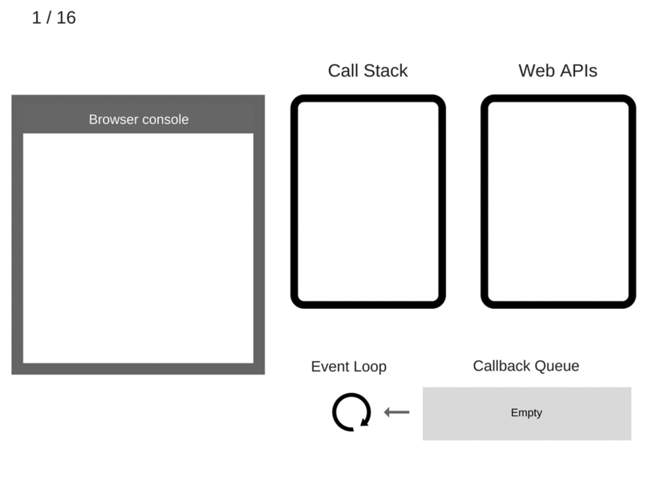

## ☝️ One thing at a time

자바스크립트의 대표적인 특징들 중 하나는 `single-thread` 기반의 언어라는 점이다. 즉, 하나의 [콜 스택](https://reese-dev.netlify.com/javascript/execution-context/#13-%EC%8B%A4%ED%96%89-%EC%BB%A8%ED%85%8D%EC%8A%A4%ED%8A%B8%EC%9D%98-%EC%8B%A4%ED%96%89-%ED%9D%90%EB%A6%84)을 사용한다는 것과 같은 맥락이다. 그리고 자바스크립트는 `Run-to-Completion`이라는 특징도 가지고 있다. 하나의 함수가 실행되면 일단 해당 함수의 실행이 끝나야만 다음 함수를 실행할 수 있다.

```
one thread == one call stack == one thing at a time
```

이렇게 single-thread 기반 + Run-to-Completion 조합으로 인해 자바스크립트는 동시에 하나의 작업만 처리한다. 즉, 자바스크립트 **엔진**이 자바스크립트 코드를 한 번에 하나씩 처리한다.

<br />


> [출처](https://blog.sessionstack.com/how-does-javascript-actually-work-part-1-b0bacc073cf?gi=df13d15d6fae)

프로그램 실행 후 종료될때까지 콜 스택의 단계적인 모습이다. 함수(또는 실행 컨텍스트)가 하나씩, 순차적으로 추가-실행-종료-제거된다. 그러니 만약 스택 안에 처리 시간이 긴 작업이 들어오더라도 그 작업이 완료될 때 까지 다음 작업을 할 수 없을테고, 프로그램이 Blocking되는 문제가 생길 것 같다. (파일 다운로드가 완료될 때 까지 버튼이나 스크롤바가 동작하지 않는다던가 하는)

<br />

그런데 이상하다. 브라우저에서는 스크롤바를 아래로 내리는 동시에 콘텐츠 리스트를 갱신할 수도 있고(onscroll 이벤트 + AJAX 요청), 화려한 애니메이션이 동작하는 웹사이트 안에서 키보드 입력을 통해 로그인도 할 수 있지 않나? (화면 렌더링 + HTTP 요청)

<br />

여러가지 작업들이 동시에 처리되고 있는것 같은데.. 한 번에 하나씩만 처리한다면서 어떻게 이런 일이 가능한걸까? 다시 말해, 어떻게 비동기적으로 작업을 처리하고 동시성(Concurrency)을 구현할 수 있는걸까?

> `동시성(Concurrency)`<br />하나의 작업자가 여러 개의 작업을 번갈아가며 수행할 수 있도록 만드는 것. 동시성을 확보하면 작업 순서와 상관없이 각 작업이 완료되지 않았더라도 필요에 따라 번갈아 가며 작업을 수행함으로써 전체 작업 수행 속도를 향상시킬 수 있다.

<br />

## 🔄 Event Loop

앞에서 얘기한 것 처럼 자바스크립트 엔진은 하나의 콜 스택을 사용해서 들어오는 요청을 순서대로, 하나씩 처리한다. 비동기니 동시성이니 하는 '시간'에 대한 개념이 없이 자바스크립트 코드 조각들을 시시각각 주는 대로 받아서 처리하는 실행기처럼 보인다.

하지만 **엔진은 '이벤트 루프'를 제어함으로써 자신이 가지고 있는 콜 스택과 브라우저의 구동환경을 연동하고 자바스크립트 코드의 실행을 스케줄링 한다. 이벤트 루프를 통해 비동기나 동시성을 구현하는 셈이다.**

<br />


[출처](https://velog.io/@th0566/2020-01-30-1501-%EC%9E%91%EC%84%B1%EB%90%A8-bkk60d2t2b)

<br />

브라우저 내부에서 자바스크립트 코드가 비동기적으로 실행되는 흐름을 나타낸 그림이다. 이벤트 루프의 역할은 간단하다. **콜 스택과 콜백 큐를 실시간으로 확인하면서 콜 스택이 비는대로 콜백 큐에 대기하고 있던 작업들을 콜 스택에 넣는 거다.**

<br />

## ⏰ Event Loop & Asynchronous event handling

그렇다면 이벤트 루프를 통한 비동기 작업은 어떻게 이루어질까? 예제 코드를 하나 보자.

```js
console.log('Hi')

setTimeout(function () {
  console.log('callback')
}, 0)

console.log('Bye')
```

<br />

이 코드가 브라우저 내부에서 실행되는 흐름을 보면 다음과 같다.

<br />



[출처](https://blog.sessionstack.com/how-javascript-works-event-loop-and-the-rise-of-async-programming-5-ways-to-better-coding-with-2f077c4438b5)

<br />

여기서 비동기 작업인 `setTimeout`이 실행되는 과정을 보면

1. `setTimeout`과 같은 비동기 Web API는 콜 스택에서 실행된 직후 브라우저 내부의 별도의 스레드로 콜백을 넘긴다.
2. 작업이 완료되면(setTimeout의 경우 타이머가 만료되면) 콜백 함수는 콜백 큐에 추가된다.
3. 이벤트 루프는 콜 스택이 비어 있을 경우 콜백 큐의 첫 번째 작업을 꺼내서 콜 스택에 넣어준다.
4. 엔진은 이벤트 루프가 넣어준 콜백 작업을 실행한다.

<br />

```js
const data = [1, 2, 3]

const async = (arr, cb) => {
  arr.forEach((v, i) => {
    setTimeout(() => {
      setTimeout(() => {
        console.log('inside')
        cb(i)
      }, 0)
      console.log('outside')
    }, 0)
  })
}

async(data, (i) => console.log(i))
```

그렇다면 위 코드의 출력 결과는 어떨까?

> hint ─ setTimeout에 설정해둔 시간이 0ms 이더라도 콜 스택이 비어 있지 않는 이상 실행되지 않고 콜백 큐에서 대기하게 된다.

<br />

## 🤼‍♀️ Event Loop & Concurrency

이번에는 동시성을 구현하는 관점에서 이벤트 루프를 살펴보자. 맨 처음에 언급했던 스크롤링 이벤트에 따른 콘텐츠 업데이트를 예로 들면, 일정 시간(약 2-3초) 동안 사용자의 스크롤링에 따른 각 프로세스의 작업 목록을 다음과 같이 나타낼 수 있을 거다.

<br />

프로세스 1 ─ onscroll 이벤트

```
onscroll, request 1
onscroll, request 2
onscroll, request 3
onscroll, request 4
onscroll, request 5
onscroll, request 6
onscroll, request 7
```

<br />

프로세스 2 ─ AJAX 응답 이벤트

```
response 1
response 2
response 3
response 4
response 5
```

<br />

각각의 블럭은 Web API처리를 담당하는 thread이고 그 안에 태스크들이 쌓여있다고 보면 된다. 프로세스 1과 프로세스 2는 각각 다른 스레드에서 처리되기 때문에 어느 한 시점에는 _동시에_ 처리되기도 한다.

```
onscroll, request 1
onscroll, request 2   response 1
onscroll, request 3   response 2
response 3
onscroll, request 4
onscroll, request 5   response 4
onscroll, request 6
onscroll, request 7
response 5
```

하지만 이벤트 루프는 한 번에 하나의 작업만 처리할 수 있다.

결국은 어느 하나가 먼저 콜백 큐에 들어오고 이벤트 루프에 의해 먼저 실행될 수 밖에 없다.

> 이때 어떤 태스크가 먼저 처리될지는 프로세스간의 상호작용을 조정해서 결정할 수 있는데, 이야기가 너무 길어지니까 나중에 다시 찾아보기로 한다.

```
onscroll, request 1   ---> 프로세스 1 시작
onscroll, request 2
response 1            ---> 프로세스 2 시작
onscroll, request 3
response 2
response 3
onscroll, request 4
onscroll, request 5
response 4
onscroll, request 6
onscroll, request 7   ---> 프로세스 1 종료
response 5            ---> 프로세스 2 종료
```

<br />

## 👀 Conclusion

이번 학습을 통해 브라우저 내부에서 비동기적인 자바스크립트 코드가 어떻게 처리되는지, 그리고 동시성 구현은 어떻게 하는건지에 대해 조금이나마 감을 잡은 것 같다. 앞으로는 코드를 많이 접해보면서 어떤 식으로 동작할지 생각해보고 구현해보는 연습을 해보면 좋을듯 싶다. 그리고 동기/비동기, 블로킹/논블로킹, promise 같이 이번 학습과정에서 마주쳤던 중요 개념들에 대해서도 공부해봐야지!

<br />

---

#### 추가로 학습해볼 키워드들

- [Blocking-NonBlocking-Synchronous-Asynchronous](https://homoefficio.github.io/2017/02/19/Blocking-NonBlocking-Synchronous-Asynchronous/)
- promise
- micro task queue
- job queue
- rendering queue
- concurrency vs parallelism

<br />

---

#### Reference

- [What the heck is the event loop anyway?](https://www.youtube.com/watch?v=8aGhZQkoFbQ)
- [자바스크립트와 이벤트 루프](https://meetup.toast.com/posts/89)
- [How does the Event Loop works in JavaScript?](https://geekflare.com/javascript-event-loops/)
- [Concurrency Model and Event Loop](https://guide.freecodecamp.org/javascript/concurrency-model-and-event-loop/)
- You Don't Know JS (비동기와 성능)
- [자바스크립트는 어떻게 작동하는가: 이벤트 루프와 비동기 프로그래밍의 부상, async/await을 이용한 코딩 팁 다섯 가지](https://engineering.huiseoul.com/%EC%9E%90%EB%B0%94%EC%8A%A4%ED%81%AC%EB%A6%BD%ED%8A%B8%EB%8A%94-%EC%96%B4%EB%96%BB%EA%B2%8C-%EC%9E%91%EB%8F%99%ED%95%98%EB%8A%94%EA%B0%80-%EC%9D%B4%EB%B2%A4%ED%8A%B8-%EB%A3%A8%ED%94%84%EC%99%80-%EB%B9%84%EB%8F%99%EA%B8%B0-%ED%94%84%EB%A1%9C%EA%B7%B8%EB%9E%98%EB%B0%8D%EC%9D%98-%EB%B6%80%EC%83%81-async-await%EC%9D%84-%EC%9D%B4%EC%9A%A9%ED%95%9C-%EC%BD%94%EB%94%A9-%ED%8C%81-%EB%8B%A4%EC%84%AF-%EA%B0%80%EC%A7%80-df65ffb4e7e)
