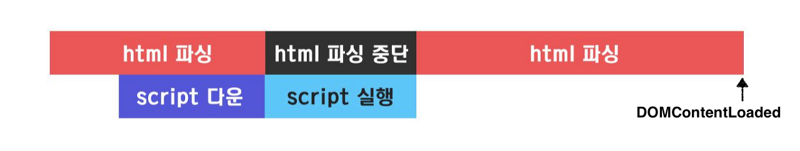
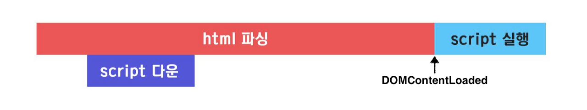

# 렌더링이란

HTML, CSS, 자바스크립트로 작성된 문서를 파싱하여 브라우저에 시각적으로 출력하는 것

> **파싱(parsing)**
>
> 프로그래밍 언어로 작성된 문서를 (1) 어휘 분석(lexical analysis)을 통해 token으로 분해하고 (2) 구문 분석(syntax analysis)을 통해 문법적 의미와 구조를 반영하여 트리 구조의 자료구조인 파스트리(parse tree / sysntax tree)를 생성하는 일련의 과정

# 렌더링 과정 (Critical Rendering Path, CRP)


1. 브라우저는 HTML, CSS, 자바스크립트, 이미지, 폰트 파일등 렌더링에 필요한 리소스를 요청하고 서버로부터 응답받는다.
2. 브라우저의 렌더링 엔진은 HTML과 CSS를 파싱하여 각각 DOM과 CSSOM을 생성한다.\
   ㅤ⎯ **무엇을, 어떻게 그릴지 결정**\
   ㅤ⎯ 바이트코드 → 문자 → 토큰 → 노드 → DOM / CSSOM
3. 브라우저의 렌더링 엔진은 DOM과 CSSOM을 결합하여 렌더 트리를 생성한다. (**Attachment**)\
   ㅤ⎯ **화면에 그려질 것만 결정**\
   ㅤ⎯ 렌더링되지 않는 노드(`<meta>`, `<script>` 태그 등), CSS에 의해 표시되지 않는 노드(`display: none`)는 포함 X
4. 브라우저의 자바스크립트 엔진은 자바스크립트를 파싱하여 AST(Abstract Syntax Tree, 추상 구문 트리)를 생성하고 바이트코드로 변환하여 실행한다.
   - 이때 자바스크립트는 DOM 또는 CSSOM을 변경할 수 있다. 변경된 DOM과 CSSOM은 다시 렌더 트리로 결합된다.
5. 렌더 트리를 기반으로 요소(노드)의 위치와 크기를 계산한다. (**Layout**)
6. 개별 요소(노드)를 픽셀로 변환하여 화면에 표시한다. (**Paint**, **Rasterize**)
7. `Layout` 과정에서 Render Layer가 2개 이상 생성되면 각각의 Layer를 Painting 한 뒤 하나의 이미지로 조합한다. (**Composite**)

# 렌더링 성능 개선하기

## 자바스크립트 파싱에 의한 HTML 파싱 중단 막기

자바스크립트의 파싱과 실행은 렌더링 엔진이 아닌 자바스크립트 엔진이 담당한다. 렌더링 엔진은 HTML을 한 줄씩 순차적으로 파싱하여 DOM, CSSOM을 생성하다가 script 태그를 만나면 자바스크립트 엔진에게 제어권을 넘긴다.

### 문제

1. 자바스크립트 엔진이 자바스크립트를 파싱하고 실행하는 동안 HTML 파싱이 블로킹되어 DOM/CSSOM 생성이 지연될 수 있다.
2. DOM/CSSOM이 완성되지 않은 상태에서 자바스크립트 코드가 이들을 변경할 경우 에러가 발생할 수 있다.

### 해결방법 1 - script 태그 위치 조정

이러한 문제들을 예방하기 위해 **script 태그를 body 요소의 가장 아래에 위치**시키는 것이 좋다.

1. 자바스크립트 로딩/파싱/실행으로 인해 DOM/CSSOM 생성이지 지연되는 일이 발생하지 않아 페이지 로딩 시간이 단축된다.
2. DOM/CSSOM이 완성되지 않은 상태에서 자바스크립트가 이들을 조작하는 경우가 발생하지 않는다.

### 해결방법 2 - async / defer

`async` / `defer` 어트리뷰트를 사용하면 **자바스크립트를 비동기적으로 로드하면서 DOM/CSSOM 생성을 동시에 진행할 수 있다**. 둘의 차이점은 **자바스크립트의 실행 시점이 다르다**는 점이다.

- `async` / `defer`는 `src` 어트리뷰트를 통해 외부 자바스크립트 파일을 로드하는 경우에만 사용할 수 있다. (인라인 자바스크립트에는 사용 불가)

#### [async](https://developer.mozilla.org/en-US/docs/Web/HTML/Element/script#attr-async)

```html
<script async src="main.js"></script>
```



- 자바스크립트 파일 로드가 완료된 직후 파싱, 실행이 진행되어 HTML 파싱이 중단된다. 이 경우 앞서 언급한 문제들이 그대로 발생할 수 있다.
- 여러 개의 script 태그에 async 어트리뷰트를 지정하면 태그의 순서와 상관없이 먼저 로드된 자바스크립트가 먼저 실행되므로 순서가 보장되지 않는다. 따라서 script의 실행 순서를 보장해야 할 경우 사용하면 안된다.

#### [defer](https://developer.mozilla.org/en-US/docs/Web/HTML/Element/script#attr-defer)

```html
<script defer src="main.js"></script>
```



- 자바스크립트 파일 로드가 완료되더라도 파싱, 실행은 HTML 파싱이 완료된 직후에 한다.
- DOMContentLoaded 이벤트는 자바스크립트 파싱이 완료될때까지 발생하지 않는다.
- 여러 개의 script 태그에 defer 어트리뷰트를 지정하면 태그의 순서대로 실행된다. DOM 생성이 완료된 이후 순차적으로 실행되어야 할 자바스크립트에 유용하다.

## Reflow, Repaint 발생빈도 최소화하기

### Reflow


- Layout 계산을 다시 하는 것을 의미한다.
- JS/CSS → Layout → Paint → Composite
- 노드 추가/삭제, 요소의 크기/위치 변경, 위도우 리사이징 등 레이아웃에 영향을 주는 변경이 발생한 경우 실행된다.
- Reflow를 발생시키는 CSS 속성 : `width`, `height`, `line-height`, `margin`, `padding`, `border`, `display`, `position`, `top`, `right`, `bottom`, `left`, `vertical-align`, `text-align`, `font-weight`, `white-space`, `border-width`, `overflow(-x/y)`, `float`

### Repaint


- 재결합된 렌더 트리를 기반으로 다시 Paint 하는 것을 의미한다.
- JS/CSS → Paint → Composite
- 페이지의 레이아웃에 영향을 주지 않는 배경 이미지, 텍스트 색상, 그림자 등 _paint only_ 속성 변경시 실행된다.
- Repaint를 발생시키는 CSS 속성 : `visibility`, `text-decoration`,`background(-image/position/repeat/size)`, `outline(-color/style/width)`, `border-radius`, `box-shadow`

> `opacity`의 경우 값이 0과 1 미만을 오갈 경우 Repaint 발생 / 값이 0과 1을 오갈 경우 Reflow 발생

Reflow, Repaint는 CPU 연산 비용이 크기 때문에 빈번하게 발생할 경우 렌더링 성능을 저하시키는 요인이 될 수 있으니 부드러운 애니메이션을 구현하려면 Reflow, Repaint의 발생 빈도를 최소화 하는게 좋다.

### 해결방법 1 - GPU가속을 이용하는 속성 사용

`transform` 같이 GPU가속을 이용하는 속성 사용시 Reflow, Repaint 없이 Composite 단계만 수행할 수 있다.


### 해결방법 2 - will-change 속성 사용

`will-change` 또는 `translateZ` 속성은 미래에 변경이 발생할 속성에 관해 브라우저에 힌트를 주는 역할을 한다. 미리 힌트를 주면 브라우저가 해당 변경을 위한 작업을 사전에 최적화하여 실제 변경이 발생할 때 더 빠르게 업데이트할 수 있고 더 효율적인 방법으로 GPU에 레이어를 생성할 수 있다.

```css
.moving-element {
  will-change: transform;
}

/**
* for older browsers
*/
.moving-element {
  transform: translateZ(0);
}
```

Deep-dive

- [Stick to Compositor-Only Properties and Manage Layer Count](https://web.dev/stick-to-compositor-only-properties-and-manage-layer-count/)
- [하드웨어 가속에 대한 이해와 적용](https://d2.naver.com/helloworld/2061385)

### requestAnimationFrame (rAF)

브라우저는 보통 60FPS(Frame Per Second)를 지원한다. 그런데 `setTimeout`/`setInterval`을 사용하여 애니메이션을 구현하는 경우 브라우저의 프레임 생성 간격(1초당 60 프레임 생성)과 `setTimeout`/`setInterval`의 콜백 실행 타이밍이 맞지 않아 애니메이션 끊김 현상이 발생하기 쉽다.

> 자바스크립트 엔진은 싱글 스레드 방식으로 동작하고 이벤트 루프 기반으로 동시성을 지원한다. 여기서 이벤트 루프 자체는 동기적으로 태스크를 처리하기 때문에 콜백이 원하는 시점에 실행되지 않을 수 있다.


따라서 위 이미지처럼 콜백 실행(애니메이션)이 완료되지 않은 상태에서 프레임이 바뀌면 Reflow/Repaint가 일어나면서 이전에 수행중이던 애니메이션이 중간에 끊어지고 새로운 애니메이션이 시작되는 프레임 유실이 발생한다.

rAF는 브라우저가 다음 렌더링을 할 준비가 됐을때 렌더링을 할 수 있도록 최적화 해주는 API다. 애니메이션을 수행하는 콜백을 인자로 받고 적절한 타이밍에 실행시킴으로써 프레임 누락 없이 부드러운 애니메이션을 구현할 수 있게 해준다.

## 리소스 로딩 속도 개선하기

### [preload](https://www.patterns.dev/posts/preload/)

preload 어트리뷰트는 브라우저에게 먼저 로드되어야 하는 리소스에 대한 힌트를 준다. 렌더링에 중요한 리소스들을 빠르게 로드할 수 있다.

```html
<head>
  ...
  <link rel="preload" href="emoji-picker.js" as="script" />
  <link rel="preload" href="styles.css" as="style" />
  <link rel="preload" href="ui.js" as="script" />
  ...
</head>
<body>
  ...
  <script src="stickers.js" defer></script>
  <script src="video-sharing.js" defer></script>
  <script src="emoji-picker.js" defer></script>
</body>
```

preload는 인터랙션 코드가 포함된 번들을 빠르게 로드하여 TTI(Time To Interactive)나 FID(First Input Delay)를 최적화 할 때 유용하다.

> **[Web Vitals](https://web.dev/vitals/)**
>
> <br />
> Chrome 팀에서 정의한 웹페이지 성능 지표
>
> - [First Contentful Paint(FCP)](https://web.dev/fcp/) ⎯ 페이지가 로드되기 시작한 시점부터 페이지 콘텐츠의 일부가 화면에 렌더링될 때까지의 시간을 측정
> - [Largest contentful paint(LCP)](https://web.dev/lcp/) ⎯ 페이지가 로드되기 시작한 시점부터 가장 큰 텍스트 블록 또는 이미지 요소가 화면에 렌더링될 때까지의 시간을 측정
> - [First input delay(FID)](https://web.dev/fid/) ⎯ 사용자가 링크를 클릭하거나, 버튼을 탭하거나, 사용자 지정 JavaScript 기반 컨트롤을 사용하는 등 처음으로 상호 작용할 때부터 해당 상호 작용에 대한 응답으로 브라우저가 실제로 이벤트 핸들러 처리를 시작하기까지의 시간을 측정
> - [Time to Interactive(TTI)](https://web.dev/tti/) ⎯ 페이지가 로드되기 시작한 시점부터 시각적으로 렌더링되고, 있는 경우 초기 스크립트가 로드되고, 사용자 입력에 신속하게 안정적으로 응답할 수 있는 시점까지의 시간을 측정
> - [Total blocking time(TBT)](https://web.dev/tbt/) ⎯ 메인 스레드가 입력 응답을 막을 만큼 오래 차단되었을 때 FCP와 TTI 사이 총 시간을 측정
> - [Cumulative layout shift(CLS)](https://web.dev/cls/) ⎯ 페이지 로드가 시작될 때와 해당 수명 주기 상태가 숨김으로 변경될 때 사이에 발생하는 모든 예기치 않은 레이아웃 이동의 누적 점수를 측정

주의할 점

1. 우선순위가 높아진 스크립트 때문에 이미지나 폰트 등의 리소스를 늦게 로드하여 FCP(First Contentful Paint), LCP(Largest Contentful Paint)가 늦어지지 않도록 해야 한다.
2. `as` 속성을 사용하여 브라우저에게 해당 리소스의 유형을 알려줘야 한다. 올바른 유형이 아닐 경우 브라우저는 리소스를 사용하지 않는다.
3. 해당 속성을 적용한 리소스는 반드시 가져오기 때문에 중복해서 요청하게 되면 네트워크 자원을 낭비할 수 있다.

### [prefetch](https://www.patterns.dev/posts/prefetch/)

곧 사용될 지 모르는 리소스들을 미리 로드하고 캐시하는 방법이다.

```html
<link rel="prefetch" href="emoji-picker.bundle.js" as="script" />
<link rel="prefetch" href="vendors~emoji-picker.bundle.js" as="script" />
```

prefetch로 지정된 모듈은 초기 번들에서 제외되기 때문에 앱의 로딩 타임을 감소시키고. 사용자에게 더 나은 UX를 제공한다.

주의할 점은 사용자가 prefetch된 리소스를 사용하지 않을 경우 불필요한 메모리 사용으로 앱이 느려질 수 있다. 꼭 필요한 리소스에만 prefetch를 적용하자.

### [preconnect](https://developer.mozilla.org/en-US/docs/Web/HTML/Link_types/preconnect)

외부 도메인에서 리소스를 가져올 가능성이 높다는 것을 암시한다. 브라우저가 해당 도메인과 미리 커넥션을 시작하여 리소스를 빠르게 로드할 수 있게 해준다.

```html
<link rel="preconnect" href="example.com" />
```

[[Reference]](https://beomy.github.io/tech/browser/preload-preconnect-prefetch/)
