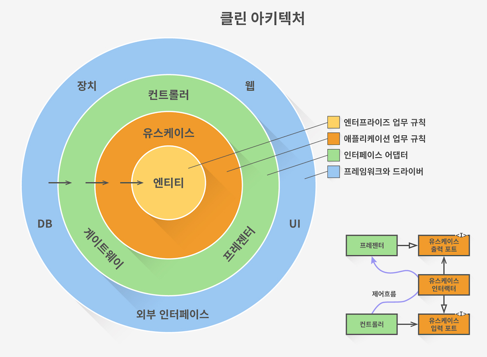
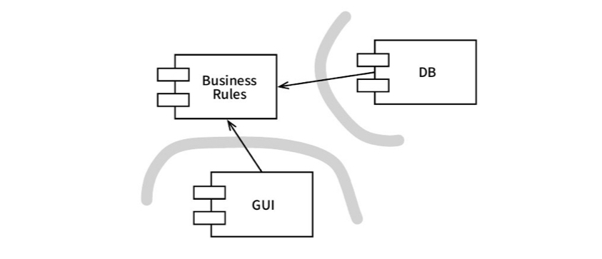
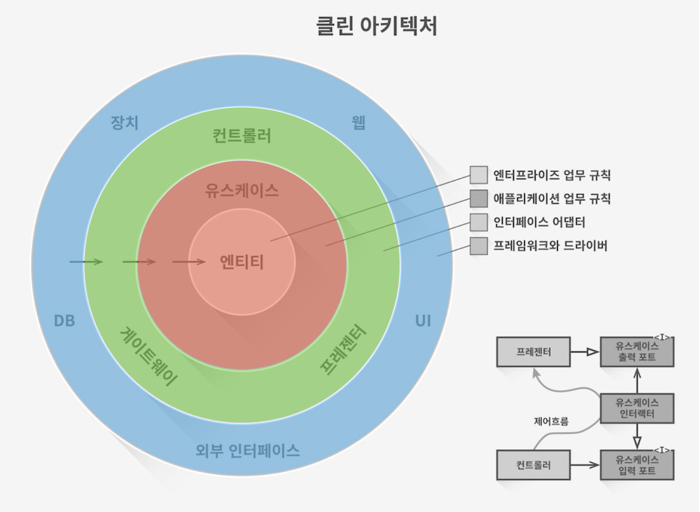
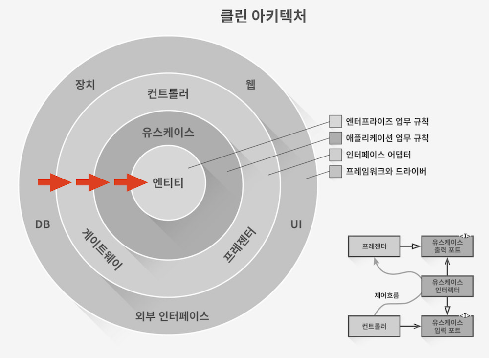

이전에 다니던 회사에서 레거시 프로젝트들을 유지보수하면서 '프로젝트의 구조를 어떻게 설계해야 변경에 유연하게 대응할 수 있을까?'라는 고민을 한 적이 있다. 자연스럽게 클린 아키텍처에 관심을 가지게 되었고 설레는 마음으로 책까지 구매했었더랬다. 하지만 예상보다 많은 분량과 쉽사리 이해되지 않는 내용 때문에 얼마 지나지 않아 책 읽기를 게을리하게 됐고, 그 여파로 클린 아키텍처에 대한 흥미마저 잃어 공부까지 무한정 미루게 되었다.

그러다가 최근 사이드 프로젝트를 시작하면서 코드 구조에 대해 고민하다가 다시 클린 아키텍처가 떠올랐다. 그리고 이번에야말로 클린 아키텍처의 개념을 이해하고 실제로 활용해볼 절호의 기회라는 생각이 들었다. 이 글을 통해 '내가 이해한' 클린 아키텍처가 무엇인지 정리해 보려고 한다.

# 클린 아키텍처란?

클린 아키텍처(Clean Architecture)란, 소프트웨어 개발 장인이자 클린 코드의 저자이기도 한 로버트 마틴이 제안한 개념으로, 끊임없이 변화하는 요구사항에 맞춰 **쉽게 변경할 수 있는 소프트웨어를 개발하기 위해 지켜야할 설계 원칙**을 말한다. 여기서 쉽게 변경할 수 있다는 건 쉽게 이해하고, 쉽게 개발하며, 쉽게 유지보수하고, 쉽게 배포할 수 있다는 뜻으로, **시스템의 수명을 유지하는 데 들어가는 비용을 최소화하고 프로그래머의 생산성을 극대화**하는 것이 클린 아키텍처의 궁극적인 목적이라고 할 수 있다.

클린 아키텍처의 모습은 로버트 마틴이 자신의 [블로그](https://blog.cleancoder.com/uncle-bob/2012/08/13/the-clean-architecture.html)에 올린 이미지로 나타낼 수 있다. 여기서 핵심은 과녁을 연상시키는 동심원들과 가장 안쪽을 향하고 있는 화살표의 방향이다. 바로 **시스템을 경계로 나누는 것**(동심원)과 **의존성 원칙을 지키는 것**(화살표의 방향)이다.

<Caption value="클린 아키텍처" />

# 핵심 1. 경계 나누기

경계를 나눈다는 건 무엇일까? 이를 이해하기 위해선 소프트웨어 시스템을 **정책**(policy)과 **세부사항**(detail)이라는 두 가지 구성요소로 분해해서 바라보는 관점이 필요하다.

정책은 우리가 흔히 말하는 비즈니스 로직 또는 도메인 로직으로, 사업적으로 수익을 창출하거나 비용을 줄일 수 있는 규칙이나 절차를 의미한다. 컴퓨터 프로그램이 아닌 사람이 직접 하더라도 전혀 관계가 없다. 예를 들어 *대출에 N%의 이자를 부과한다*는 사실은 은행이 돈을 버는 업무 규칙이다. 이자를 계산하는 로직은 프로그램으로 자동화하든 사람이 직접 수행하든 전혀 상관이 없다. 정책은 시스템의 본질을 이루는 규칙이기에 쉽게 변하지 않는다.

한편 세부사항은 사용자, 외부 시스템, 프로그래머가 정책과 소통할 때 필요한 요소들을 말한다. 입출력 장치, UI, DB, 웹 시스템, 서버, 프레임워크, 통신 프로토콜 등이 여기에 해당한다. 정책에는 아무런 영향을 미치지 않으며 상황에 따라 쉽게 바뀐다.

> **소프트웨어 아키텍처는 선을 긋는 기술이며, 나는 이러한 것을 경계(boundary)라고 부른다. 경계는 소프트웨어 요소를 서로 분리하고, 경계 한 편에 있는 요소가 반대편에 있는 요소를 알지 못하도록 막는다.**  
> ⎯ 로버트 마틴, 클린 아키텍처

**클린 아키텍처는 중요하고 자주 변경되지 않는 것(정책)과 중요하지 않고 자주 변경되는 것(세부사항)을 구분하고 이 둘을 격리하는 것에서 시작한다.**

중요하지 않은 세부사항은 플러그인처럼 쉽게 갈아낄 수 있어야 하며, 가능한 한 많이, 최대한 오랫동안 결정하지 않을 수 있어야 한다. 이러한 구조가 뒷받침될 때 소프트웨어가 변경에 유연하게 대응할 수 있을 뿐만 아니라 다양한 실험과 시도로 얻은 충분한 양의 정보로 최선의 선택을 할 수 있기 때문이다.

<Caption value="클린 아키텍처는 경계를 나누고 격리하는 것에서 시작한다" />

그렇다면 경계는 어디에 그으면 될까? 경계는 관련이 있는 것과 없는 것 사이에 그으면 된다. GUI는 정책과 관련이 없기 때문에 이 둘 사이에는 경계가 필요하다. GUI와 DB, DB와 정책도 마찬가지다.

다시 클린 아키텍처 이미지로 돌아가서 로버트 마틴은 시스템상의 경계를 어떻게 나눴는지 살펴보자.

<Caption value="클린 아키텍처 계층" />

- **엔티티** `정책`
  - 핵심 업무 규칙을 캡슐화한 것으로, 일련의 데이터와 함수의 집합이다.
  - 자동화된 시스템을 사용하든 사람이 수동으로 작업하든 관계없는 규칙이 모여있는 계층이다.
- **유스케이스** `정책`
  - 단일 애플리케이션에 특화된 데이터와 함수의 집합이다.
  - 엔티티에 정의된 정책을 언제 어떻게 호출할지를 정의한다. (=엔티티에 의존한다)
  - 자동화된 시스템을 통해서만 수행할 수 있다는 점에서 엔티티와 다르다. 즉, 사람이 수동으로 수행할 수 없다.
- **인터페이스 어댑터**
  - 정책과 세부사항 사이에서 데이터가 오갈 때, 데이터의 형식을 각 계층에서 편하게 사용할 수 있는 형식으로 변환해주는 역할을 한다.
- **프레임워크와 드라이버** `세부사항`
  - 프레임워크, DB, UI, 웹 시스템과 같은 세부사항들이 모여있는 계층이다.

# 핵심 2. 의존성 원칙 지키기

클린 아키텍처는 의존성 원칙 그 자체라고 해도 과언이 아니다. 경계는 얼마든지 자유롭게 나눌 수 있지만 어떤 상황에서도 의존성 원칙을 지켜야 하기 때문이다. **모든 의존성은 반드시 바깥에서 안으로, 저수준에서 고수준으로 향해야 한다.**

> **소스 코드 의존성은 반드시 안쪽으로, 고수준의 정책을 향해야 한다.**  
> ⎯ 로버트 마틴, 클린 아키텍처

저수준과 고수준은 무엇일까? 컴퓨터 프로그램을 '입력을 출력으로 변환하는 정책을 상세하게 기술한 설명서'에 비유해보자.

입력과 출력으로부터 멀리 위치할수록 추상화 수준이 높아지고 여러 애플리케이션에서 범용적으로 사용되는 고수준 계층/컴포넌트/정책이다. 이러한 고수준 관심사들은 시스템의 본질이자 규칙이기 때문에 잘 변경되지 않는다. 변경되더라도 중요한 이유로 변경되는 경향이 있다.

저수준은 고수준과 정반대다. 입출력과 가까이 위치하며, 추상화 수준이 낮고, 상대적으로 덜 중요한 이유로 빈번하게 변경되곤 한다.

<Caption value="모든 의존성은 반드시 바깥에서 안으로, 저수준에서 고수준으로 향해야 한다" />

엔티티와 유스케이스 계층은 입력과 출력에서부터 멀리 떨어진 고수준 계층이다. 잘 변경되지 않는 핵심이기 때문에 원의 안쪽에 위치한다. 반면 프레임워크와 드라이브 계층은 빈번하게 변경되는 저수준 계층이다. 시스템과 외부 세상의 접점으로 원의 가장 바깥에 위치한다.

의존성 원칙을 지켜 저수준 컴포넌트가 고수준 컴포넌트에 의존하도록 설계하면 저수준 컴포넌트에서 발생한 변경에 의해 고수준 관심사가 의도치 않게 변경되는 것을 막고 견고한 소프트웨어의 기반을 마련할 수 있다.

# 정리

클린 아키텍처는 변경되는 것과 변경되지 않는 것을 구분하고 격리함으로써 각각이 독립적으로 변경될 수 있는 구조를 만들고, 그 안에서 저수준에서 고수준으로 향하는 단방향 의존성 흐름을 만드는 것이다.

이러한 설계 원칙을 지켰을 때 시스템은 다음과 같은 특징을 가지게 되며, 변경에 유연하게 대응할 수 있게 된다.

1. **프레임워크 독립성** ⎯ 프레임워크를 도구로 사용함으로써 프레임워크가 강제하는 제약사항에 얽매이지 않고 시스템을 개발할 수 있다.
2. **테스트 용이성** ⎯ 비즈니스 로직을 UI, DB, 웹서버 등 기타 외부 요인과 관계없이 테스트할 수 있다.
3. **UI 독립성** ⎯ 시스템의 다른 부분을 고려하지 않고 UI를 변경할 수 있다.
4. **데이터베이스 독립성** ⎯ 비즈니스 로직에 얽매이지 않고 DB를 교체할 수 있다.
5. **모든 외부 에이전시에 대한 독립성** ⎯ UI, DB 등 외부 세계가 변하더라도 비즈니스 로직은 아무런 영향을 받지 않는다.

**클린 아키텍처를 구현하는 방법에 정해진 정답은 없다. 중요한 것은 클린 아키텍처 설계 원칙과 그 원칙이 해결하는 문제를 이해하고 적절한 수준에서 시스템에 적용하는 것이다.**
