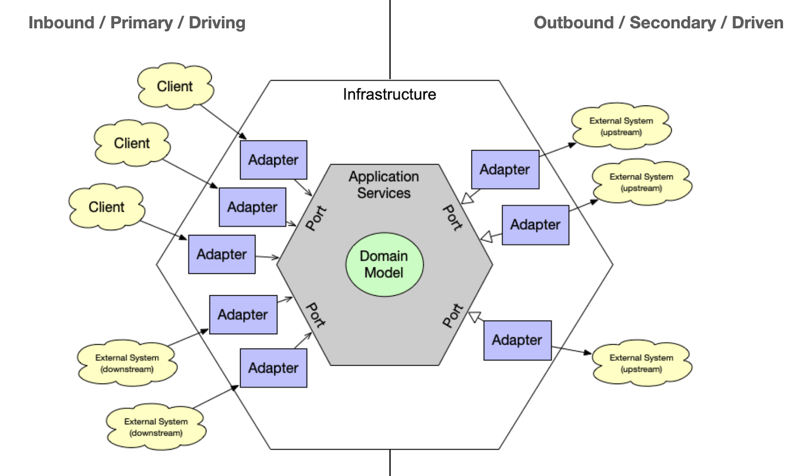

<Link href="/dev/clean-architecture">지난 글</Link>에서 클린 아키텍처에 대해
공부한 내용을 정리해 보았다. 요약하자면 클린 아키텍처란 변경에 유연하게 대응할
수 있는 시스템을 구축하기 위한 '설계 원칙'이다. 원칙은 크게 두 가지로 정리할 수
있는데, 바로 시스템을 계층화하고 계층 간 의존성을 저수준에서 고수준으로 향하도록
만드는 것이다. 이러한 설계 원칙을 상황에 맞춰 적절한 수준으로 구현했을 때
시스템의 수명을 유지하는 데 들어가는 비용을 최소화하고 개발 생산성을 극대화할 수
있다.

이 글에서는 헥사고날 아키텍처를 사용해서 클린 아키텍처의 설계 원칙을 프로젝트에 적용해본 경험을 정리했다.

# 헥사고날 아키텍처

[헥사고날 아키텍처](<https://en.wikipedia.org/wiki/Hexagonal_architecture_(software)>)(Hexagonal Architecture)는 시스템을 내부(도메인)와 외부(인프라)로 구분하고 Port와 Adapter라는 요소를 사용해서 계층간의 느슨한 결합도를 유지하는 소프트웨어 아키텍처다.

객체 지향 소프트웨어 디자인의 구조적 문제(의도치 않은 계층간 종속성, 비즈니스 로직으로 인한 UI의 오염 등)를 피하기 위해 고안된 아키텍처로, 로버트 C. 마틴이 클린 아키텍처를 소개하면서 [언급](https://blog.cleancoder.com/uncle-bob/2012/08/13/the-clean-architecture.html)한 아키텍처들중 하나이기도 하다.

그런데 왜 하필 헥사고날일까? Port는 최대 6개까지 생성할 수 있는 걸까? 헥사고날은 단지 아키텍처의 개념을 시각적으로 풀어내기 용이해서 차용한 것일 뿐, Port와 Adapter는 필요한 만큼 생성할 수 있다. (그래서 개인적으로는 'Ports and Adapters'라는 명칭이 이러한 오해 없이 아키텍처의 특징을 잘 드러낸다고 생각한다.)

이제 헥사고날 아키텍처에는 클린 아키텍처의 설계 원칙이 어떻게 녹아있는지 살펴보자.



<Caption value="헥사고날 아키텍처" />

## 1. 경계 나누기

앞서 언급한 것처럼 헥사고날 아키텍처는 시스템을 도메인 정책을 위한 계층 하나와 사용자 및 외부 기능, 즉 세부 사항을 위한 또 다른 계층 하나로 나눠 관심사를 분리한다.

도메인 계층에는 원칙적으로는 어떠한 의존성도 가지지 않는 비즈니스 로직이 들어있다. 상대적으로 잘 바뀌지 않으며, 바뀌더라도 중요한 이유로 바뀐다. 한편 인프라 계층은 UI, DB, 프레임워크 등 아키텍처 관점에서의 세부 사항들이 존재하는 영역이다. 상대적으로 덜 중요한 이유로 빈번하게 바뀐다.

## 2. 의존성 원칙 지키기

헥사고날 아키텍처는 **Port**와 **Adapter**라는 요소를 통해 의존성의 방향을 일관되게 저수준에서 고수준으로 향하게 한다. Port는 도메인과 외부 세계가 상호작용할 수 있는 유일한 통로로, 상호작용에 필요한 인터페이스(API, 명세)의 집합이다. Adapter는 Port를 통해 도메인과 외부 세계를 연결하는 부분을 담당하는 구현체라고 할 수 있다.

### Inbound port / Inbound adapter

외부 세계가 도메인에 정의된 비즈니스 로직을 수행할때 필요한 요소들이다. Inbound port는 도메인에서 수행할 수 있는 비즈니스 로직(Use case, Service)에 대한 인터페이스로, 외부 세계가 Inbound adapter를 통해 도메인에 요청을 보내면 Inbound adapter는 Inbound port를 호출하여 비즈니스 로직을 수행한다.

### Outbound port / Outbound adapter

반대로 도메인에서 외부 세계에 대한 참조가 필요한 경우에는 Outbound port와 Outbound adapter를 활용한다. 예를 들어 엔티티를 생성하기 위해 DB에 적재된 데이터를 참조해야 하는 경우, 고수준의 도메인이 저수준의 DB 제어 로직에 의존하게 된다. 이때 도메인의 요구사항에 맞춰 Outbound port에 인터페이스를 정의하고 해당 인터페이스의 구현체이자 실제 DB부터 데이터를 가져오는 역할을 수행하는 Outbound adapter를 port에 주입하여 실행하면 의존성의 방향을 저수준에서 고수준으로 향하도록 역전시킬 수 있다.

# 프로젝트에 적용해보기

학습한 내용을 프로젝트에 적용해볼 차례다. 프로젝트는 타이머 기능이 있는 일정 관리 애플리케이션으로, 프론트엔드에서 mock 서버를 구현하여 API를 대체하는 상황이다. 아래 이미지는 mock 서버 구현 시 적용한 헥사고날 아키텍처의 전체적인 흐름을 나타낸다.


<Caption value="헥사고날 아키텍처를 프로젝트에 적용한 모습" />

이제 코드를 살펴보자. 제시된 코드는 일정을 생성(Create)하는 Use case에 대한 예시 코드로, Typescript로 작성되었다.

## 도메인 모델 정의하기

먼저 도메인 계층에 '일정'이라는 도메인 모델(정확히는 Entity)을 정의한다.

```tsx
export type Task = {
  id: string
  categoryId: string
  title: string
  estimatedDuration: number
}
```

## Inbound port 만들기

Inbound port에는 일정 생성 Use case에 대한 외부 API를 정의한다. 이제 Inbound adapter가 Inbound port에 정의한 `createTask`를 호출하여 일정을 생성할 수 있다.

```tsx
export interface CreateTaskDto {
  categoryId: string
  title: string
  estimatedDuration: number
}

export interface TaskInboundPort {
  createTask: (taskData: CreateTaskDto) => Promise<Task>
}
```

## Service

이제 도메인 내부에서 Inbound port에 정의한 인터페이스를 구현한다.

```tsx
import { CreateTaskDto, TaskInboundPort } from '../inbound-ports'
import { TaskOutboundPort } from '../outbound-ports'
import { taskRepository } from './outbound-adapters/task-repository'

export const service = (taskRepository: TaskOutboundPort): TaskInboundPort => ({
  createTask: async (taskData: CreateTaskDto) =>
    taskRepository.createTask(taskData),
})

export const taskService = service(taskRepository)
```

일정을 생성하는 Use case의 경우 DB에 기록하여 데이터의 영속성을 가져가야 하기 때문에 Outbound port에 의존하게 된다. 이때 저수준 → 고수준으로 의존성이 역전되도록 Outbound adapter를 주입받아 실행한다.

이제 Outbound port와 adapter를 살펴보자.

## Outbound port 및 adapter 만들기

Outbound port에는 도메인에서 DB에 새로운 일정을 추가할때 사용할 API를 정의한다.

```tsx
import { Task, TaskState } from '../models'

export interface CreateTaskDto {
  categoryId: string
  title: string
  estimatedDuration: number
}

export interface TaskOutboundPort {
  createTask: (taskData: CreateTaskDto) => Promise<Task>
}
```

Inbound port가 도메인 내의 Service에서 구현되는것과 달리 Outbound port는 Outbound adapter에 의해 구현된다. 아래 예시는 Outbound adapter를 통해 Memory DB에 일정 데이터를 적재하는 코드다.

```tsx
import { CreateTaskDto, TaskOutboundPort } from '@domain'
import { MemoryDatabase } from '../lib'

async function createTask(taskData: CreateTaskDto) {
  return await MemoryDatabase.create(taskData)
}

export const taskRepository: TaskOutboundPort = {
  createTask,
}
```

이러한 구조가 주는 장점은 무엇일까? 바로 도메인에 영향을 주지 않고 세부 사항(DB)을 쉽게 변경할 수 있다는 점이다.

Outbound port에 정의한 인터페이스를 따르기만 한다면 Local storage가 됐든 Indexed DB가 됐든 상관이 없다. 그저 원하는 저장소를 사용하는 adapter를 만들고 service에 해당 adapter를 주입하기만 하면 된다.

## Inbound adapter 만들기

지금까지 도메인 모델을 정의하고 Inbound/Outbound port를 통해 도메인의 Use case를 실행할 수 있는 코어를 구현했다. 하지만 외부에서 해당 Use case를 실행해 달라는 요청이 없으면 아무런 의미가 없다.

이때 필요한 것이 Inbound adapter다. Inbound adapter는 Use case를 외부에 노출하여 실행 요청을 보낼 수 있게 해준다. 이 예시에서는 MSW(Mock Service Worker)를 사용하여 REST API Controller를 제공했다.

```tsx
import { rest } from 'msw'
import { taskService } from '@infrastructure'

export const handlers = [
  rest.post('/task', async (req, res, ctx) => {
    const taskData = await req.json()

    try {
      const result = await taskService.createTask(taskData)
      return res(ctx.status(200), ctx.json(result))
    } catch (error) {
      return res(ctx.json({ error.message }))
    }
  })
]
```

이제 클라이언트에서 일정 생성 HTTP 요청이 발생하면 MSW handler를 통해 Use case를 실행할 수 있다.

# 회고

헥사고날 아키텍처를 직접 구현해 보면서 클린 아키텍처의 <Link href="/dev/clean-architecture#정리">장점</Link>을 코드 레벨에서 체감해 볼 수 있어서 좋았다. 또한 이러한 아키텍처가 객체 지향 진영에서 나온 것인 만큼 객체 지향에 대해, 그리고 도메인 주도 설계에 대해 깊이 있게 공부하고 백엔드 개발 시 활용해보고 싶다는 생각이 들었다. 한편으로는 함수형 패러다임을 사용할 경우 아키텍처의 모습은 어떤 모습일지에 대해서도 궁금하기도 했다.

아쉬운 점도 있다. 애플리케이션의 기능이 일정을 읽고, 생성하고, 업데이트하고, 삭제하는 단순 CRUD가 전부였기 때문에 헥사고날을 적용하면서 코드의 복잡도가 필요 이상으로 커졌다. 아키텍처가 주는 장점을 넘어서는 오버 엔지니어링이었다. 클린 아키텍처를 직접 구현해 봤다는 점에서 의의를 두고 싶다.

앞으로 내가 작성하는 코드가 변경에 유연하게 대응할 수 있는지를 충분히 고민해야겠다고 다짐하며 글을 마무리한다.

> 빨리 가는 유일한 방법은 제대로 가는 것이다 <br />
> ⎯ 로버트 C. 마틴
