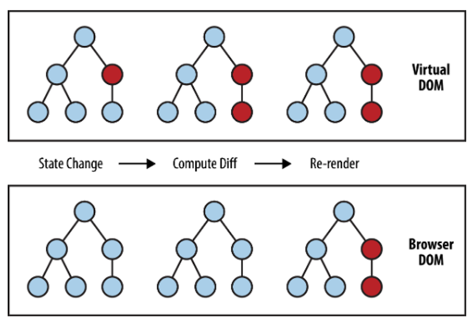
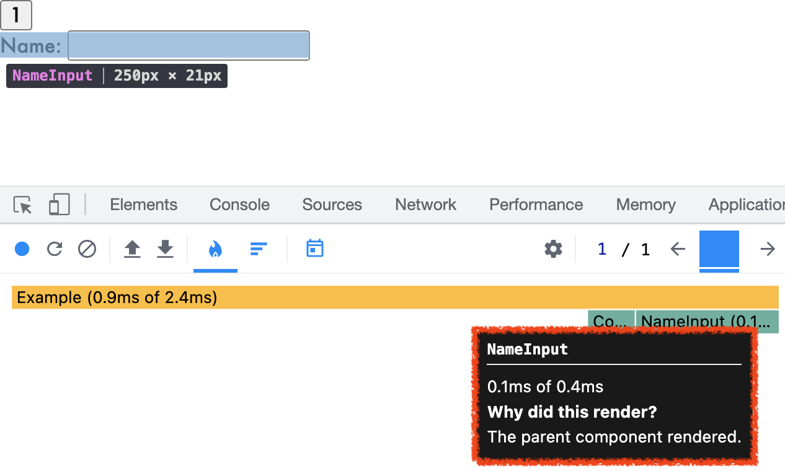
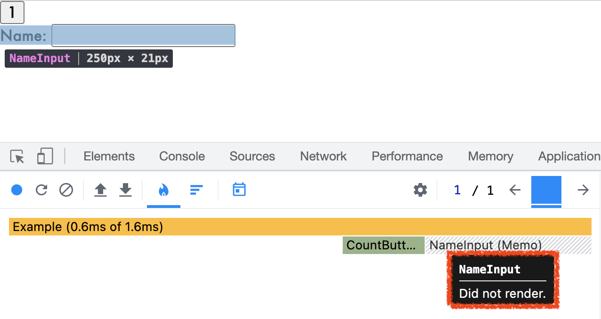
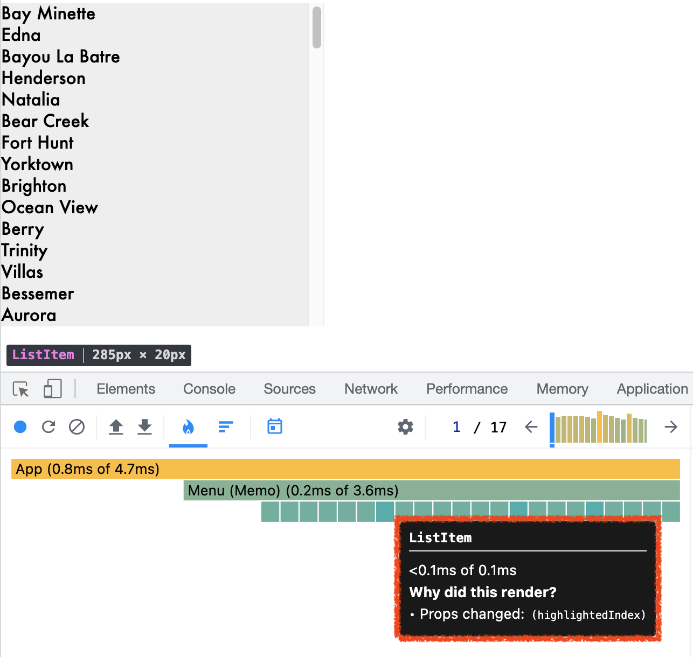
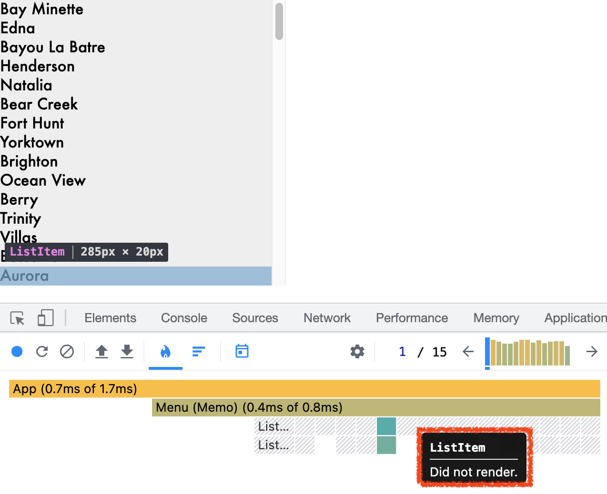

# TL;DR

1. React는 virtual DOM을 이용, DOM 변경 작업을 일괄(batch) 처리하여 렌더링 성능을 최적화한다.
2. 렌더링 성능 최적화 시에는 state colocation을 우선적으로 적용하고 그 이후에 `memo`, `useCallback` 등을 사용하는게 좋다.
3. 성능 최적화에는 비용이 든다. 비용 대비 얻는 이점이 큰지 따져보고, 책임감을 가지고 하자.

# React는 어떻게 렌더링을 최적화 하나?

`element.appendChild(childElement)`와 같은 브라우저의 DOM 업데이트 작업은 비교적 오래 걸리는 작업이다. React는 빠른 렌더링을 위해 연속적으로 발생하는 DOM 업데이트를 순차적으로 모두 처리하지 않고 한꺼번에 일괄 처리하는 방식을 채택했다. 이를 위해 메모리상에 virtual DOM을 올려 놓고 virtual DOM의 변경 전후를 비교하여 변경된 부분만 실제 DOM에 반영한다.



<Caption value="React는 virtual DOM의 전후 상태를 비교하여 변경이 필요한 부분만 실제 DOM에 반영한다." />

## virtual DOM

virtual DOM은 React 요소로 이루어진 트리구조의 객체다. 여기서 React 요소는 `React.createElement`가 반환하는 불변 객체로, 화면에 그리고 싶은 DOM에 대한 정보를 담고 있다. [[Reference]](https://kentcdodds.com/blog/what-is-jsx)

```js
// JSX
<div id="root">Hello world</div>

// React element
{
  type: "div",
  key: null,
  ref: null,
  props: { id: "root", children: "Hello world" },
  _owner: null,
  _store: {}
}
```

<Caption value="React.createElement가 반환하는 React 요소" />

React는 상태가 변경될때마다 `React.createElement()`를 호출하고 새로운 virtual DOM을 생성하여 이전 것과 비교하는 작업을 수행한다. 상태가 변할때마다 변화하는 UI룰 스냅샷으로 찍어놓고 비교하는 것과 같다.

## React 요소가 DOM 요소로 만들어지는 과정

React가 화면을 그리는 과정은 크게 render, reconciliation, commit 세 단계로 이루어진다. [[Reference]](https://kentcdodds.com/blog/fix-the-slow-render-before-you-fix-the-re-render#what-is-a-re-render
)

> render → reconciliation → commit\
> ㅤㅤ↖ㅤㅤㅤㅤㅤㅤㅤㅤㅤㅤ↙\
> ㅤㅤㅤㅤㅤstate change

- **render** ⎯ 우리가 작성한 컴포넌트(자바스크립트 함수)를 호출하여 React 요소를 생성한다. (`React.createElement()`)
- **reconciliation** ⎯ 새롭게 생성된 React 요소들을 이전에 생성한 것과 비교한다. [[Reference]](https://reactjs.org/docs/reconciliation.html)
- **commit** ⎯ (필요하다면) 브라우저 DOM을 업데이트한다.

virtual DOM을 생성하고 비교하는 과정은 render, reconciliation 단계에 속한다.

그리고 일반적으로 가장 느린 단계는 실제 DOM을 업데이트하는 commit 단계다. (물론 모든 DOM 업데이트가 느린건 아니고 [layout](https://developer.mozilla.org/en-US/docs/Web/Performance/Critical_rendering_path#layout) 단계를 거치는 경우가 그렇다.)

# React 렌더링 성능 최적화 방법

## 1. State colocation

렌더링 성능 최적화가 필요하다면 바로 `React.memo`를 사용하기보다 state colocation을 먼저 고려해보자.

state colocation이란 **상태를 해당 상태와 관련있는 컴포넌트와 최대한 가깝게 위치시키는 것**을 말한다.

> Place code as close to where it's relevant as possible

React는 상태가 바뀌었을때 실제로 어떤 컴포넌트가 DOM 업데이트까지 수행해야 하는지 알 수 없기 때문에 해당 상태값이 위치한 컴포넌트와 모든 자식 컴포넌트를 전부 리렌더링 한다. 불필요한 리렌더링은 애플리케이션의 렌더링 성능을 떨어뜨리는 요인이기 때문에 state colocation으로 상태값과 해당 상태값을 참조하는 컴포넌트를 가까이 위치시켜서 불필요한 리렌더링을 막는 것이 좋다.

### 어떻게 하는 것인가?

1. **Component 레벨에서** ⎯ 상태를 아래로 내리거나 위로 올린다. [[Reference 1]](https://kentcdodds.com/blog/state-colocation-will-make-your-react-app-faster) [[Reference 2]](https://overreacted.io/before-you-memo/) [[Reference 3]](https://kentcdodds.com/blog/optimize-react-re-renders)
2. **Context API 사용시** ⎯ (1) context 안에는 꼭 공유되어야 하는 상태값만 넣고 (2) provider는 해당 상태값을 사용하는 컴포넌트에 최대한 가까이 위치시킨다.
3. **Redux 사용시** ⎯ global store에는 반드시 global한 상태값만 넣는다.

### 어떤 장점이 있나?

1. 불필요한 render, reconciliation 단계가 실행되지 않아 렌더링 성능이 개선된다.
2. 애플리케이션 유지보수가 쉬워진다.
3. 연산비용이 큰 컴포넌트를 분리하고 서버에서 실행함으로써 브라우저단에서 성능 이점을 누릴 수 있다. [[Reference]](https://overreacted.io/before-you-memo/#whats-the-moral)

## 2. 메모이제이션 (memoization)

메모이제이션(memoization)이란 컴퓨터 프로그램이 동일한 계산을 반복해야 할 때, 이전에 계산한 값을 메모리에 저장함으로써 동일한 계산의 반복 수행을 제거하여 프로그램 실행 속도를 빠르게 하는 기술이다. 일종의 캐싱 전략인 셈이다. [[Reference]](https://ko.wikipedia.org/wiki/%EB%A9%94%EB%AA%A8%EC%9D%B4%EC%A0%9C%EC%9D%B4%EC%85%98)

React는 가장 최근의 입력값과 반환값을 메모이제이션하고 **참조 동등성**을 사용하여 컴포넌트의 리렌더링 여부를 결정한다. 그리고 메모이제이션을 위해 `React.memo`, `useCallback`, `useMemo` 세 개의 API를 제공한다.

> **참조 동등성 (referential equality)**\
> 값이 저장된 메모리 주소가 같으면 동일한 값으로 간주하는 것을 말한다.\
> [[Reference 1]](https://blog.bitsrc.io/understanding-referential-equality-in-react-a8fb3769be0) [[Reference 2]](https://dev.to/vicnovais/understanding-referential-equality-in-reacts-useeffect-2m7o)

### React.memo로 리렌더링 줄이기

`React.memo`는 컴포넌트 함수 실행 결과를 메모이제이션 해두었다가 재사용하게 해주는 API다.

```js
function CountButton({ count, onClick }) {
  return <button onClick={onClick}>{count}</button>
}

function NameInput({ name, onNameChange }) {
  return (
    <label>
      Name:{' '}
      <input value={name} onChange={(e) => onNameChange(e.target.value)} />
    </label>
  )
}

function Example() {
  const [name, setName] = React.useState('')
  const [count, setCount] = React.useState(0)
  const increment = () => setCount((c) => c + 1)
  return (
    <div>
      <div>
        <CountButton count={count} onClick={increment} />
      </div>
      <div>
        <NameInput name={name} onNameChange={setName} />
      </div>
      {name ? <div>{`${name}'s favorite number is ${count}`}</div> : null}
    </div>
  )
}
```

위 예시의 경우 React DevTools로 `<Countbutton>`을 클릭하는 과정을 프로파일링 해보면 부모 컴포넌트가 리렌더링되면서 `<NameInput>`도 리렌더링 되는 것을 알 수 있다.



<Caption value="부모 컴포넌트가 리렌더링되면 자식 컴포넌트도 리렌더링 된다." />

하지만 리렌더링이 됐다고 해서 `<NameInput>`에 해당하는 **실제 DOM이 변경되지는 않는다**. `<NameInput>`이 참조하고 있는 상태값들(`name`, `setName`)은 클릭전과 동일하기 때문에 render, reconciliation 단계까지 수행한 결과가 이전과 동일하고, commit 단계는 수행하지 않기 때문이다.

**하지만 render, reconciliation 단계를 수행하는데 많은 연산이 필요하다면 어떨까?** 실제 DOM이 변경되지 않음에도 불구하고 **불필요한 컴퓨팅 파워를 낭비**하게 되는 셈이다.

이때 `React.memo`를 사용해서 성능 최적화를 할 수 있다.

```js
// ...
function NameInput({ name, onNameChange }) {
  return (
    <label>
      Name:{' '}
      <input value={name} onChange={(e) => onNameChange(e.target.value)} />
    </label>
  )
}

NameInput = React.memo(NameInput)

// ...
```



<Caption value="React.memo를 사용해서 불필요한 연산을 줄일 수 있다." />

`React.memo`를 적용하고 다시 프로파일링을 해보면 이제는 `<NameInput>`이 리렌더링 되지 않는것을 확인할 수 있다.

이전에 렌더링된 결과(virtual DOM)를 메모이제이션 해두었다가 재사용하여 render, reconciliation 단계를 생략하고 불필요한 리소스 낭비를 하지 않는 것이다.

---

`React.memo`는 두번째 인자로 props 비교 함수를 받을 수 있다. [[Reference]](https://reactjs.org/docs/react-api.html#reactmemo) 첫번째 인자로 전달한 컴포넌트의 props값을 비교하여 변경전과 후의 값이 같으면 이전의 렌더링 결과를 재사용하고 다르면 리렌더링(render, reconciliation 단계를 수행)한다.

만약 해당 함수를 입력하지 않으면 얕은(shallow) 비교를 수행하는 기본 함수를 사용한다.

```js
function Menu(
  {
    // ...
  }
) {
  return (
    <ul {...getMenuProps()}>
      {items.map((item, index) => (
        <ListItem
          key={item.id}
          // ...
        >
          {item.name}
        </ListItem>
      ))}
    </ul>
  )
}

function ListItem({ getItemProps, item, index, highlightedIndex, ...props }) {
  const isHighlighted = highlightedIndex === index
  return (
    <li
      {...getItemProps({
        index,
        item,
        style: {
          fontWeight: isSelected ? 'bold' : 'normal',
          backgroundColor: isHighlighted ? 'lightgray' : 'inherit',
        },
        ...props,
      })}
    />
  )
}
```

`<Menu>` 컴포넌트와 `<Menu>`를 구성하는 `<ListItem>` 컴포넌트가 있다. `<ListItem>` 컴포넌트는 마우스 hover시 backgroundColor가 바뀌면서 하이라이팅 된다.

`<Menu>` 컴포넌트 내에서 마우스를 이리저리 움직이면 하이라이팅되는 `<ListItem>`이 계속 바뀌는데, 이 과정을 프로파일링 해보면 아래와 같은 결과가 나온다.



<Caption value="모든 <ListItem>이 리렌더링 되고 있다." />

DOM 업데이트가 필요한 `<ListItem>`은 이전에 하이라이팅됐던 `<ListItem>`과 새로 하이라이팅할 `<ListItem>` 딱 두 개 뿐이다. 그런데 나머지 `<ListItem>`들까지 불필요한 리렌더링 연산을 수행하고 있다.

렌더링 성능 최적화를 위해 `React.memo`를 사용해보자.

```js
// ...

ListItem = React.memo(ListItem, (prevProps, nextProps) => {
  // true 반환 -> 렌더링 X
  // false 반환 -> 렌더링 O

  if (prevProps.getItemProps !== nextProps.getItemProps) return false
  if (prevProps.item !== nextProps.item) return false
  if (prevProps.index !== nextProps.index) return false

  if (prevProps.highlightedIndex !== nextProps.highlightedIndex) {
    const wasPrevHighlighted = prevProps.highlightedIndex === prevProps.index
    const isNowHighlighted = nextProps.highlightedIndex === nextProps.index
    return wasPrevHighlighted === isNowHighlighted
  }
  return true
})
```

props 중에서 하이라이팅에 관여하는 `highlightedIndex`를 제어하여 컴포넌트의 리렌더링 여부를 결정했다.



<Caption value="실제 DOM 업데이트가 필요한 <ListItem>만 리렌더링한다." />

그 결과 이제는 DOM 업데이트가 필요한 두 개의 `<ListItem>`만 리렌더링되는 것을 확인할 수 있다.

### useCallback으로 리렌더링 줄이기

`React.memo`를 사용하더라도 리렌더링이 발생하는 경우가 있다. 바로 자식 컴포넌트에 함수를 전달하는 경우다.

```js
function SelectCandy({ selected, onChange }) {
  // ...
}

SelectCandy = React.memo(SelectCandy)

function Parent() {
  const [selectedCandy, setSelectedCandy] = useState('snickers')
  const [count, setCount] = useState(0)

  const addCandy = () => {
    setCount(count + 1)
  }

  const showSelectedCandy = (candy) => {
    setSelectedCandy(candy)
    console.log(`${candy} has been selected!`)
  }

  return (
    <>
      <span>{count}</span>
      <button onClick={addCandy}>add</button>
      <SelectCandy selected={selectedCandy} onChange={showSelectedCandy} />
    </>
  )
}
```

위 예시에서 버튼을 클릭하면 `<Parent>` 컴포넌트가 리렌더링 되고 `<SelectCandy>`도 함께 리렌더링 된다. `React.memo`도 사용했고 `selectedCandy` 값도 그대로인데 왜 리렌더링이 됐을까?

원인은 `<Parent>`가 렌더링될 때마다 `showSelectedCandy` 함수가 새로 생성되어 `onChange` props가 변하기 때문이다. 새로 생성된 함수는 기존의 함수와 다른 메모리 공간에 할당되기 때문에 기존 함수와 똑같더라도 참조 동등성에 의해 이 둘은 다르게 인식된다.

```js
function Parent() {
  const [selectedCandy, setSelectedCandy] = useState('snickers')

  // ...

  useCallback((candy) => {
    setSelectedCandy(candy)
    console.log(`${candy} has been selected!`)
  }, [])

  return (
    <>
      <span>{count}</span>
      <button onClick={addCandy}>add</button>
      <SelectCandy selected={selectedCandy} onChange={setSelectedCandy} />
    </>
  )
}
```

만약 `showSelectedCandy`가 상태값 변경만 한다면 `useState`의 상태값 변경 함수는 변하지 않는다는 점을 이용해서 `onChange` 속성값으로 `setSelectedCandy`를 전달할 수 있겠지만, console 출력 작업도 함께 하고 있으므로 `useCallback`을 사용해서 불필요하게 새로운 함수가 생성되어 리렌더링 발생하는 일을 막을 수 있다.

---

### useMemo로 연산 비용이 큰 함수의 반환값 재사용 하기

`useCallback`이 함수를 메모이제이션하여 불필요한 리렌더링을 막아준다면, `useMemo`는 연산 비용이 많이 드는 작업의 결과값을 메모이제이션하여 **컴포넌트 렌더링시 불필요한 병목현상이 발생하지 않게 해준다**.

```js
function Distance({ x, y, z }) {
  const distance = cacluateDistance(x, y)
  return (
    <div>
      The distance between {x} and {y} is {distance}
    </div>
  )
}
```

위 예시에서 `cacluateDistance` 함수는 많은 연산이 필요한 무거운 작업이다. 이 함수는 인자로 받는 `x`, `y`값의 변경 여부에 관계없이 `Distance` 컴포넌트가 리렌더링 될때마다 호출된다. 리렌더링을 일으키는 요인은 여러가지가 있을 수 있다. 부모 컴포넌트가 리렌더링 되거나, `z` props가 변하거나..

`cacluateDistance` 함수는 연산량이 많기 때문에 새로운 `distance` 값을 반환하기까지 비교적 긴 시간이 걸린다. 그런데 리렌더링이 될 때마다 호출된다면 이는 고스란히 렌더링 성능을 저하하는 요인으로 작용할 수밖에 없다.

이때 `useMemo`를 사용하면 된다. `cacluateDistance`의 반환값을 `useMemo`로 메모이제이션하여 재사용 하는 것이다.

```js
function Distance({ x, y, z }) {
  const distance = React.useMemo(() => cacluateDistance(x, y), [x, y])
  return (
    <div>
      The distance between {x} and {y} is {distance}
    </div>
  )
}
```

`cacluateDistance` 함수가 의존하고 있는 `x`, `y`값을 의존성 배열에 넣어 해당 값들이 변경됐을 때에만 `cacluateDistance` 함수를 호출하여 새로운 `distance`값을 얻는다. 그 전까지는 이전에 계산된 값을 재사용 한다. 불필요한 연산 작업을 줄여 렌더링 성능을 개선한 것이다.

# 렌더링 성능 최적화를 대하는 태도

## 성능 최적화에는 비용이 든다

`React.memo`, `useCallback`, `useMemo`를 적재적소에 사용하면 효과적으로 렌더링 성능을 개선할 수 있지만, 모든 추상화에는 비용이 든다는 것을 기억하자.

이들을 사용함으로써

1. 코드의 복잡도가 높아지며
2. 의존성 배열을 잘못 사용하여 버그를 발생시키기 쉽고
3. 의도치않게 성능 저하를 초래할 수 있으며 [[Reference]](https://kentcdodds.com/blog/usememo-and-usecallback#why-is-usecallback-worse)
4. 의존성 배열에 넣은 값들 & 메모이제이션된 값들이 GC에서 제외되면서 메모리 누수가 발생할 수 있다.

그러니 **성능 최적화를 할 때는 발생하는 비용 대비 최적화의 효용이 큰지 따져보고 책임감을 가지고 해야 한다**.

## 느린 렌더링(slow render)를 먼저 고치자

자바스크립트가 render 및 reconciliation 단계를 매우 빠르게 처리함에도 불구하고 앱이 버벅이는 이유는 무엇일까? 일반적으로 리렌더링보다 느린 렌더링이 원인인 경우가 많다. 컴포넌트가 리렌더링 됐다고 항상 DOM이 업데이트 되는건 아니기 때문이다. [[Reference]](https://kentcdodds.com/blog/fix-the-slow-render-before-you-fix-the-re-render#unnecessary-re-renders)

느린 렌더링은 **render 단계에서 병목을 일으키는 코드가 있는 경우**를 의미한다. 느린 렌더링를 일으키는 병목 코드를 그대로 둔 채 리렌더링만 개선하면 코드의 복잡도가 올라가고 렌더링 이슈는 더 심해질 수 있다.

Chrome 개발자 도구의 Performance 탭과 React DevTools profiler를 이용해서 느린 렌더링이 발생하는 인터랙션 구간을 분석하고 병목이 되는 원인을 찾아 조치를 취하자. **느린 렌더링으로 인한 렌더링 성능 저하가 개선된 이후에 리렌더링이 여전히 렌더링 성능을 저하시키는 원인이라는 판단이 되면, 그때 리렌더링을 최적화해도 늦지 않다**.
