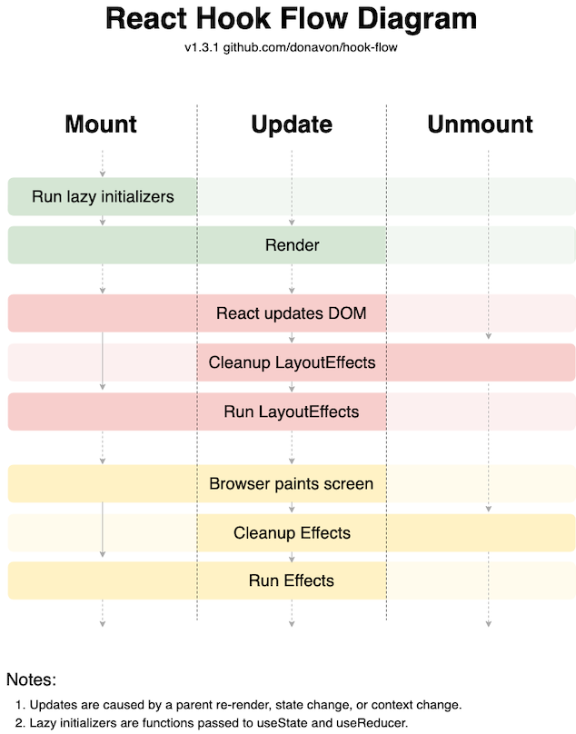

# 1. Why Hooks?

[[Reference]](https://reactjs.org/docs/hooks-intro.html#motivation)

<br />

Hooks는 기존 클래스 컴포넌트가 가진 문제들을 해결하기 위해 등장했다.

## 클래스 컴포넌트가 가진 문제점들

### 1. 자바스크립트 Class

`constructor`, `super`, `this`, `bind`, ...

자바스크립트 Class 문법을 다루는데서 오는 어려움이 React를 어렵게 느끼게 만든다.

### 2. Lifecycle 메서드

클래스 컴포넌트에서는 하나의 기능(concern)이 여러 lifecycle 메서드에 분산될수밖에 없다.

기능이 많아질수록 코드의 복잡도가 높아지고 유지보수가 어려워진다.

### 3. 로직의 재사용이 어려움

클래스 컴포넌트에서 로직을 재사용하기 위한 패턴들(mixins, Higher-Order Components, render props)은 모두 그 장점보다 단점이 더 크다.

대표적으로 `Wrapper Hell` 문제가 있다.

## Hook은 이 문제들을 어떻게 해결하나?

### 1. Class 대신 함수

React는 컴포넌트를 정의할때 Class 대신 함수를 써서 Class 문법이 야기하는 불필요한 복잡도를 제거했다.

### 2. Lifecycle 메서드 대신 hook

useState, useEffect 등의 hook을 사용하여 관심사를 명확하게 분리했다.

하나의 관심사가 여러 lifecycle 메서드에 걸쳐서 분산되어 있던 때와 비교하면 관심사의 응집도가 높아졌고 코드의 가독성 역시 좋아졌다.

### 3. Custom hook

여러개의 컴포넌트에서 재사용하고 싶은 로직이 있다면 함수로 추출하면 된다. 바로 Custom hook이다.

Custom hook을 사용하면 코드를 쉽게 재사용할 수 있다. 테스트 하기도 쉽다.

> **Custom hook을 네이밍 할떄 `use`로 시작하는 convention을 쓰는 이유**
>
> 1. React 내부적으로 Custom hook을 'hook'으로 인지하고 `Rules of hook`을 적용하기 위해서다.
> 2. Custom hook이 potentially stateful하다는 것을(=state를 가지고 있을수 있음을) 직관적으로 나타내기 위해서다.

# 2. Rules of Hooks

[[Reference]](https://reactjs.org/docs/hooks-rules.html)

### 1. hook은 컴포넌트내 최상위 레벨에서만 호출해야 한다.

루프, 조건문, 중첩함수 내에서는 hook을 호출할 수 없다.

최상위 레벨에서 호출해야 컴포넌트가 렌더링 될 때마다 항상 동일한 순서로 hook이 호출되는 것을 보장할 수 있고, useState와 useEffect가 여러 번 호출되더라도 상태를 올바르게 유지할 수 있다.

### 2. hook은 함수 컴포넌트 또는 custom hook 내에서만 호출할 수 있다.

일반 자바스크립트 함수 내에서는 hook을 호출할 수 없다.

---

#### 1번 규칙에 대한 설명

하나의 컴포넌트 안에 여러개의 useState/useEffect hook이 있을때 React는 어떻게 state들을 구분할 수 있을까?

```js
function Form() {
  // 1. Use the name state variable
  const [name, setName] = useState('Mary')

  // 2. Use an effect for persisting the form
  useEffect(function persistForm() {
    localStorage.setItem('formData', name)
  })

  // 3. Use the surname state variable
  const [surname, setSurname] = useState('Poppins')

  // 4. Use an effect for updating the title
  useEffect(function updateTitle() {
    document.title = name + ' ' + surname
  })

  // ...
}
```

React는 hook이 호출되는 순서에 의존한다.

```js
// ------------
// First render
// ------------
useState('Mary') // 1. Initialize the name state variable with 'Mary'
useEffect(persistForm) // 2. Add an effect for persisting the form
useState('Poppins') // 3. Initialize the surname state variable with 'Poppins'
useEffect(updateTitle) // 4. Add an effect for updating the title

// -------------
// Second render
// -------------
useState('Mary') // 1. Read the name state variable (argument is ignored)
useEffect(persistForm) // 2. Replace the effect for persisting the form
useState('Poppins') // 3. Read the surname state variable (argument is ignored)
useEffect(updateTitle) // 4. Replace the effect for updating the title

// ...
```

> 첫번째 useState는 `name` 상태값과 연결\
> 첫번째 useEffect는 `persistForm` effect를 수행\
> 두번째 useState는 `surname` 상태값과 연결\
> 두번째 useEffect는 `updateTitle` effect를 수행

컴포넌트가 렌더링될 때마다 위와같이 동일한 호출 순서를 유지하는한 React는 각각의 상태를 구분하고 useState/useEffect와 연결하여 상태값을 기억하고 업데이트 할 수 있다.

하지만 조건문 안에서 hook을 호출하면 어떻게 될까?

```js
// 🔴 We're breaking the first rule by using a Hook in a condition
if (name !== '') {
  useEffect(function persistForm() {
    localStorage.setItem('formData', name)
  })
}
```

조건에 따라 hook이 호출되지 않고 전체적인 호출 순서가 달라진다. 이렇게 되면 상태값을 구분할 수 없고 useState/useEffect와의 연결정보가 어그러지면서 버그가 발생한다.

```js
useState('Mary') // 1. Read the name state variable (argument is ignored)
// useEffect(persistForm)  // 🔴 This Hook was skipped!
useState('Poppins') // 🔴 2 (but was 3). Fail to read the surname state variable
useEffect(updateTitle) // 🔴 3 (but was 4). Fail to replace the effect
```

# 3. Hook Flow


