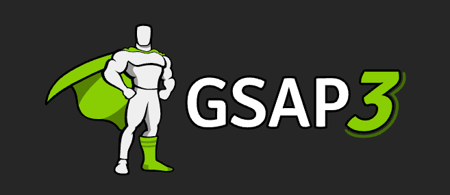
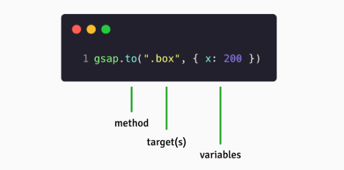

# GSAP?



[GSAP](https://greensock.com/)(GreenSock Animation Platform) : 타임라인 기반 자바스크립트 애니메이션 라이브러리

- **호환성** ⎯ HTML, CSS, SVG, React, Vue, Angular, Canvas, Three.js, jQuery, 그리고 모든 브라우저(Firefox, Chrome, Opera, Safari, IE)와 호환된다.
- **성능** ⎯ GPU 가속을 포함한 여러가지 성능 최적화를 해주기 때문에 CSS animations/transition보다 빠르며, 성능 이슈 없이 부드러운 애니메이션을 구현할 수 있다.
- **유연함** ⎯ GSAP은 애니메이션 구현에 필요한 도구(API, 플러그인, 프로퍼티 등)들 한데 모은 도구 상자에 비유할 수 있다. 특정한 사용 패턴이나 아키텍처를 강제하지 않기 때문에 필요한 도구를 가져다 쓰기만 하면 된다.
- 순수 자바스크립트 + Zero dependencies (!!)

# 사용법



→ "클래스가 '.box'인 요소에 애니메이션을 적용해서 x축으로 200px 이동시켜줘"

# 주요 개념

## [Tween](https://greensock.com/docs/v3/GSAP/Tween)

애니메이션 수행 단위 (A single animation)

```js
gsap.to('.box', { x: 200 }) // Tween
```

## [Timeline](https://greensock.com/docs/v3/GSAP/Timeline)

여러 요소에 애니메이션을 적용할때 애니메이션 실행 타이밍을 세밀하게 제어할수 있게 해주는 도구

- WITHOUT Timelines

```js
gsap.to("#id", {x: 100, duration: 1});
gsap.to("#id", {y: 50, duration: 1, delay: 1});      //wait 1 second
gsap.to("#id", {opacity: 0, duration: 1, delay: 2}); //wait 2 seconds
...
```

- WITH Timelines

```js
var tl = gsap.timeline({ repeat: 2, repeatDelay: 1 })
tl.to('#id', { x: 100, duration: 1 })
tl.to('#id', { y: 50, duration: 1 })
tl.to('#id', { opacity: 0, duration: 1 })

// then we can control the whole thing easily...
tl.pause()
tl.resume()
tl.seek(1.5)
tl.reverse()
```

# 적용


<Caption value="GSAP으로 부드럽게 화면 전환하기" />

Home 화면에 있는 애니메이션을 실행하기 전에 페이지 내에 있는 모든 이미지 로드가 완료되어야 하는 상황이다. Home 화면에 진입하고 서버로부터 이미지를 받아오는 동안 화면을 어떻게 처리하면 좋을까?

Skeleton을 사용하는 방법도 있겠지만 이미지 개수가 많고 규칙적으로 정렬되어 있지 않아 시각적으로 예쁘지 않다.

이럴 땐 임시 화면(이하 Preloader)을 활용하는 것이 적절한 방법일 수 있다. Home 화면 진입 시 Preloader를 먼저 표시하다가 이미지 로드가 완료되면 Preloader를 감추고 Home 화면을 표시하는 것이다. 이때 transition으로 화면을 부드럽게 전환하면 매끄러운 사용자 경험을 제공할 수 있다.

```js
import EventEmitter from "events";
import GSAP from "gsap";

export default class Preloader extends EventEmitter {
  ...

  onLoaded() {
    // Timeline 생성
    this.animatedOut = GSAP.timeline({
      delay: 2, // 2초 후 애니메이션 시작
    });

    // 애니메이션 : Preloader의 opacity를 0으로 변경
    this.animatedOut.to(this.element, {
      autoAlpha: 0,
    });

    // 애니메이션이 완료되면 completed 이벤트 발생시키기
    this.animatedOut.call(() => {
      this.emit("completed");
    });
  }

  // DOM에서 Preloader 제거
  destroy() {
    this.element.parentNode.removeChild(this.element);
  }
}

```

Preloader는 이미지 로드가 완료되면 completed 커스텀 이벤트를 발생시켜서 로드가 완료되었음을 알린다.

```js
import Preloader from "./components/Preloader";

class App {
  constructor() {
    this.createPreloader();
    ...
  }

  createPreloader() {
    this.preloader = new Preloader();

    // completed라는 일회성 이벤트 등록
    this.preloader.once("completed", this.onPreloaded.bind(this));
  }

  onPreloaded() {
    this.preloader.destroy(); // Preloader 제거
  }

  ...
}

new App();

```

App은 completed 이벤트를 감지하여 Preloader를 화면에서 제거한다.
