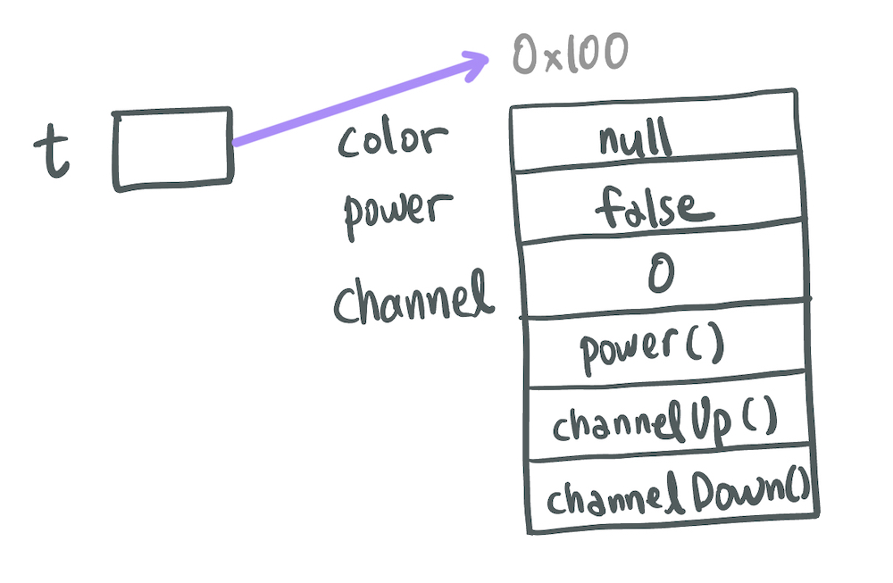
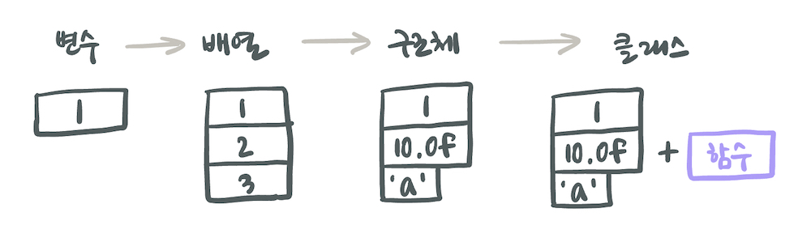

# 1. 객체지향 개념

## 객체지향의 기본 개념
> *실제 세계는 사물(객체)'로 이루어져 있으며, 발생하는 모든 사건들은 사물간의 상호작용이다.*

## 객체지향언어의 주요 특징

### 1. 코드의 재사용성이 높다.
새로운 코드를 작성할 때 기존 코드를 이용하여 쉽게 작성할 수 있다.

### 2. 코드의 관리가 용이하다.
코드간의 관계를 이용해서 적은 노력으로 쉽게 코드를 변경할수 있다.

### 3. 신뢰성 높은 프로그래밍이 가능하다.
제어자와 메서드를 이용해서 데이터를 보호하고 올바른 값을 유지하도록 하며, 코드의 중복을 제거하여 코드이 불일치로 인한 오동작을 방지할 수 있다.

---

프로그래밍을 할 때 너무 객체지향개념에 얽매여서 고민하기 보다는 일단 프로그램을 기능적으로 완성한 다음 어떻게 하면 보다 객체지향적으로 코드를 개선할 수 있을지를 고민하여 점차 개선해 나가는 것이 좋다. 처음부터 이론을 많이 안다고 해서 좋은 설계를 할 수 있는 것은 아니다.

# 2. 클래스와 객체

## 클래스와 객체의 정의 & 용도

- 클래스
  - 정의 : 객체의 설계도 / 틀
  - 용도 : 객체 생성
- 객체
  - 정의 : 실제로 존재하는 것 / 사물 또는 개념
  - 용도 : 객체가 가지고 있는 기능과 속성에 따라 다름

## 객체 vs 인스턴스

- **인스턴스화(instantiate)** : 클래스로부터 객체를 만드는 과정
- **인스턴스(instance)** : 어떤 클래스로부터 만들어진 객체

인스턴스는 객체와 같은 의미이지만, 객체는 모든 인스턴스를 대표하는 포괄적인 의미를 갖고 있으며, 인스턴스는 어떤 클래스로부터 만들어진 것인지를 강조하는 보다 구체적인 의미이다.

> - 책상은 인스턴스다 (X) → 책상은 객체다 (O)
> - 책상은 책상 클래스의 객체이다 (X) → 책상은 책상 클래스의 인스턴스다 (O)

## 객체의 구성요소 - 속성 & 기능

객체는 속성과 기능의 집합\
객체가 가지고 있는 속성과 기능을 그 객체의 멤버(구성원, member)라고 한다.

- `속성(property)` : `멤버변수(member variable)`, `특성(attribute)`, `필드(field)`, `상태(state)`
- `기능(function)` : `메서드(method)`, `함수(function)`, `행위(behavior)`

---

**TV의 속성과 기능**

- **속성** : 크기, 길이, 높이, 색상, 볼륨, 채널 등
- **기능** : 켜기, 끄기, 볼륨 높이기, 채널 변경하기 등

```js
public class Tv {
  // Tv의 속성 (멤버변수)
  String color;
  boolean power;
  int channel;

  // Tv의 기능 (메서드)
  void power() {
    power = !power;
  }

  void channelUp() {
    channel++;
  }

  void channelDown() {
    channel--;
  }
}

class TvInstance {
  public static void main(String[] args) {
    Tv t; // (1)
    t = new Tv(); // (2)
    t.channel = 7;
    t.channelDown();
    System.out.println("현재 채널은 " + t.channel + " 입니다."); // 현재 채널은 6 입니다.
  }
}
```

- (1)
  - Tv클래스 타입의 참조변수 t 선언 → 참조변수 t를 위한 메모리 할당

- (2)
  - 연산자 `new` : Tv인스턴스를 메모리의 빈 공간에 생성 (멤버변수는 각 자료형의 기본값으로 초기화)
  - 대입연산자 `=` : 생성된 인스턴스의 주소값을 참조변수 t에 저장



> TV를 사용하려면 TV리모콘이 필요한 것처럼, **Tv인스턴스를 사용하려면 Tv클래스 타입의 참조변수가 필요하다**.

## 클래스의 또다른 정의

### 객체지향이론 관점에서

- 객체를 생성하기 위한 틀
- 속성과 기능의 집합

### 프로그래밍 관점에서

#### 1. 데이터와 함수의 결합



<Caption value='프로그래밍 언어에서 데이터 저장개념의 발전 과정'/>

- 변수 : 하나의 데이털르 저장할 수 있는 공간
- 배열 : 같은 종류의 여러 데이터를 하나의 집합으로 저장할 수 있는 공간
- 구조체 : 서로 관련된 여러 데이터를 종류에 관계없이 하나의 집합으로 저장할 수 있는 공간
- 클래스 : 데이터와 함수의 결합 (구조체 + 함수)

과거에는 데이터와 함수가 서로 관계가 없는 것처럼 따로 다루어져 왔지만, 사실 함수는 주로 데이터를 가지고 작업을 하기 때문에 많은 경우 데이터와 긴밀한 관계를 맺게 된다. 그래서 자바 같은 객체지향언어는 관계가 깊은 변수(데이터)와 함수를 하나의 클래스에 정의하여 이들을 함께 다룰 수 있게 했다.

→ 클래스란 **관련있는 변수와 함수를 함께 정의한 것**이다.

C언어에서는 문자열을 문자의 배열로 다루지만, 자바에서는 String 클래스로 다룬다. 이는 문자열과 문자열을 다루는데 필요한 함수들을 함께 묶어 필요한 작업을 간단하게 수행할 수 있게 해준다.

#### 2. 사용자 정의 타입는

- 사용자 정의 타입(user-defined type) : 언어에서 제공하는 자료형(primitive type)외에 프로그래머가 서로 관련된 변수들을 묶어서 새롭게 추가한 타입

> 자바 같은 객체지향언어에서는 클래스가 곧 사용자 정의 타입이다.

기본형의 개수는 8개로 정해져 있지만 참조형의 개수가 정해져 있지 않은 이유 : 프로그래머가 새로운 타입을 추가할 수 있기 때문이다.
