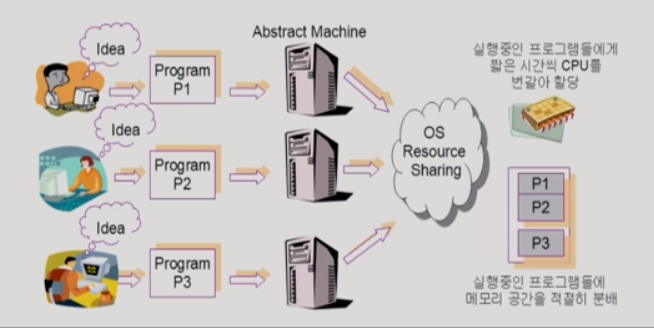
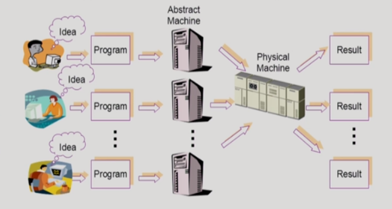
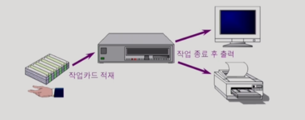
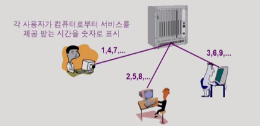
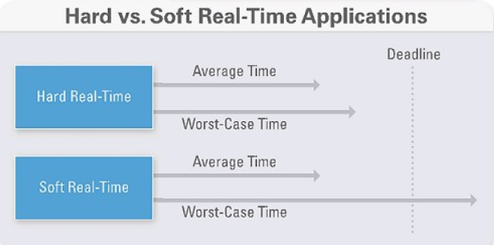
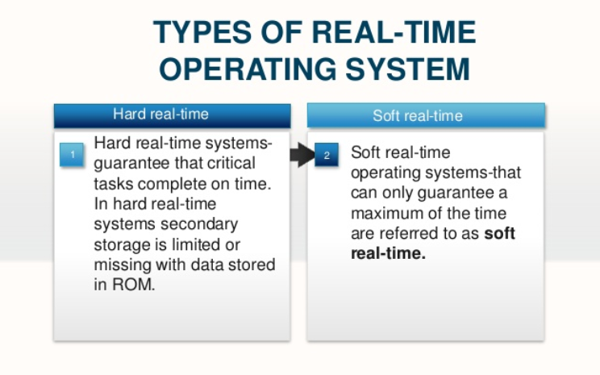
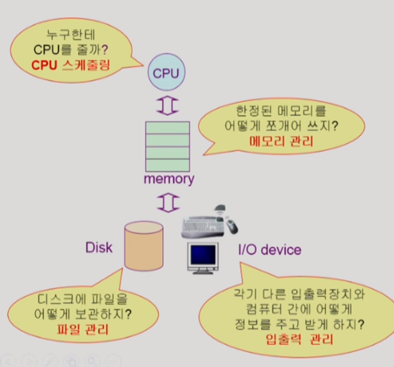

> 반효경 교수님 운영체제 수업(2014)을 듣고 정리한 내용입니다.

# 1. 운영체제란 무엇인가?

## 운영체제(Operating System, OS)란?

- 컴퓨터 하드웨어 바로 위에 설치되어 사용자 및 다른 모든 소프트웨어와 하드웨어를 연결하는 소프트웨어 계층

- 협의의 운영체제(`커널`)
  ─ **운영체제의 핵심 부분으로 컴퓨터 부팅 이후부터 계속 메모리에 상주하는 부분**
- 광의의 운영체제
  ─ 커널 뿐 아니라 각종 주변 시스템 유틸리티(메모리에 상주하지 않는 독립적인 프로그램들)를 포함한 개념

 

## 운영체제의 목적

### 1. 컴퓨터 시스템의 자원을 효율적으로 관리

프로세서, 기억장치, 입출력 장치 등의 하드웨어 자원의 경우 사양이 이미 정해져 있다. 운영체제는 주어진 자원으로 최대한의 성능을 낼 수 있도록 자원을 효율적으로 관리하며(**효율성**), 동시에 여러 사용자들에게 공평하게 분배하는 역할을 수행한다.(**형평성**)

### 2. 컴퓨터 시스템을 편리하게 사용할 수 있는 환경을 제공

운영체제가 자원을 효율적으로 관리하고 사용자들에게 고르게 분배하기 때문에 사용자/프로그램의 입장에서는 자신이 컴퓨터를 혼자 점유하고 있는 듯한 환상을 느끼게 된다. 하드웨어를 직접 다루는 복잡한 부분 역시 운영체제가 수행하기 때문에 컴퓨터를 편리하게 사용할 수 있다.

 

## 운영체제의 분류

### 1. 동시 작업 가능 여부에 따른 분류

- 단일 작업 (single tasking) ─ 한 번에 하나의 작업만 처리 예) MS-DOS 프롬프트 상에서는 한 명령의 수행을 끝내기 전에 다른 명령을 수행할 수 없음
- `다중 작업 (multi tasking)` ─ 동시에 두 개 이상의 작업 처리 예) UNIX, MS Windows 등에서는 한 명령의 수행이 끝나기 전에 다른 명령이나 프로그램을 수행할 수 있음

### 2. 사용자의 수에 따른 분류

: 한 대의 컴퓨터를 여러 사용자(계정)가 동시에 접속해서 사용할 수 있는가?

- 단일 사용자(single user) 예) MS-DOS, MS Windows
- `다중 사용자(multi user)` 예) UNIX, NT server

### 3. 처리 방식에 따른 분류

- **일괄 처리(batch processing)**

  - 작업 요청의 일정량을 모아서 한꺼번에 처리
  - 작업이 완전히 종료될 때까지 기다려야 함
  - 예) 초기 Punch Card 처리 시스템

  

 

- `시분할(time sharing)`

  - 여러 작업을 수행할 때 컴퓨터 처리 능력을 일정한 시간 단위로 분할하여 사용
  - 일괄 처리 시스템에 비해 짧은 응답 시간
  - interactive한 사용자 경험 제공 (즉각적인 출력)
  - 예) UNIX

  

 

- **실시간(Realtime OS)**

  - 정해진 시간 안에 반드시 결과가 나오는 것을 보장
  - 특수한 목적을 가지고 있는 경우 사용
  - 예) 원자로/공장 제어, 미사일 제어, 반도체 장비, 로봇 제어
  - 실시간 시스템의 개념 확장
    - Hard Realtime System (경성 실시간 시스템): 데드라인을 지키지 않으면 치명적인 결과를 초례하는 경우
    - Soft Realtime System (연성 실시간 시스템)

  
  

 

## 몇 가지 용어

`Multitasking`\
`Multiprogramming`\
`Time sharing`\
`Multiprocess`

- 위 용어들은 컴퓨터에서 여러 작업을 동시에 수행하는 것을 뜻한다.
- Multiprogramming은 여러 프로그램이 메모리에 올라가 있음을 강조
- Time sharing은 CPU의 시간을 분할하여 나누어 쓴다는 의미를 강조

> `Multiprocessor` ─ 하나의 컴퓨터에 CPU(processor)가 여러 개 붙어 있음을 의미

 

## 운영체제의 예

### 1. 유닉스(UNIX)

- 대형 컴퓨터를 위해 만들어진 운영체제 → 멀티 유저, 멀티태스킹 지원
- 코드의 대부분을 C언어로 작성
- 소스 코드 공개
- 높은 이식성 (portable)
- 최소한의 커널 구조
- 복잡한 시스템에 맞게 확장 용이
- 다양한 버전
  - System V, FreeBSD, SunOS, Solaris
  - Linux

### 2. DOS(Disk Operating System)

- MS사에서 IBM-PC를 위해 개발
- 단일 사용 운영체제, 메모리 관리 능력의 한계 (주 기억 장치: 640KB)

### 3. MS Windows

- 개인용 컴퓨터(PC)를 위해 만들어진 운영체제 → 단일 사용자, 단일 작업 지원
- Plug and Play, 네트워크 환경 강화
- DOS용 응용 프로그램과 호환성 제공
- 풍부한 지원 소프트웨어

### 4. Handheld device를 위한 OS

- PalmOS, Pocket PC(WinCE), Tiny OS

 

## 운영체제의 자원 관리

운영체제의 가장 기본적인 역할은 주어진 자원들을 효율적으로 관리해서 컴퓨터 시스템의 성능을 최대한으로 활용하는 것이다. 자원을 관리하는 차원에서 각각의 자원별로 어떤 이슈들이 있는지 살펴보자.

- `CPU` : **CPU 스케줄링** ─ 어떤 프로그램에게 CPU를 할당할 것인가? 일반적으로 생각할때 '스케줄링'이라고 하면 선착순으로 처리하는 것이 가장 공정하고 합리적인 방법이라고 생각하는 경향이 있지만 이는 컴퓨터에서는 효율적이지 못한 방식이다. 디스크가 메모리에 비해 60만에서 100만배가 느리고 메모리는 CPU에 비해 수백배가 느리기 때문. 운영체제는 여기서 발생하는 천문학적인 시간차이를 완충하면서 주어진 자원의 특성을 최대한 활용하는 방향으로 발전해왔다. CPU는 짧은 시간을 간격으로 CPU를 할당했다가 다시 회수하는 방식으로 작동한다.

- `메모리` : **메모리 관리** ─ 메모리를 어떤 프로그램에 얼마나 할당해야 하는가? 프로그램이 많아질수록 각각의 프로그램이 할당받는 메모리가 매우 적어지고 프로그램 실행이 어려워 질 수 있다. 일부 프로그램에게 최우선적으로 메모리를 할당하고 어느정도 실행이 끝나면 나머지 프로그램에게 할당하는 방식으로 관리할 수 있다.(Working set model) 디스크에서 새로운 무언가를 메모리에 올리려고 할 때, 메모리가 꽉 차 있으면 기존 메모리상에서 어떤 것을 쫓아내야 할지 결정해야 한다. 이때 CPU에서 재사용할 가능성이 높은 프로그램을 예측해서(과거의 메모리 사용 이력을 참고해서 결정) 메모리를 비워낸다.

- `디스크` : **파일 관리** ─ 파일을 어떻게 관리할 것인가? 디스크의 파일 관리는 엘리베이터와 비슷하다. 디스크의 스케줄링은 디스크 헤드의 움직임을 최소화 하면서 많은 요청을 빠르게 처리할 수 있는 방향으로 발전해왔다. 디스크 헤드와 가까운 위치의 파일을 먼처 처리하는 식.

- `I/O device` : **입출력 관리** ─ CPU나 메모리보다 처리속도가 훨씬 느린데 어떻게 이들과 효과적으로 데이터를 주고 받을것인가?

- **프로세스 관리**

  - 프로세스의 생성과 삭제
  - 자원 할당 및 반환
  - 프로세스 간 협력

- 그 외 보호 시스템, 네트워킹, Command line interpreter

 

## 운영체제 공부 방법

OS 사용자 관점이 아니라 OS 개발자 관점에서 접근해야 한다.

- 우리의 몸이 뇌의 통제를 받듯 컴퓨터 하드웨어는 운영체제의 통제를 받는다. 그리고 운영체제는 사람이 프로그래밍하는 것! 스스로를 운영체제라고 생각하고 본인의 할 일이 무엇인지 생각해보자.
- 대부분의 알고리즘은 OS 프로그램 자체의 내용이다.
