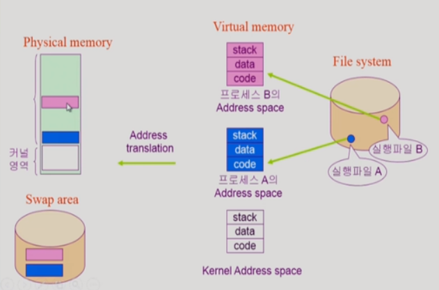
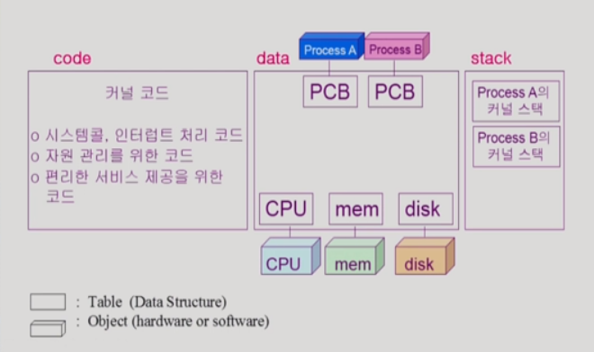
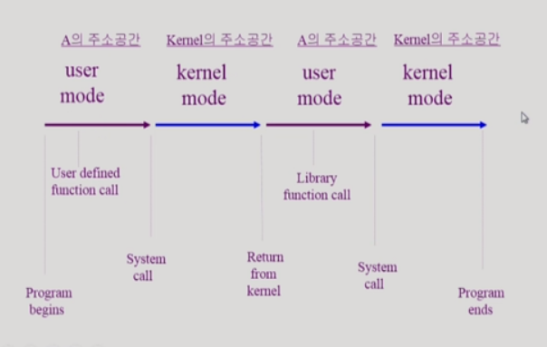

> 반효경 교수님 운영체제 수업(2014)을 듣고 정리한 내용입니다.

 

컴퓨터 내부에서 프로그램이 실행되는 과정을 알아본다.

 

# 2-2. 프로그램의 실행

## 메모리 로드 (Memory Load)

프로그램은 '실행파일' 형태로 하드 디스크의 파일 시스템에 저장되어 있다. 실행파일을 실행시키면 프로그램이 메모리상에 올라가서 '프로세스'가 되는데, 이때 메모리에 즉시 올라가는게 아니라 가상 메모리 단계를 거친다.

가상 메모리 단계란 프로그램을 실행하는 시점에 해당 프로그램만의 독자적인 Address space(메모리상의 주소 공간)를 생성하는 것을 말한다.

이 Address space는 stack, data, code 영역으로 구분된다.

- `stack` ─ 함수를 호출하거나 리턴할때 사용하는 영역
- `data` ─ 변수 등 프로그램이 사용하는 데이터들을 담고 있는 영역
- `code` ─ CPU에서 실행할 기계어 코드를 담고 있는 영역

Address space를 통째로 메모리에 올리는 것이 아니라, 당장 필요한 부분만을 메모리에 올린다. 또한 커널(운영체제)영역이 항상 메모리상에 상주하는것과는 달리, Address space는 프로그램 실행이 끝나면 메모리상에서 지워진다.

당장 필요하지 않는 부분은 디스크의 Swap area에 보관해둔다.

> Swap area는 메모리의 연장선상에 위치하는 디스크 공간으로 메모리 용량을 보조하는 역할을 한다. 메모리와 마찬가지로 휘발성이다. 반면 디스크의 file system은 비휘발성 공간이다.

Address transition은 가상 메모리 상의 주소를 주 메모리 상의 주소로 변환하는 것을 말하며, 하드디스크의 특정 장치가 이 역할을 담당하고 있다.

 

## 커널 주소 공간의 구성

커널 역시 하나의 프로그램이기 때문에 Address space를 가지고 있다.

`code`영역에는 
자원을 효율적으로 관리하고 사용자에게 편리한 인터페이스를 제공하기 위한 코드가 존재한다. 인터럽트가 들어왔을 때 CPU 제어권이 운영체제에게 주어지기 때문에 각각의 인터럽트를 어떻게 처리해야 하는지를 명시해놓은 코드가 있다.

`data`영역에는 
운영체제는 CPU, memory, disk등의 하드웨어들을 관리하기 위한 자료구조들이 들어있다. 또한 각각의 프로그램을 관리하기 위한 자료구조(Process Control Block) 역시 포함한다.

`stack`영역에는 
운영체제도 함수 구조로 코드가 작성되어 있기 때문에 stack이 존재한다. 운영체제의 커널코드는 여러 사용자 프로그램의 요청에 따라 실행되기 때문에 사용자 프로그램마다 별도의 커널 스택을 가지고 있다.

 

## 사용자 프로그램이 사용하는 함수

- 함수
  - **사용자 정의 함수**: 내가 프로그램에 정의한 함수
  - **라이브러리 함수**: 다른사람이 만들어 놓은 함수이지만 내 프로그램의 실행 파일에 포함되어 있는 함수
  - **커널 함수**
    - 운영체제 프로그램의 함수
    - 커널 함수의 호출 = System call

사용자 정의 함수든 라이브러리 함수든 컴파일해서 실행파일을 만들게 되면 내 프로그램 안에 들어있는 함수이기 때문에 언제든 자유롭게 실행할 수 있다.

반면 커널함수의 경우 내 프로그램의 함수가 아니라 커널코드에 포함된 함수이기 때문에 시스템 콜을 통해서 CPU 제어권을 넘겨야만 실행이 가능하다.

 

## 프로그램이 실행되는 단계

하나의 프로그램이 실행되는 동안 운영체제는 user mode ↔ kernel mode 전환을 반복한다.

프로그램이 CPU 제어권을 가지고 있으면 user mode라고 한다. 이때 syetem call을 하게 되면 CPU 제어권이 커널로 넘어가면서 kernel mode로 전환하게 되고 커널의 주소공간에 있는 커널함수를 실행한다.
