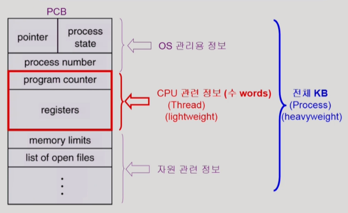
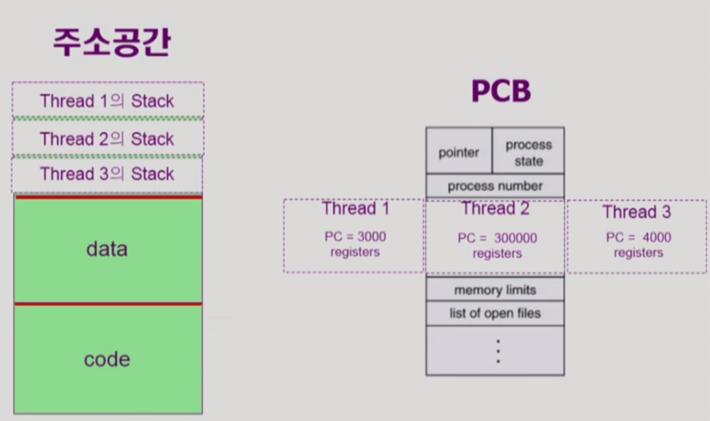

> 반효경 교수님 운영체제 수업(2014)을 듣고 정리한 내용입니다.

 

## Thread

thread란 **프로세스의 실행 단위 / CPU 수행 단위**이다.

동일한 작업을 하는 프로세스가 여러 개 인 경우 프로세스의 Address space는 하나만 생성하고 여러 개의 thread를 둠으로써 메모리의 낭비를 줄이고 프로세스마다 다른 부분의 코드를 실행할 수 있다. (lightweight process)

thread는 다음의 CPU 수행 정보들로 구성되어 있으며

- program counter(PC)
- register set
- stack space

 

thread 끼리는

- Address space의 data, code 영역을 공유하되 stack은 별도로 할당받는다.
- PCB에서는 program counter(PC)와 register set을 제외한 프로세스 관련 정보 및 자원들을 모두 공유한다.

thread들이 공유하는 부분 (code section, data section, OS resources)을 **task**라고 한다.

 

### thread의 장점

1. **Responsiveness**

다중 스레드로 구성된 태스크 구조에서는 하나의 서버 스레드가 blocked(waiting) 상태인 동안에도 동일한 태스크 내의 다른 스레스가 실행(running)되어 빠른 처리를 할 수 있다.

예를들어 웹브라우저(프로그램)이 스레드를 여러 개 가지고 있다면 하나의 스레드가 이미지를 비롯한 추가 데이터를 받기 위해 서버에 요청을 걸어놓고 blocked 상태가 됐을 때 다른 스레드가 이미 받아놓은 HTML 텍스트를 우선적으로 화면에 출력할 수 있다. 이러한 비동기식 입출력을 통해 사용자의 답답함을 줄이고 응답성을 높일 수 있다.

2. **Resource Sharing**

하나의 프로세스 안에 CPU 수행 단위(스레드)를 둬서 code, data, resource 자원을 공유함으로써 보다 효율적으로 자원을 활용할 수 있다.

3. **Economy**

동일한 일을 수행하는 다중 스레드가 협력하여 높은 처리율(throughput)과 성능 향상을 얻을 수 있다.

- 새로운 프로세스 하나를 만드는 것 보다 기존의 프로세스에 스레드를 추가하는 것이 overhead가 훨씬 적다.
- CPU switch 역시 프로세스 단위로 교환이 일어나는 것 보다 프로세스 안에서 스레드 끼리 교환이 일어나는게 overhead가 적다.
- Solaris의 경우 위 두 가지 overhead가 각각 30배, 5배

 

4. **Utilization of MP Architectures**

> 1 ~ 3번이 CPU가 1개인 경우인데 반해 4번은 CPU가 여러 개 인 경우이다.

각각의 스레드가 서로 다른 CPU를 가지고 병렬적으로 작업을 진행해서 훨씬 효율적으로 작업을 수행할 수 있다.

 

### thread의 실행

스레드는 실행 방법에 따라 다음의 두 가지 타입으로 나눌 수 있다.

- **Kernel Thread** ─ 운영체제가 스레드가 여러 개인 것을 알고 있어서 스레드간의 CPU 교환을 '커널이' CPU 스케줄링을 하듯이 관리한다.

- **User Thread** ─ 운영체제는 스레드가 여러 개인 것을 모르는 상태에서 사용자 프로그램이 라이브러리의 지원을 받아 스스로 여러 개의 스레드들을 관리한다. 커널이 스레드의 존재를 모르기 때문에 구현에 제약이 있을 수 있다.

(그밖에 real-time 스레드들도 존재한다.)
