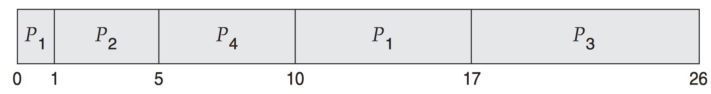

> 반효경 교수님 운영체제 수업(2014)을 듣고 정리한 내용입니다.

 

여러 개의 프로그램이 실행될 때 다음과 같은 이슈가 발생한다.

1. 여러 Process가 CPU를 점유하려고 할 때, 누구에게 줄 것인가?
2. 하나의 Process에게 얼마나 오랫동안 CPU를 할당할 것인가?

이러한 이슈들을 해결하는 작업이 바로 CPU 스케줄링이다. 즉, 어떤 프로세스에게 얼마 동안 CPU를 할당할지 결정하는 작업이라고 할 수 있다.

 

## CPU burst & I/O burst

하나의 프로세스가 실행될 때 CPU burst와 I/O burst가 교대로 실행된다.

> 출처: https://walkccc.github.io/CS/OS/Chap06/

 

### CPU burst

프로그램 실행중에 연속적으로 CPU를 사용하는 단절된 구간이다. (스케줄링의 단위)

### I/O burst

프로그램 실행중에 I/O작업이 끝날때까지 block되는 구간이다.

 

프로세스의 종류에 따라 CPU burst / I/O burst의 빈도와 길이가 다르다. 이러한 특성에 따라 프로세스를 다음의 두 가지로 나눌 수 있다.

- `I/O bound process`

  - CPU를 잡고 계산하는 시간보다 I/O에 많이 시간이 필요한 프로세스
  - 사용자와의 인터랙션이 많아서 I/O burst가 빈번하게 발생하는 경우가 여기에 해당
  - **many short CPU bursts**

 

- `CPU bound process`
  - 계산 위주의 프로세스
  - CPU를 진득하게 쓰는 프로그램
  - **few very long CPU bursts**

 

컴퓨터 안에서 다양한 종류의 process(= job)가 섞여 있기 때문에 CPU 스케줄링이 필요하다.

> e.g. CPU 스케줄링으로 I/O bound job에 우선적으로 CPU 할당 (CPU bound job이 CPU를 잡고 놓지 않을 경우 I/O bound job은 하염없이 기다려야 하고 사용자는 답답함을 느끼게 되기 때문)

 

## CPU Scheduler & Dispatcher

> CPU Scheduler와 Dispatcher는 운영체제 커널 코드의 한 부분으로(별도의 하드웨어X), 각각 다음의 역할을 수행한다.

- **CPU Scheduler**

  - ready 상태의 프로세스 중 CPU를 할당할 프로세스를 선택한다.

- **Dispatcher**
  - CPU Scheduler에 의해 선택된 프로세스에게 CPU를 할당한다.
  - 이 과정을 Context switch(문맥 교환)이라고 한다.

 

## CPU 스케줄링이 필요한 경우

1. Running → Blocked (e.g. I/O request syscall, `wait()` for child)
2. Running → Ready (e.g. timer interrupt)
3. Blocked → Ready (e.g. completion of I/O)
   > 일반적으로 I/O작업이 끝나면 I/O작업을 요청했던 프로세스를 Ready 상태로만 변경할 뿐 즉시 CPU를 할당하지는 않는다. 하지만 I/O를 요청했던 프로세스가 우선순위가 가장 높은 프로세스였을 경우 I/O 작업이 완료되자마자 해당 프로세스에게 CPU를 할당한다. (우선순위 기반 CPU 스케줄링)
4. Terminate

 

- 1, 4에 의한 CPU 스케줄링은 `nonpreemptive`(비선점형) ─ 자진 반납
- 2, 3에 의한 CPU스케줄링은 `preemtive`(선점형) ─ 강제로 빼앗음

 

## CPU 스케줄링 성능 척도 (Scheduling Criteria)

Performance Index 또는 Performance Measure라고도 한다.

 

시스템 입장에서의 성능 척도\
→ 제한된 시간 내에 최대한 많은 프로세스를 처리 ('작업량'이 관건)

- **CPU utilization**(이용률)\
  : 전체 시간 중에서 CPU가 프로세스들을 실행한 시간의 비율 (0 ~ 100%)

- **Throughput**(처리량)\
  : 단위 시간당 완료한 프로세스들의 개수
  > 네트워크에서는 단위 시간당 전송한 양을 의미 (e.g. Mbps, Kbps)

 

프로세스 입장에서의 성능 척도 → CPU를 최대한 빨리 얻어서 빨리 실행 ('시간'이 관건)

- **Turnaround time**(소요시간, 반환시간): 특정 프로세스에 대해 실행을 요청한 시점부터 완전히 종료된 시점까지의 소요 시간 (실제 실행 시간 외에 ready queue에서의 대기시간과 device queue에서의 대기시간도 포함)

- **Waiting time**(대기시간): 프로세스가 ready queue에서 기다린 시간의 총 합

- **Response time**(응답시간): 실행이 요청된 시점부터 최초로 CPU를 얻기까지 소요된 시간

 

## CPU 스케줄링 알고리즘

### 1. FCFS (First-Come First-Served)

- nonpreemtive
- 프로세스를 ready queue에 들어온 순서대로 실행하는 알고리즘이다. FCFS 알고리즘의 평가 기준은 평균적인 waiting time이고, burst time과 ready queue에 추가된 순서를 고려하여 계산한다.

 

**Case 1**

| Process | Burst Time |
| :-----: | :--------: |
|   P1    |     24     |
|   P2    |     3      |
|   P3    |     3      |

- Order: P1 → P2 → P3

- Gantt chart:

- Average waiting time = `(0 + 24 + 27) / 3 = 17ms`

 

**Case 2**

- Order: P2 → P3 → P1

- Gantt chart:

- Average waiting time = (0 + 3 + 6) / 3 = 9ms

 

nonpreemtive 방식이기 때문에 먼저 처리하는 프로세스의 burst time에 따라 average waiting time이 달라진다.

burst time이 긴 프로세스가 ready queue에 먼저 들어오게 되면 나중에 들어온 모든 프로세스들은 기다릴 수밖에 없다. `convoy effect`

이러한 문제점을 해결하려면 burst time이 짧은 프로세스를 먼저 처리하면 된다.

 

### 2. SJF (Shortest-Job-First)

- SPN (Shortest-Process-Next) 라고도 한다.
- nonpreemtive & preemtive 두 가지 방식으로 구현할 수 있다.
- burst time이 짧은 프로세스를 먼저 처리하기 때문에 평균적인 waiting time을 평가 기준으로 했을 때 가장 최적의 성능을 보장한다. (preemtive 방식일때)

 

**Case 1 - _nonpreemtive_**

- 하나의 프로세스가 CPU를 잡으면 burst가 완료될 때까지 CPU를 빼앗기지 않는다. (하나의 프로세스가 완료될 때 마다 burst time을 비교하여 실행할 프로세스를 선정)

| Process | Arrival Time | Burst Time |
| :-----: | :----------: | :--------: |
|   P1    |      0       |     8      |
|   P2    |      1       |     4      |
|   P3    |      2       |     9      |
|   P4    |      3       |     5      |

- Average waiting time = `(0 + (8 - 1) + (8 + 4 + 5 - 2) + (8 + 4 - 3)) / 4 = 7.75ms`

가장 먼저 도착한 P1부터 실행한다. P1의 실행이 완료되면 (P2, P3, P4가 모두 도착해있는 상태) burst time이 짧은 P2 → P4 → P3 순으로 실행한다.

 

**Case 2 - _preemtive_**

- 현재 수행중인 프로세스의 남은 burst time보다 더 짧은 burst time을 가지는 새로운 프로세스가 도착하면 CPU 제어권을 빼앗아서 새로운 프로세스에게 할당한다. (ready queue에 새로운 프로세스가 도착할때마다 burst time을 비교하여 실행할 프로세스를 선정)
- 이 방법을 SRTF (Shortest-Remaining-Time-First) 라고도 한다.

 

| Process | Arrival Time | Burst Time |
| :-----: | :----------: | :--------: |
|   P1    |      0       |     8      |
|   P2    |      1       |     4      |
|   P3    |      2       |     9      |
|   P4    |      3       |     5      |

> ※ Arrival Time: ready queue에 들어온 시점

 

- Gantt chart:

- Average waiting time = `[(10 - 1) + 0 + (17 - 2) + (5 - 3)] / 4 = 26 / 4 = 6.5 ms`

preemtive 방식에서 계산된 average waiting time은 최적화된 값이므로, 위와 같은 예제에서는 6.5ms 보다 짧은 average waiting time을 얻을 수 없다.

 

#### 문제점 및 해결방법

1. Starvation (Indefinite Blocking): SRTF(preemtive) 방식의 경우 우선순위가 낮은 프로세스(long burst time)는 마지막까지 실행되지 않을 수도 있다.

해결방법: **Aging** 기법

사람이 나이를 먹는 것처럼 프로세스도 시간이 지나면 priority가 1씩 높아지게 된다. 따라서 아무리 낮은 priority를 가지고 있는 프로세스도 언젠가는 높은 priority를 갖게 되기 때문에 CPU에 의해 실행될 수 있게 된다.

 

2. CPU burst time을 미리 알 수 없다.

해결방법 : exponential average을 사용, 과거 burst time 패턴을 통해 '추정'할 수 있다.

> 최근 데이터일수록 더 큰 비중으로 반영하고 오래된 데이터 일수록 적은 비중으로 반영하는 특성이 있다.

 

### 3. Priority Scheduling

- 프로세스마다 적절한 우선순위를 부여하여 우선순위가 높은 프로세스부터 실행하는 알고리즘
- 우선순위는 프로세스 생성 시에 사용자에 의해 지정되기도 하고 운영체제에서 내부적으로 메모리 용량이나 실행 시간 등을 기준으로 하여 결정하기도 한다.
- 우선순위를 부여하는 방식에 따라 결과가 FCFS와 같게 만들 수도 있고 SJF나 SRTF와 같게 만들 수도 있다. (_SJF, SRTF는 Priority Scheduling의 일종!_)
- 프로세스별로 **priority number** (integer)를 할당하여 우선순위를 나타낼 수 있으며 일반적으로 priority number가 '작을수록' 높은 우선순위를 뜻한다.
- nonpreemtive & preemtive 두 가지 방식으로 구현할 수 있다.
- 우선순위가 높은 프로세스가 계속해서 ready queue에 들어올 경우 우선순위가 낮은 프로세스는 영원히 실행되지 않을 수 있다. (Starvation) → Aging 기법으로 해결

 

### 4. Round-Robin (RR)

- preemtive
- ready queue의 프로세스들을 일정한 할당 시간 단위(quantum)로 돌아가면서 실행한다. 선택된 프로세스는 실행을 위해 할당된 시간을 가지며 이 시간이 만료되면 CPU를 빼앗기고 강제로 ready queue에 삽입된다.
- CPU burst time과 대기시간이 비례한다는 특징이 있다. CPU 작업량이 많을 수록 더 빈번하게 기다려야 하기 때문.
- 할당 시간 단위(q)가 길어질수록 FCFS에 가까워진다.
- 할당 시간 단위(q)가 짧아질수록 Response Time이 짧아지는 대신 빈번한 문맥 교환으로 인한 오버헤드가 늘어난다.

#### 장점

1. 할당 시간 만큼 CPU를 줬다가 뺐는 작업을 반복하기 때문에 **Response Time이 짧아지는 효과**가 있다. → 짧은 계산 작업과 입출력 작업이 반복적으로 발생하는 대화형 프로세스에 적합

2. CPU burst time을 예측할 필요가 없고 **모든 프로세스가 CPU를 얻을 수 있다**.

   > 어떤 프로세스도 `할당 시간 단위(q) x (프로세스 개수(n) - 1)`만큼의 시간 이상 기다릴 필요가 없다. 이 시간 내에 반드시 실행할 기회가 주어진다.

   → 다양한 burst time을 가지는 프로세스들이 뒤섞여 있을 때 효과적 (burst time이 길어도 CPU를 얻을 수 있기 때문에)

 

| Process | Burst Time |
| :-----: | :--------: |
|   P1    |     24     |
|   P2    |     3      |
|   P3    |     3      |

- Gantt chart:

- Average waiting time = `[(10 - 4) + 4 + 7] / 3 = 5.66 ms`

일반적으로 SJF보다 Turnaround time, Waiting time은 길지만 Response Time은 더 짧다.

모든 프로세스가 동일한 burst time을 가지는 경우 → FCFS: 먼저 도착한 프로세스를 먼저 처리하여 종료시킬 수 있지만 → Round-Robin: 모든 프로세스를 일정 단위로 잘게 쪼개서 번갈아가며 처리하기 때문에 Turnaround time, Waiting time이 길어지고 모든 프로세스가 마지막까지 메모리에 남아있다가 거의 동시다발적으로 종료된다.

 

---

**Reference**

- https://walkccc.github.io/CS/OS/Chap06/#611-cpuio-burst-cycle
- 운영체제의 이해 (홍릉과학출판사)
- https://sanghyunj.tistory.com/18
- https://jhnyang.tistory.com/8?category=815411
- https://operatingsystems.tistory.com/entry/OS-Scheduling-Algorithm
