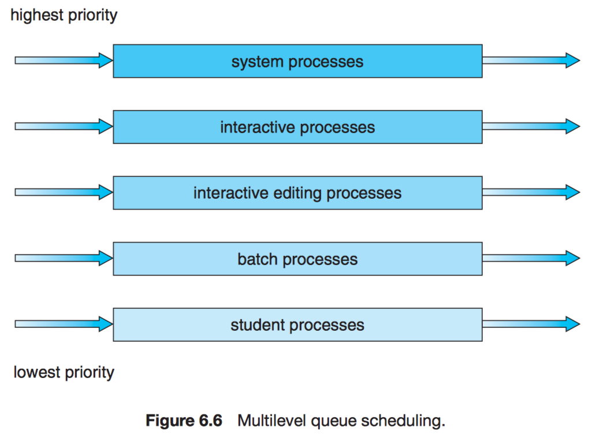
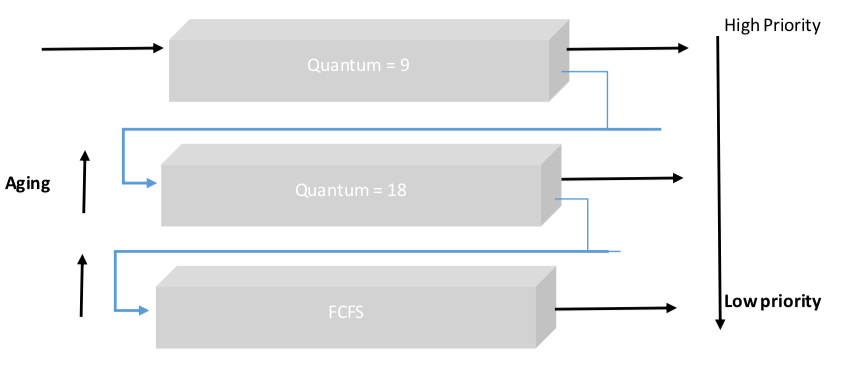
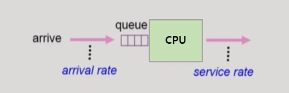

> 반효경 교수님 운영체제 수업(2014)을 듣고 정리한 내용입니다.

 

### 5. Multilevel Queue

- ready queue를 프로세스들의 특성에 따라 여러 레벨로 분리하고 높은 레벨(=높은 우선순위)의 queue에 프로세스가 없는 경우에 한해서 그 다음 레벨의 queue에 있는 프로세스를 실행한다.

 

- 각 레벨별로 별도의 스케줄링 알고리즘을 적용할 수도 있다.

  > foreground(대화형) process - RR background batch process - FCFS

 

- queue에 대한 스케줄링이 필요
  - **Fixed priority scheduling** ─ 높은 레벨의 queue를 절대적으로 먼저 처리하는 스케줄링. 즉, 높은 레벨의 queue가 비었을 때만 낮은 레벨의 queue에 있는 프로세스를 실행함 → 낮은 레벨에 있는 queue는 영원히 실행되지 않을 수 있음 (Starvation 문제)
  - **Time slice** ─ 각 queue에 CPU 시간을 적절한 비율로 할당하는 (e.g. CPU의 80%를 높은 레벨의 queue에 할당하고 나머지 20%는 낮은 레벨의 queue에 할당)

 

> 출처: https://walkccc.github.io/CS/OS/Chap06/#611-cpuio-burst-cycle

 

### 6. Multilevel Feedback Queue

- 프로세스들이 상황에 따라 queue와 queue 사이를 이동할 수 있는 스케줄링 알고리즘

 

- Multilevel Feedback Queue를 정의하는 파라미터들과 일반적인 운영방식

  - _queue를 몇 개 둘 것인가_
  - _각 queue별로 어떤 스케줄링 알고리즘을 적용할 것인가_
    > 상위 queue로 갈수록 RR + 짧은 quantum unit, 가장 하위의 queue는 FCFS
  - _프로세스를 상위(또는 하위) queue로 보내는 기준은 무엇인가_
    > 상위 queue에서 할당한 시간이 만료될 경우 바로 다음 하위 queue로 강등되며 상위 queue가 빌 때 까지 대기해야 함
  - _프로세스가 queue로 들어갈 때 어떤 queue로 들어갈 것인가_ > 가장 먼저 도착한 프로세스를 가장 상위 queue로 배치

 

- queue 하나에 대해 RR을 적용하는것 보다 더 **CPU burst가 짧은 프로세스를 우대**해주는 스케줄링 방식이다.

 

> 출처: https://tutorialwing.com/multilevel-feedback-queue-scheduling-tutorial-example/

 

## Multiple-Processor Scheduling

- CPU가 여러 개인 경우의 스케줄링

   

- Homogeneous processor인 경우
  - queue에 한 줄로 세워서 각 프로세서가 알아서 꺼내가게 할 수 있다.
  - 반드시 특정 프로세서에서 수행되어야 하는 job이 있는 경우, 해당 job을 특정 프로세서에 먼저 할당할 수 있다.

 

- Load Sharing 필요
  - 일부 프로세서에 job이 몰리지 않도록 부하를 적절히 공유하는 메커니즘이 필요하다.
  - 별개의 queue를 두는 방법 vs 공동 queue를 사용하는 방법

 

- **Symmetric Multiprocessing (SMP)**
  - 각 프로세서가 각자 알아서 스케줄링 결정

 

- **Asymmetric multiprocessing**
  - 하나의 프로세서가 시스템 데이터의 접근과 공유를 책임지고 나머지 프로세서는 거기에 따른다.

 

## Real-Time Scheduling

> - real-time job은 주로 특수 목적의 컴퓨터 시스템에서 적용되는데, 실행 결과가 제대로 출력되는 것 뿐만 아니라 실행되는 시점도 지정된 시간 내에 실행이 완료되어야 한다. (e.g. 미사일 방어 시스템, 자동 브레이크 시스템)
> - real-time job들은 periodic한 특성을 가진 경우가 많다. (e.g. 10초에 한 번씩 최소한 1초 동안 CPU를 가져야 한다.)

- **Hard real-time system** ─ 정해진 시간 안에 반드시 끝나도록 스케줄링 해야 함

- **Soft real-time computing** ─ 일반 프로세스에 비해 높은 priority를 갖도록 해야 함 (deadline 보장x)

 

## Thread Scheduling

- **Local Scheduling** ─ User level thread의 경우 사용자 프로세스가 직접 thread를 스케줄링한다. 운영체제는 thread의 존재를 모르는 상태에서 해당 프로세스에게 CPU를 줄지 말지를 결정할 뿐이다. 프로세스에 CPU가 주어지면 프로세스 내부에서 어떤 thread에게 CPU를 줄건지 결정한다.

 

- **Global Scheduling** ─ Kernel level thread의 경우 운영체제가 thread의 존재를 알고 있다. 프로세스와 마찬가지로 운영체제(커널의 단기 스케줄러)가 thread 스케줄링을 담당한다.

 

## Scheduling Algorithm Evaluation

1. **Queueing models**

   

   확률분포로 주어지는 arrival rate(프로세스의 도착률)와 service rate(CPU의 처리율) 등을 통해 각종 performance index 값을 계산해서 여러가지 성능 척도들을 도출하는 방법

 

2. **Implementation & Measurement**

   실제 시스템에 알고리즘을 구현하여 실제 작업(workload)에 대해서 성능을 측정 비교

 

3. **Simulation**

   알고리즘을 모의 프로그램으로 작성 후 trace를 입력하여 결과 비교
