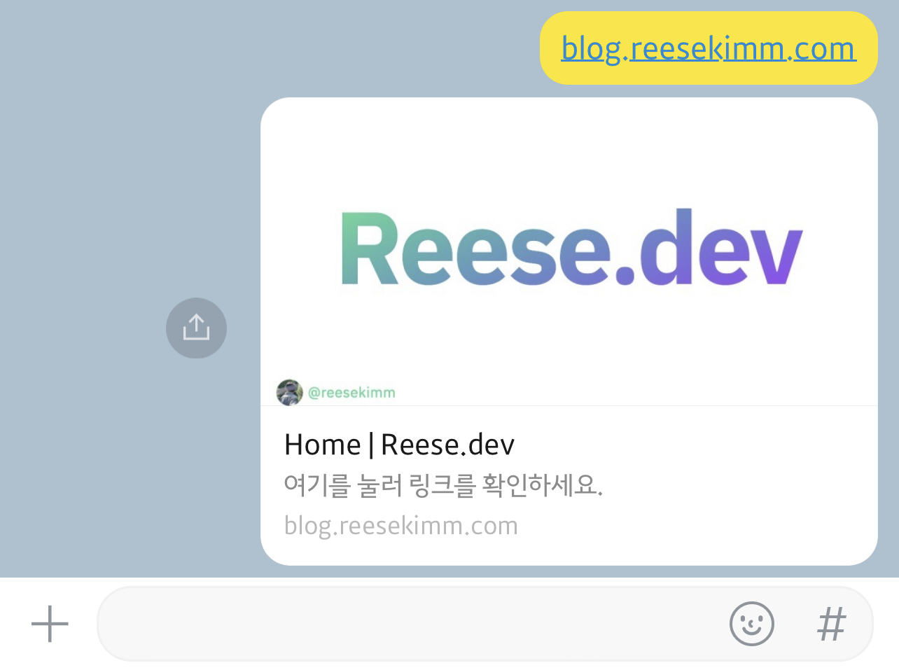
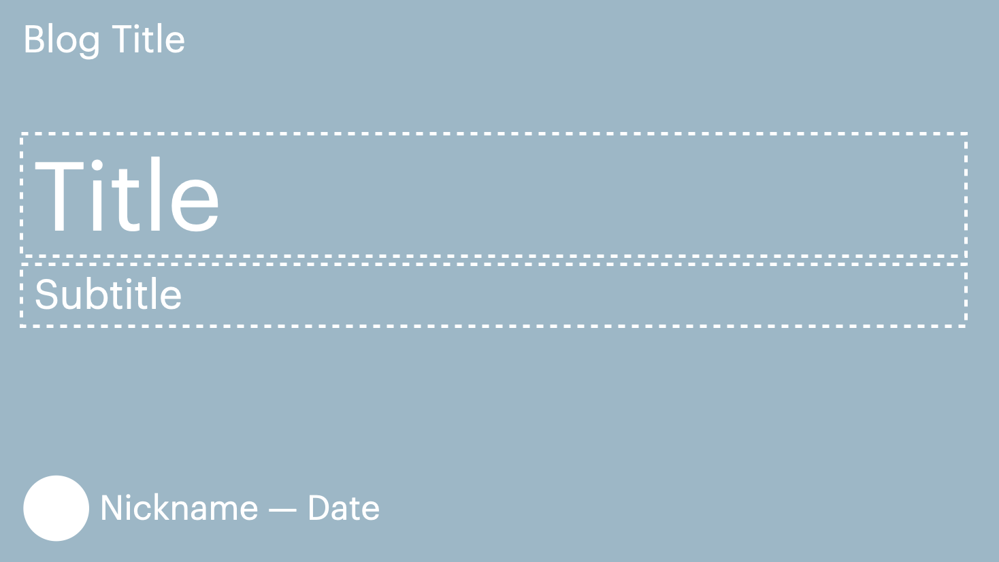
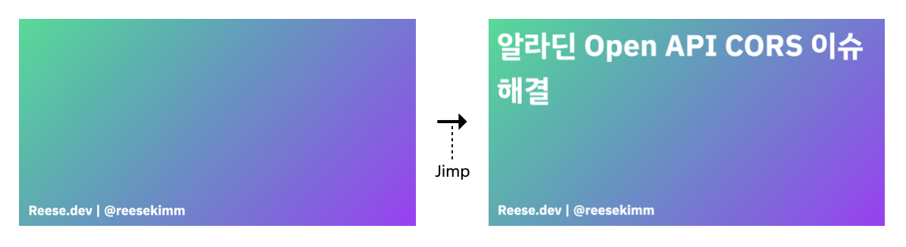
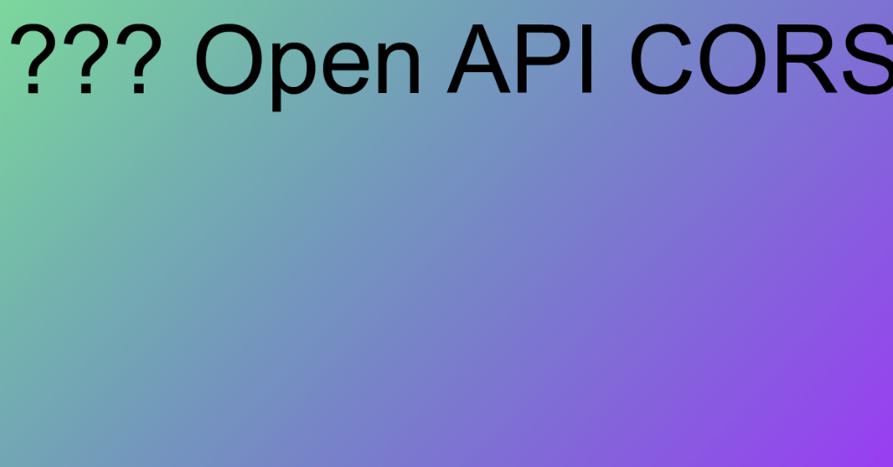
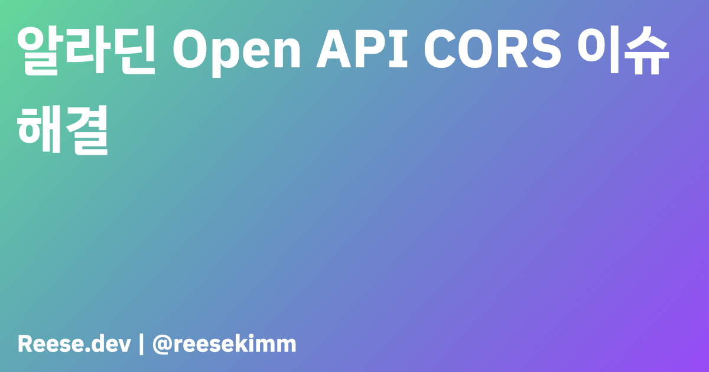
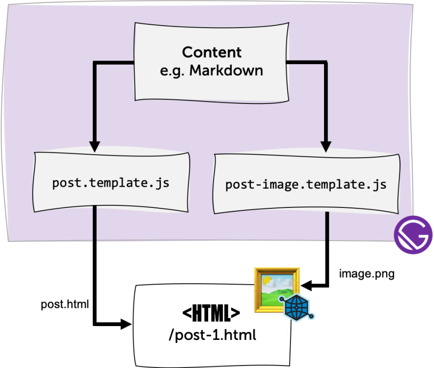
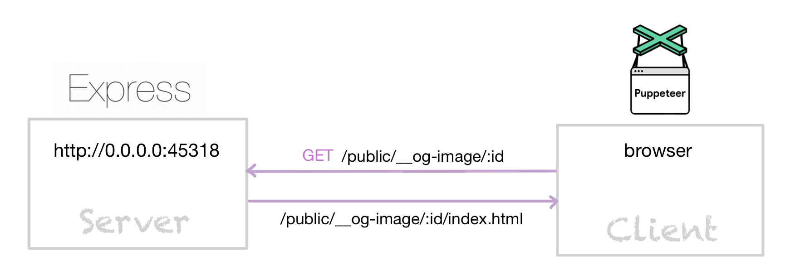
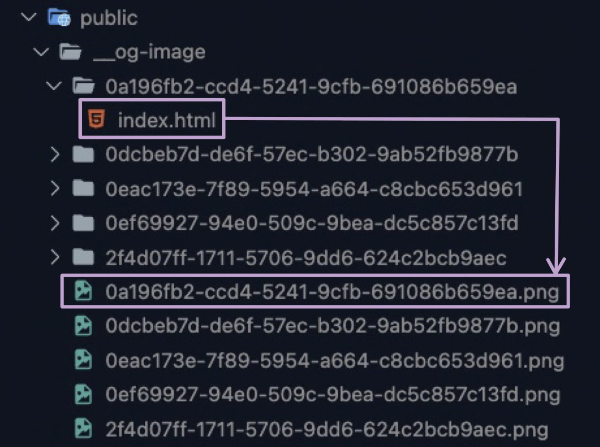
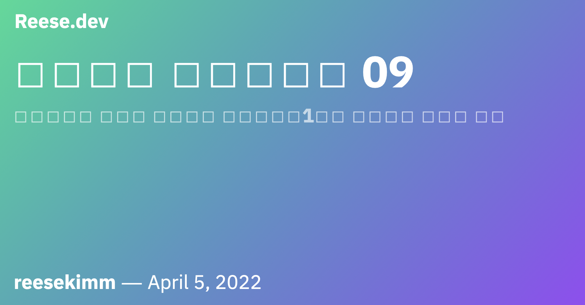
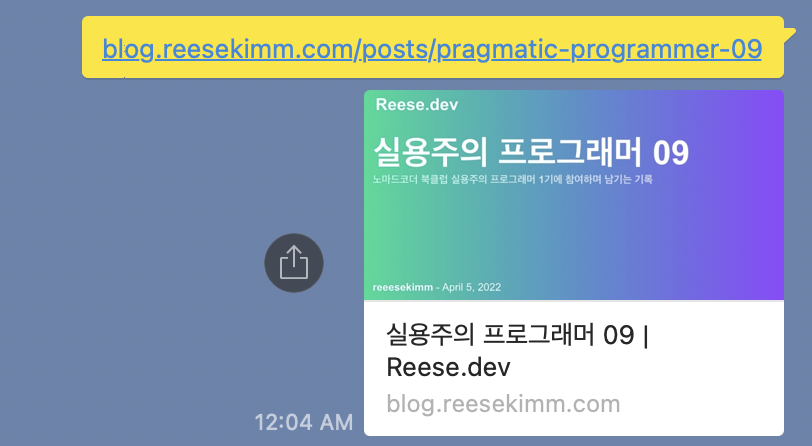

다이나믹 오픈그래프 이미지 생성 기능을 개발하면서 마주쳤던 이슈들을 해결하다가 [Gatsby 플러그인](https://www.npmjs.com/package/gatsby-plugin-dynamic-open-graph-images)까지 배포하게 된 이야기를 글로 남겨보려고 한다.

# 오픈그래프

[오픈그래프](https://ogp.me/)란 **웹사이트 주소만으로 사이트 내의 정보를 미리보기 할 수 있게 해주는 프로토콜**이다. 2010년 Meta가 Facebook 내에서 외부 사이트의 정보를 효과적으로 표시하기위해 개발했고 지금은 거의 표준화되어 수많은 서비스들이 사용하고 있다.

구현 방법은 간단하다. 이렇게 HTML의 `<head>` 태그에 `og:title`, `og:type`, `og:url`, `og:image` `<meta>` 태그를 추가하기만 하면

```html
<html>
  <head>
    <title>Home | Reese.dev</title>
    <meta property="og:title" content="Reese.dev" />
    <meta property="og:type" content="website" />
    <meta property="og:url" content="https://blog.reesekimm.com" />
    <meta
      property="og:image"
      content="https://blog.reesekimm.com/__og-image/default.png"
    />
    ...
  </head>
  ...
</html>
```

오픈그래프를 지원하는 플랫폼에서는 아래의 순서로 동작하여 오픈그래프 이미지를 표시한다.

1. 사용자가 링크를 입력한다.
2. 플랫폼은 정규표현식을 활용해서 입력창의 문자열이 '링크'라는 것을 판별한다.
3. 플랫폼의 크롤러가 해당 링크가 가리키는 웹사이트에 방문하여 head 태그 내의 오픈그래프 meta 태그들을 읽고 정보를 수집한다.
4. 수집한 정보를 바탕으로 미리보기 화면을 생성한다.



<Caption value="카카오톡이 생성해주는 오픈그래프 이미지" />

오픈그래프를 사용하면 웹사이트를 더 매력적으로 어필할 수 있을 뿐만 아니라 신뢰감까지 줄 수 있기에 이번에 블로그를 이관하면서 오픈그래프 이미지를 넣기로 했다.

# 다이나믹 오픈그래프 이미지 생성하기

매번 동일한 오픈그래프 이미지를 제공할 수도 있지만 나는 블로그 포스트마다 다른 오픈그래프 이미지를 제공하고 싶었다. 포스트를 공유할 때마다 오픈그래프 이미지 안에 포스트 제목, 소제목, 작성일, 닉네임 등의 정보를 함께 표시하는거다.



<Caption value="내가 원하는 오픈그래프 이미지 레이아웃" />

## 1. 직접 구현해보자

Gatsby 생태계에는 이미 수많은 플러그인들이 공개되어 있으니 오픈그래프 관련 플러그인도 있을 터였다. 하지만 이번엔 바로 플러그인을 쓰기보다 직접 구현해보고 싶었고, 구글링을 하다가 한 [블로그](https://tkplaceholder.io/how-to-automate-social-cards-for-your-gatsby-blog/) 글을 통해 Jimp라는 라이브러리를 사용하는 방법을 알게됐다.

### Jimp


<Caption value="Jimp - JavaScript Image Manipulation Program" />

[Jimp](https://www.npmjs.com/package/jimp)는 Node.js 이미지 프로세싱 라이브러리다. 이미지 사이즈, 색상을 변경하거나 블러효과를 주는 등 이미지 처리를 위한 다양한 메서드들을 제공해준다.

```js
/* Resize */
image.resize( w, h[, mode] );
image.scale( f[, mode] );
image.scaleToFit( w, h[, mode] );
...

/* Crop */
image.crop( x, y, w, h );
...

/* Composing */
image.composite( src, x, y, [{ mode, opacitySource, opacityDest }] );
image.mask( src, x, y );
...

/* Flip and rotate */
image.flip( horz, vert );
image.rotate( deg[, mode] );

/* Colour */
image.brightness( val );
image.greyscale();
...

/* Alpha channel */
image.opacity( f );
...

/* Blurs */
image.blur( r );
...

/* Effects */
image.sepia();
...

/* 3D */
image.displace( map, offset );
```

<Caption value="Jimp로 할 수 있는 다양한 이미지 처리" />

글에서 소개한 방식은 오픈그래프 이미지의 베이스가 되는 배경 이미지를 준비한 후 Jimp를 이용해서 해당 이미지에 포스트 정보를 텍스트로 삽입하는 것이다.



<Caption value="Jimp를 사용한 오픈그래프 이미지 생성 방식" />

markdown 기준으로 작성되어 있는 예제코드를 mdx를 사용하고 있는 내 코드베이스에 맞춰 변경했고, 포스트를 수정할때마다 오픈그래프 이미지를 만들 필요는 없다고 판단해서 production용 빌드 프로세스가 완료된 시점에 오픈그래프 이미지를 생성하도록 [onPostBuild](https://www.gatsbyjs.com/docs/reference/config-files/gatsby-node/#onPostBuild) API를 사용했다.

```js
// gatsby-node.js
const path = require('path')
const jimp = require('jimp')

const WIDTH = 1200
const HEIGHT = 630

exports.createPages = async () => {
  // ...
}

exports.onPostBuild = async ({ graphql }) => {
  // 전체 포스트 정보 쿼리하기
  const result = await graphql(`
    query {
      allMdx {
        edges {
          node {
            id
            frontmatter {
              title
              slug
            }
          }
        }
      }
    }
  `)

  const posts = result.data.allMdx.edges

  return Promise.all(
    posts.map(
      async ({
        node: {
          frontmatter: { title },
        },
      }) => {
        // 배경 이미지와 폰트 가져오기
        const [image, font] = await Promise.all([
          jimp.read(path.join(__dirname, '../static', 'og-base.png')),
          jimp.loadFont(jimp.FONT_SANS_128_BLACK),
        ])

        // 배경 이미지 사이즈 조절 및 포스트 제목 삽입 후 원하는 경로에 저장하기
        return image
          .resize(WIDTH, HEIGHT)
          .print(font, 10, 10, title, WIDTH)
          .writeAsync(path.join('./public', 'og', `${title}.png`))
      }
    )
  )
}
```

promise 처리로 애를 먹다가 마침내 해결하고 부푼 마음으로 `npm run build`를 실행!

결과는 처참했다.



<Caption value="???" />

### ⚠️ 한글 깨짐 이슈

문제는 폰트였다. Jimp가 기본적으로 제공해주는 폰트를 사용했더니 한글이 전부 깨졌던 것이다.

게다가 **Jimp는 BMFont(bitmap font)만 지원**했다. 그래서 한글 BMFont를 쓰는 방법도 고려해봤지만 아무래도 디자인 통일성을 위해 블로그에서 사용한 폰트를 그대로 사용하고 싶었다. 하지만 해당 폰트는 TTF 포맷만 지원했기 때문에 TTF를 BMFont로 변환하는 작업이 필요했다.

Jimp 문서에서 소개하는 폰트 변환 프로그램들을 포함해서 구글링으로 여러 프로그램을 비교해보았다. 지금까지 유지보수가 잘 되고 있고 쓸만해 보이는 프로그램은 [hiero](https://libgdx.com/wiki/tools/hiero)였다. 하지만 프로그램을 실행하기 위해서는 Java를 설치해야 했고, BMFont로 변환하는데 성공하더라도 폰트를 변경할 때마다 매번 BMFont로 변환해야 하는 번거로움이 싫었다.

고민끝에 TTF를 지원하는 플러그인이 없는지 찾아보기로 했다.

## 2. 플러그인을 써보자

이 시점에서 플러그인이 갖춰야 하는 조건은 두 가지 였다.

> 첫째, mdx 포맷에서도 사용이 가능할 것\
> 둘째, TTF를 지원할 것

그러다 한 [블로그](https://codepunkt.de/writing/generating-beautiful-open-graph-images-with-nodejs/#implementing-my-own-solution)를 통해 [gatsby-remark-opengraph](https://www.npmjs.com/package/gatsby-remark-opengraph)라는 플러그인을 알게됐다. 이 플러그인은 TTF를 지원하기 위해 Rust + WebAssembly 조합을 활용하고 있었다.

여러 개의 텍스트를 원하는 색상과 크기로 원하는 위치에 넣을 수 있다는 점이 매력적이었다. 기본적으로 markdown을 지원하지만 `createImage`라는 별도의 API를 제공해서 mdx에서도 손쉽게 플러그인의 기능을 사용할 수 있다는점 역시 좋았다.

```js
// gatsby-node.js
const path = require('path')
const { createImage } = require('gatsby-remark-opengraph')

exports.createPages = async () => {
  // ...
}

exports.onPostBuild = async ({ graphql }) => {
  const result = await graphql(...)

  const posts = result.data.allMdx.edges

  return Promise.all(
    posts.map(
      async ({
        node: {
          frontmatter: { title, date },
        },
      }) => {
        return createImage({
          background: require.resolve('../static/og-base.png'),
          outputPath: path.join('./public', 'og', title),
          texts: [
            {
              text: title,
              font: require.resolve('../static/IBMPlexSansKR-Bold.ttf'),
              color: '#ffffff',
              fontSize: 120,
              y: 200,
            },
            {
              text: date,
              font: require.resolve('../static/IBMPlexSansKR-Bold.ttf'),
              color: '#ffffff',
              fontSize: 40,
              y: 600,
            },
            // ...
          ],
        })
      }
    )
  )
}
```

background 이미지를 hex code로 입력했을때는 정상적으로 동작하더니 이미지 파일로 변경하자마자 아래와 같은 에러가 발생했다.

```
panicked at 'Image index (34, 630) out of bounds (1200, 630)',
/home/christoph/.cargo/registry/src/github.com-1ecc6299db9ec823/image-0.22.5/./src/buffer.rs:733:21
Stack:
Error:
    at module.exports.__wbg_new_59cb74e423758ede
(/Users/reesekimm/dev/blog.reesekimm.com/node_modules/@codepunkt/wasm-layout-text/wasm_layout_text.js:303:15)
    at null.<anonymous> (wasm://wasm/0006e902:1:56901)
    ...
```

<Caption value="난생 처음 보는 에러메세지" />

### ⚠️ Rust라는 복병의 등장

문제는 플러그인이 의존하고 있는 @codepunkt/wasm-layout-text 패키지의 [render](https://github.com/codepunkt/wasm-layout-text/blob/master/src/lib.rs#L114) 메서드에서 발생한 것이었다. 하지만 Rust에 대한 지식이 부족하다보니 디버깅에 한계가 있었고, 단순히 에러메세지를 구글링 한다고 해서 해결될게 아니라는걸 깨달았다.

단색 배경을 쓰는 것으로 타협하기엔 아쉬움이 남았고 이 에러를 해결하기위해 Rust를 공부하자니 배보다 배꼽이 더 커지는 격이라 다른 방법을 찾아보기로 했다. 그리고 차선책으로 같은 블로그 글에서 언급한 [gatsby-remark-twitter-cards](https://github.com/alessbell/gatsby-remark-twitter-cards)라는 플러그인을 써보기로 했다.

gatsby-remark-twitter-cards의 경우 markdown만 지원하는데다 별도의 API를 제공하지 않았다. 하지만 코드를 살펴보니 mdx 코드 베이스에 맞춰 적용해볼 수 있을 것 같았고, 출처를 밝히고 필요한 부분만 추출하여 [사용](https://github.com/reesekimm/blog.reesekimm.com/blob/main/api/onPostBuild.js)했다.

그 결과..



<Caption value="완성된 오픈그래프 이미지" />

하지만 고정된 레이아웃에 한정된 데이터만 표시할 수 있다는 점과 완성된 오픈그래프 이미지를 production build를 실행해야만 볼 수 있다는 점이 아쉬움으로 남았다.

## 3. 플러그인 재탐색

플러그인에 필요한 조건 하나를 추가했다.

> 첫째, mdx 포맷에서도 사용이 가능할 것\
> 둘째, TTF를 지원할 것\
> ⭐️**셋째, 이미지 디자인과 표시할 정보를 자유자재로 변경할 수 있을 것**⭐️

[Gatsby Plugin Library](https://www.gatsbyjs.com/plugins)에서 'open graph'라는 키워드로 검색하여 다운로드 횟수가 가장 많은 [gatsby-plugin-open-graph-images](https://www.gatsbyjs.com/plugins/gatsby-plugin-open-graph-images/?=open%20graph)를
써보기로 했다.

이 플러그인의 경우 Gatsby가 기본적으로 제공하는 createPage action을 사용하여 페이지와 오픈그래프 이미지(컴포넌트)를 함께 생성한다.



<Caption value="gatsby-plugin-open-graph-images 동작 원리" />

```js
// gatsby-node.js
const { createOpenGraphImage } = require("gatsby-plugin-open-graph-images");

...

exports.createPages = async ({ actions, graphql }) => {
  const { createPage } = actions;

  // 데이터 쿼리
  const result = await graphql(...)

  // 쿼리 결과값에서 포스트 데이터 추출
  const posts = result.data.allMdx.edges;

  posts.forEach(({ node }) => {
    createPage({
      path: node.frontmatter.slug,
      component: postTemplate,
      context: {
        // createOpenGraphImage 함수를 호출하여 오픈그래프 이미지 생성
        ogImage: createOpenGraphImage(createPage, {
          component: postOgImageTemplate,
          context: {
            id: node.id,
            title: node.frontmatter.title,
            ...
          },
          size: {
            width: 400,
            height: 50,
          },
        }),
      },
    });
  });
};
```

오픈그래프 이미지를 리액트 컴포넌트를 개발하듯이 자유롭게 디자인할 수 있을 뿐만 아니라 포스트 페이지를 생성하는 시점에 최신상태의 포스트 정보(제목, 소제목, 태그, 작성일 등)가 오픈그래프 이미지 컴포넌트에도 즉시 반영된다. 게다가 production build를 하지 않아도 브라우저에서 이미지를 확인할 수 있으니 딱 내가 찾던 플러그인이었다.

그런데 어찌된 일인지 **원하는대로 동작하지 않았다**. 여러개의 포스트중 첫번째 포스트만 오픈그래프 이미지가 생성되고 나머지 포스트의 오픈그래프 이미지는 생성되지 않는 것이다.

### 🔧 고쳐 쓰자

이대로 포기하기엔 아쉬워서 내부 코드를 뜯어봤다. 개발환경에서 오픈그래프 이미지를 생성하기 위한 metadata를 Gatsby cache로 관리하다가 production build시 cache를 참조해서 이미지 파일을 생성하도록 구현되어 있었다.

내 코드베이스에 적용한 상태에서 디버깅을 해보니 cache 업데이트가 정상적으로 이루어지지 않고 있었다. 오픈그래프 이미지용 metadata가 없으니 당연히 이미지 파일도 생성되지 않았던 것이다.

고민끝에 사용방법은 그대로 유지한 채 내부 구현 방식을 바꿔서 써보기로 했다. **cache로 오픈그래프 이미지용 metadata를 관리하는 로직을 제거하고 순수하게 파일 시스템상의 빌드 결과물만을 참조하여 이미지 파일을 생성**하기로 했다.

큰 흐름은 이렇다.

`gatsby build`를 실행하여 production build를 하면

1. createPages API를 호출하여 포스트 페이지가 빌드될때 포스트별 오픈그래프 이미지가 함께 빌드되어 지정한 경로에 `/{postId}/index.html` 형태로 담긴다.


<Caption value="Gatsby createPage action이 포스트별 오픈그래프 이미지를 생성한다." />

2. 빌드가 완료되면 onPostBuild API가 호출된다. 이때 1번의 빌드 결과물(index.html)을 참조하여 이미지 파일을 생성하고 저장한다.

<br />

2번 과정을 도식화하면 다음과 같다.



<Caption value="puppeteer를 사용한 오픈그래프 이미지 생성" />

서버와 클라이언트가 등장한다.

서버는 빌드 결과물이 담긴 경로로 GET 요청이 들어왔을때 해당 경로의 파일 시스템을 참조하여 오픈그래프 이미지 index.html 파일을 응답값으로 내려준다.

이때 GET요청의 주체는 Puppeteer가 생성한 브라우저(클라이언트)가 된다. Puppeteer는 서버가 내려주는 오픈그래프 이미지(index.html)를 브라우저에 띄우고 스크린샷을 찍은 뒤, 그 결과물을 `{postId}.png` 형태로 지정 경로에 저장한다.



<Caption value="파일 시스템상의 빌드 결과물" />

[Puppeteer](https://pptr.dev/)는 Node.js 환경에서 chrome/chromium 브라우저를 띄우고 해당 브라우저를 제어할 수 있는 다양한 API를 제공해주는 라이브러리이다. Puppeteer로 할 수 있는 일은 꽤 다양한데 그 중 하나가 접속한 페이지의 스크린샷을 찍는 것이다.

> 참고로 Puppeteer가 띄우는 브라우저는 눈에 보이는 GUI(Graphical User Interface) 없이 CLI(Command Line Interface)로 작동하기 때문에 **Headless 브라우저**라고 한다.

이제 코드를 살펴보면

```js
const fs = require('fs/promises')
const path = require('path')
const http = require('http')
const puppeteer = require('puppeteer')
const express = require('express')

exports.generateOgImages = async (config) => {
  const { size, outputDir } = config
  const rootDir = path.join('public', outputDir)

  const servingUrl = await getServingUrl(rootDir)
  const componentPaths = await getComponentPaths(rootDir)

  const browser = await puppeteer.launch()
  const page = await browser.newPage()

  for (const path of componentPaths) {
    await page.setViewport(size)
    await page.goto(`${servingUrl}/${rootDir}/${path}`, {
      waitUntil: 'networkidle2',
    })
    await page.screenshot({
      path: `${rootDir}/${path}.png`,
      clip: { x: 0, y: 0, ...size },
    })

    console.log(`🖼 Created image at ${rootDir}/${path}.png`)
  }

  await browser.close()
}

// 서버 실행
const getServingUrl = async (dir) => {
  const app = express()

  // 포스트별 오픈그래프 이미지 컴포넌트(HTML) 반환
  app.get(`/${dir}/:id`, async (req, res) => {
    const file = path.join(
      `${path.resolve('./')}/${dir}`,
      req.params.id,
      'index.html'
    )
    res.sendFile(file)
  })

  const server = http.createServer(app)
  await server.listen(0)

  return `http://0.0.0.0:${server.address().port}`
}

// 파일 시스템을 탐색하여 포스트 아이디 리스트를 반환
const getComponentPaths = async (dir) => {
  return fs.readdir(`${path.resolve('./')}/${dir}`)
}
```

빌드 결과물로 생성된 이미지 파일을 확인하니 처음 기획대로 디자인된 오픈그래프 이미지가 보인다!


<Caption value="초기 기획대로 구현한 오픈그래프 이미지" />

## 4. 플러그인을 배포하다

처음에는 수정한 코드를 [Local 플러그인](https://www.gatsbyjs.com/docs/creating-a-local-plugin/) 형태로 적용했었다. 그런데 블로그 배포시 Github actions workflow에서 Local 플러그인에서 쓰이는 패키지(Express.js, puppeteer 등)를 설치하지 못하는 이슈가 생겼다. 그도 그럴것이 workflow에는 `/plugins`(Gatsby Local 플러그인을 모아두는 폴더) 하위에 있는 의존성 패키지 설치에 대한 고려가 전혀 되어있지 않았기 때문이다.

workflow를 수정하기보다는 Local 플러그인을 [Generic 플러그인](https://www.gatsbyjs.com/docs/how-to/plugins-and-themes/creating-a-generic-plugin/)으로 변환해 보기로 했다. Generic 플러그인을 만들어보는 경험이자 오픈소스 생태계에도 기여할 수 있는 좋은 기회라는 생각이 들어서다.

여러 시행착오 끝에 [Generic 플러그인](https://www.npmjs.com/package/gatsby-plugin-dynamic-open-graph-images)을 배포했다🎉

### ⚠️ 한글 깨짐 이슈 (2차)

블로그에 플러그인을 적용하고 빌드 결과물로 오픈그래프 이미지가 정상적으로 생성되는 것을 확인한 뒤, 블로그를 배포했다.

그런데



<Caption value="블로그 배포 이후엔 한글이 깨져있다." />

배포 이후에 한글이 깨지는 문제가 발생했다.

로컬에서는 정상적으로 동작하는 것을 확인했으므로 Github actions 배포환경을 의심해 보았다. ubuntu locale 설정을 하지 않은게 원인인가 싶어 locale 설정을 해봤으나 여전히 한글이 깨졌다.

계속해서 구글링을 하다가 나와 비슷한 상황을 겪고 있는 분의 [글](https://velog.io/@king/puppeteer-%EC%82%AC%EC%9A%A9%ED%95%B4%EB%B3%B4%EA%B8%B0-dzk68koazq)을 보게됐다. Ubuntu 패키지 이슈일 수 있다는 내용에서 힌트를 얻어 runner를 로컬환경과 동일한 macos로 [변경](https://github.com/reesekimm/blog.reesekimm.com/commit/45ffc2ce0d1dc07dd34acc9e4450f7e7a45fd1d9)했다. 그리고 그제서야 한글이 정상적으로 출력됐다.



<Caption value="감격의 순간" />

# 마치며

다양한 방법을 찾아서 시도해보는 과정에서 생각보다 많은 지식과 기술들을 습득할 수 있었다. 단순히 다른사람이 만든 플러그인을 가져다 썼다면 몰랐을 소중한 경험이다. 무엇보다 코드를 읽고 내부 동작을 이해함으로써 마법 같았던 무언가의 구체적인 실체가 드러났을때 느껴지던 묘한 쾌감과 즐거움이 기억에 남는다.

사실 오픈그래프 이미지로 고정된 이미지를 사용하더라도 전혀 문제될게 없었다. 그런데 나는 왠지 모르게 다이나믹 오픈그래프를 너무 만들고 싶었다. 그 과정이 쉽지만은 않았고 계속되는 시행착오에 지치는 순간도 있었다. 하지만 만들고 싶은걸 만들어야겠다는 의지가 포기하지 않고 계속하게 해준 큰 원동력이 되어준 것 같다.

# References

- [링크 붙여넣을 때 보이는 이미지는 어디서 오는 것일까?](https://brunch.co.kr/@jiyeonsongofnt/11)
- [Bridging the Gap between Gatsby and Open Graph Images](https://dev.to/duffleit/bridging-the-gap-between-gatsby-and-open-graph-images-52gh)
- [도커(Docker) 컨테이너 로케일 설정](https://www.44bits.io/ko/post/setup_linux_locale_on_ubuntu_and_debian_container)
