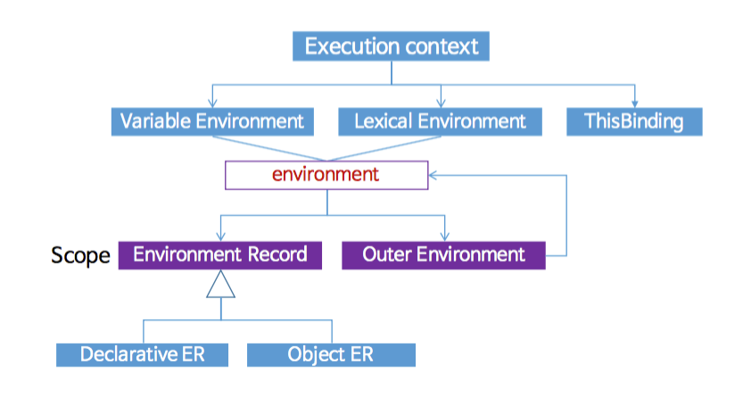
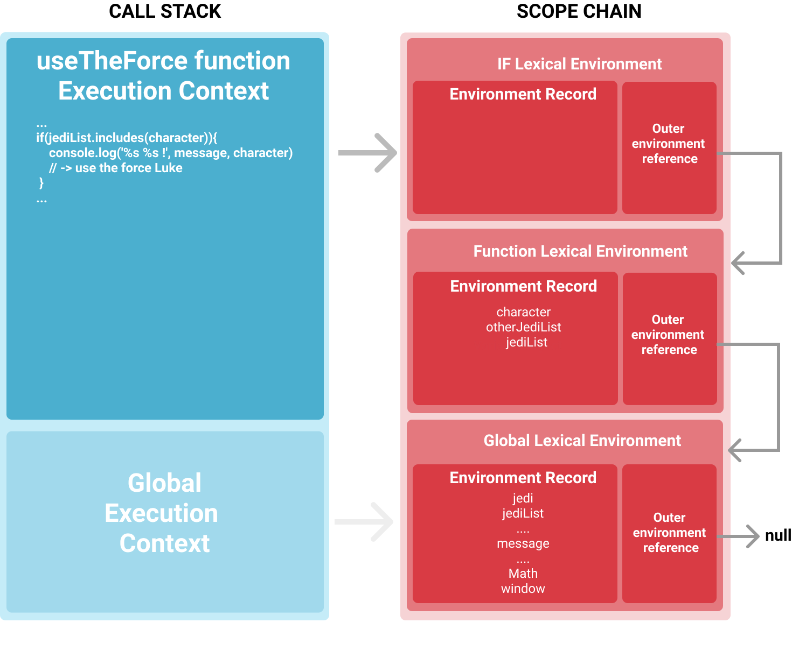

실행 컨텍스트(Execution context)는 짧게 '컨텍스트'라고도 하며 스코프, 호이스팅, this, 함수, 클로저 등의 동작 원리를 담고 있는 자바스크립트의 핵심 원리이다. 실행 컨텍스트를 정확하게 이해하면 스스로 작성한 코드 뿐만 아니라 다른 사람이 작성한 코드를 이해하고 활용하거나 디버깅하는 일이 수월해질 것이다.

<br />

# 1. 실행 컨텍스트 (Execution context)

실행 컨텍스트는 **자바스크립트 코드가 실행되는 환경**을 나타내는 추상적인 개념이다. **코드가 실행되기 위해 필요한 환경**이라고도 할 수 있다.

자바스크립트 엔진이 코드를 실행하려면 실행에 필요한 여러가지 정보를 알고 있어야 한다. 실행에 필요한 정보란 아래와 같은 것들이 있는데

- `변수`: 전역변수, 지역변수, 매개변수, 객체의 프로퍼티
- `함수 선언`
- `변수의 유효범위(Scope)`
- `this`

엔진은 이러한 정보들을 형상화하고 구분하기 위해서 *실행 컨텍스트를 '객체'의 형태로 생성하고 관리*한다.

## 1.1 실행 컨텍스트의 종류

실행 컨텍스트는 실행되는 코드의 종류에 따라 세 가지로 나눌 수 있다.

- **전역 실행 컨텍스트 (Global Execution Context)**: 가장 기본적이고 베이스가 되는 실행 컨텍스트이다. 어떠한 함수에도 속해있지 않은 코드가 전역 실행 컨텍스트에 포함된다. 전역 실행 컨텍스트는 전역 객체(브라우저의 경우 window 객체)를 생성하고 this를 전역 객체에 할당한다. 프로그램 하나당 하나의 전역 실행 컨텍스트가 있다.

- **함수 실행 컨텍스트 (Functional Execution Context)**: 함수가 실행될 때 마다 해당 함수를 실행하기 위한 새로운 실행 컨텍스트가 생성된다. 각각의 함수는 자기 자신만의 실행 컨텍스트를 가지는 셈이다. 실행 컨텍스트는 함수가 실행(호출)될때만 생성된다.

- **eval 함수 실행 컨텍스트 (Eval Function Execution Context)**: eval함수 내부의 코드가 실행될 때에도 이들만의 실행 컨텍스트가 생성된다.

<br />

## 1.2 실행 컨텍스트의 구조

실행 컨텍스트의 구조이다. 크게 `Lexical Environment`컴포넌트, `Variable Environment` 컴포넌트, `This Binding` 객체로 이루어져 있다. 그리고 `Lexical Environment와` `Variable Environment`(environment)는 다시 `Environment Record`와 `Outer Environment Reference`로 구성된다. 자세한 내용은 2. 실행 컨텍스트 생성 과정에서 살펴보자.



<br />

## 1.3 실행 컨텍스트의 실행 흐름

자바스크립트 엔진은 script tag를 처음 만나면 가장 먼저 전역 실행 컨텍스트를 만들어서 이를 현재 실행중인 실행 스택에 push 한다. 그리고 함수가 호출될 때 마다 새로운 실행 컨텍스트를 만들어서 실행 스택의 맨 꼭대기에 push한다.

실행 스택의 맨 위에 있는 실행 컨텍스트가 현재 실행되고 있는 컨텍스트이다. 현재 실행되는 컨텍스트에서 이 컨텍스트와 관련 없는 실행 코드가 실행되면 새로운 컨텍스트가 생성되어 스택에 들어가고 제어권이 그 컨텍스트로 이동한다.

> 실행 스택과 콜 스택은 같은 말이다. 실행 스택은 코드가 실행되는 동안 모든 컨텍스트들을 저장하는 스택이며 LIFO(Last In, First Out) 방식으로 동작한다.

아래의 코드를 살펴보자.

```js
let a = 'Hello World!'

function first() {
  console.log('Inside first function')
  second()
  console.log('Again inside first function')
}

function second() {
  console.log('Inside second function')
}

first()

console.log('Inside Global Execution Context')
```

출력결과

```
Inside first function
Inside second function
Again inside first function
Inside Global Execution Context
```

위 코드가 실행될때 실행 스택의 모습을 그림으로 나타내면 다음과 같다.

<br />


<br />

전역 실행 컨텍스트가 가장 먼저 스택에 추가되고 이후에 함수가 호출될 때 마다 새로운 실행 컨텍스트가 만들어지고, 스택에 추가되며, 실행이 완료되면 스택에서 제거된다. 전역 실행 컨텍스트는 어플리케이션이 종료될 때(웹 페이지에서 나가거나 브라우저를 닫을 때)까지 유지된다.

<br />

# 2. 실행 컨텍스트 생성 과정

앞서 잠깐 언급했던 실행 컨텍스트의 구조이다. 전체적인 구조를 파악해두고 생성 과정을 살펴보자.


엔진이 실행컨택스트를 생성하는 과정은 크게 **1) Creation Phase(생성 단계)**와 **2) Execution Phase(실행 단계)** 두 단계로 이루어진다.

## 2.1 Creation Phase (생성 단계)

Creation Phase에서 엔진은 다음의 동작을 수행한다.

- `LexicalEnvironment` 컴포넌트를 만든다.

- `VariableEnvironment` 컴포넌트를 만든다.

- 현재 실행 컨텍스트의 `this`의 값을 결정한다.

<br />

### 2.1.1 Lexical Environment (렉시컬 환경)

렉시컬 환경은 **식별자(identifier)와 특정 변수(variable)의 맵핑을 지속적으로 트래킹하는 엔진의 내부 구조**이다. 간단히 얘기하면 **식별자와 변수의 맵핑이 이루어지는 공간**이다.

렉시컬 환경은 `함수`, if문이나 for문과 같은 `블록문`, 그리고 `catch절`이 평가될 때 생성된다. 여기서 함수에 의해 생성되는 렉시컬 환경은 함수가 호출될 때 생성되는 것이 아니라, 그에 앞서 **함수 선언 코드가 평가될 때 생성된다**는 점을 기억하자. (클로저 개념과 연결된다.)

> 렉시컬 환경을 `스코프`라고 부르는 경우가 많다.

```js
var a = 20
var b = 40

function foo() {
  console.log('bar')
}
```

위 예시코드의 렉시컬 환경은 다음과 같이 표현할 수 있다.

```js
lexicalEnvironment = {
  a: 20,
  b: 40,
  foo: <ref. to foo function>
}
```

<br />

#### 렉시컬 환경의 구성

렉시컬 환경은 2개의 컴포넌트로 이루어져 있다.

- Environment Record
- Outer Environment Reference (Scope Chain)

<br />

**1. Environment Record (ER)**

Environment Record는 현재 실행 컨텍스트 내부의 변수 또는 함수의 선언이 저장되는 공간이다.

Environment Record는 두 가지 타입이 있다.

- **Declarative Environment Record** (Declarative ER) ─ `변수 선언`, `함수 선언`, `catch절`에서 사용되는 `식별자:값` 맴핑 정보를 담는 객체이다. 다음과 같이 실제 값이 저장된다.

  ```js
  DeclartionEnvironmentRecord = {
    a: 33,
    b: 'Hello World',
  }
  ```

- **Object Environment Record** (Object ER) ─ `with문`과 같이 식별자를 어떤 특정 객체 A의 속성으로 취급할 때 사용되며, 이를 위해 `bindingObject`라는 프로퍼티로 A를 가리키는 참조가 저장된다.
  ```js
  ObjectEnvironmentRecord = {
    bindObject: [object],
  }
  ```

> 참고) 함수의 경우 Environment Record에 `arguments`객체가 포함된다.

<br />

**2. Outer Environment Reference (Scope Chain)**

흔히 스코프 체인이라고 하는 것은 ES3에서는 스펙에 정식으로 존재했던 용어인데, ES6에서는 스코프 체인이라는 용어는 존재하지 않는다. 대신 ES5부터 `Lexical nesting structure` 또는 `Logical nesting of Lexical Environment values` 등으로 표현하고 있다.

Outer Environment Reference는 스코프 체인에 상응하는 개념으로, 중첩된 스코프 내에서 변수를 검색하는 메커니즘이라고 할 수 있다. 물리적으로는 `Lexical Environment`를 원소로 하는 단방향 연결 리스트로 구현되어 있다.

```js{7, 18}
FunctionExectionContext = {
  LexicalEnvironment: {
    EnvironmentRecord: {
      Type: "Declarative",
      // Identifier-value bindings go here
    }
    outer: <Global or outer function environment reference>,
    this: <depends on how function is called>
  }
}

GlobalExectionContext = {
  LexicalEnvironment: {
    EnvironmentRecord: {
      Type: "Object",
      // Identifier-value bindings go here
    }
    outer: <null>,
    ThisBinding: <Global Object>
  }
}
```

엔진은 가장 먼저 현재 렉시컬 환경에서 해당 변수를 찾아보고 검색에 실패하면 다음 리스트가 가리키는 상위 렉시컬 환경을 참조하여 변수를 검색하는 식으로 탐색을 이어나간다. 이러한 탐색은 해당 변수의 식별자를 찾거나 상위 렉시컬 환경의 `Outer Environment Reference` 참조가 `null`일 경우(`Global Lexical Environment`) 종료된다. 만약 `Global Lexical Environment`에서도 변수를 찾지 못할경우 정의되지 않은 변수에 접근하는 것으로 판단하여 Reference 에러를 발생시킨다.



<br />

### 2.1.2 Variable Environment (변수 환경)

변수 환경은 위에서 언급한 렉시컬 환경과 거의 동일하다. ES6에서 이 두 컴포넌트의 차이점은 렉시컬 환경은 함수 선언 및 변수(`let`, `const`)바인딩을 저장하는데 사용되는 반면 변수 환경은 변수(`var`)바인딩만 저장한다는 점이다.

<br />

## 2.2 Execution Phase (실행 단계)

지금까지 실행 컨텍스트의 Creation Phase를 알아보았다. 다음 단계인 Execution Phase는 훨씬 간단 명료하다. 이 단계에서는 모든 식별자에 값을 할당하고, 코드를 실행시킨다.

<br />

이제 실행 컨텍스트의 생성과정을 예시코드와 함께 살펴보자.

```js
let a = 20
const b = 30
var c

function multiply(e, f) {
  var g = 20
  return e * f * g
}

c = multiply(20, 30)
```

위 코드가 실행되면 자바스크립트 엔진은 전역에 있는 코드를 실행하기 위해 전역 실행 컨텍스트를 생성한다. Creation phase(생성 단계)에 있는 전역 실행 컨텍스트를 나타내 보면 다음과 같다. 이 시점에 변수의 **선언**이 이루어지고 전역 실행 컨텍스트의 `this`가 정해진다.

```js{5,6,14}
GlobalExectionContext = {
  LexicalEnvironment: {
    EnvironmentRecord: {
      Type: "Object",
      a: < uninitialized >,
      b: < uninitialized >,
      multiply: < func >
    },
    outer: <null>
  },
  VariableEnvironment: {
    EnvironmentRecord: {
      Type: "Object",
      c: undefined
    },
    outer: <null>,
  },
  ThisBinding: <Global Object>
}
```

이어지는 Execution phase(실행 단계)에서는 변수에 값이 **할당**되고 코드가 실행된다. 아래는 Execution phase에 있는 전역 실행 컨텍스트이다.

```js{5,6,14}
GlobalExectionContext = {
  LexicalEnvironment: {
    EnvironmentRecord: {
      Type: "Object",
      a: 20,
      b: 30,
      multiply: < func >
    },
    outer: <null>
  },
  VariableEnvironment: {
    EnvironmentRecord: {
      Type: "Object",
      c: undefined,
    },
    outer: <null>
  },
  ThisBinding: <Global Object>
}
```

코드 실행 중에 `multiply(20, 30)` 함수 호출 구문을 마주치면 해당 함수를 실행하기 위해 실행 컨텍스트를 생성한다.

```js{9}
let a = 20;
const b = 30;
var c;

function multiply(e, f) {
 var g = 20;
 return e * f * g;
}

c = multiply(20, 30);
```

Creation phase에 있는 함수 실행 컨텍스트를 보면 전역 실행 컨텍스트와 달리 Environment Record에 `arguments`객체가 포함되어 있음을 알 수 있다.

```js{5,12}
FunctionExectionContext = {
  LexicalEnvironment: {
    EnvironmentRecord: {
      Type: "Declarative",
      Arguments: {0: 20, 1: 30, length: 2},
    },
    outer: <GlobalLexicalEnvironment>
  },
  VariableEnvironment: {
    EnvironmentRecord: {
      Type: "Declarative",
      g: undefined
    },
    outer: <GlobalLexicalEnvironment>
  },
  ThisBinding: <Global Object or undefined(strict mode)>
}
```

Creation phase가 완료되면 컨텍스트는 Execution phase에 진입한다. 마찬가지로 함수 내부의 변수에 값을 할당한다. 아래는 Execution phase에 있는 함수 실행 컨텍스트의 모습이다.

```js{12}
FunctionExectionContext = {
  LexicalEnvironment: {
    EnvironmentRecord: {
      Type: "Declarative",
      Arguments: {0: 20, 1: 30, length: 2},
    },
    outer: <GlobalLexicalEnvironment>
  },
  VariableEnvironment: {
    EnvironmentRecord: {
      Type: "Declarative",
      g: 20
    },
    outer: <GlobalLexicalEnvironment>
  },
  ThisBinding: <Global Object or undefined(strict mode)>
}
```

함수 실행이 완료되면 함수의 리턴값은 변수 `c`에 저장된다. 그리고 전역 렉시컬 환경이 업데이트 된다.

<br />

이미 눈치챘을지도 모르겠지만 실행 컨텍스트의 Creation phase(생성 단계)에서 `let`과 `const`로 선언된 변수는 아무런 값도 가지지 않지만 `var`로 선언된 변수는 `undefined`을 가지고 있다.

전역 실행 컨텍스트의 Creation phase를 다시 한 번 살펴보자.

```js{5,6,14}
GlobalExectionContext = {
  LexicalEnvironment: {
    EnvironmentRecord: {
      Type: "Object",
      a: < uninitialized >,
      b: < uninitialized >,
      multiply: < func >
    },
    outer: <null>
  },
  VariableEnvironment: {
    EnvironmentRecord: {
      Type: "Object",
      c: undefined,
    }
    outer: <null>
  },
  ThisBinding: <Global Object>
}
```

Creation phase에서 코드가 스캔되면서 `var`변수의 경우 변수 선언과 동시에 기본 값 `undefined`을 할당받지만 `let`/`const`변수는 초기화 되지 않은 상태(uninitialized)로 저장되는 것이다.(→호이스팅)

이러한 동작 방식으로 인해 `var`변수는 (`undefined`이긴 하지만) 선언 전에 접근해서 값을 얻을 수 있는 반면 `let`이나 `const`변수는 선언 전에 접근할 경우 Reference 에러가 뜬다. (→Temporal Dead Zone(TDZ))

> 참고) Execution phase에서 엔진이 `let`변수에 할당할 값을 찾지 못할 경우 `undefined`를 대신 할당할 것이다.

<br />

---

<br />

### 참조

- [Understanding Execution Context and Execution Stack in Javascript](https://blog.bitsrc.io/understanding-execution-context-and-execution-stack-in-javascript-1c9ea8642dd0) ([번역 @imacoolgirlyo](https://velog.io/@imacoolgirlyo/JS-%EC%9E%90%EB%B0%94%EC%8A%A4%ED%81%AC%EB%A6%BD%ED%8A%B8%EC%9D%98-Hoisting-The-Execution-Context-%ED%98%B8%EC%9D%B4%EC%8A%A4%ED%8C%85-%EC%8B%A4%ED%96%89-%EC%BB%A8%ED%85%8D%EC%8A%A4%ED%8A%B8-6bjsmmlmgy#types-of-exection-context))
- [JavaScript 식별자 찾기 대모험](https://homoefficio.github.io/2016/01/16/JavaScript-%EC%8B%9D%EB%B3%84%EC%9E%90-%EC%B0%BE%EA%B8%B0-%EB%8C%80%EB%AA%A8%ED%97%98/)
- [자바스크립트의 스코프와 클로저](https://meetup.toast.com/posts/86)
- [자바스크립트 함수(3) - Lexical Environment](https://meetup.toast.com/posts/129)
- [Lexical Environment](https://medium.com/@kkak10/lexical-environment-4e0cffcad98d)
- [JavaScript under the hood: Execution Context, Call Stack and Scope Chain](https://medium.com/openmindonline/javascript-under-the-hood-execution-context-b1b2fbf56e90)
- [실행 컨텍스트와 자바스크립트의 동작 원리](https://poiemaweb.com/js-execution-context)
- 인사이드 자바스크립트 (한빛미디어)
